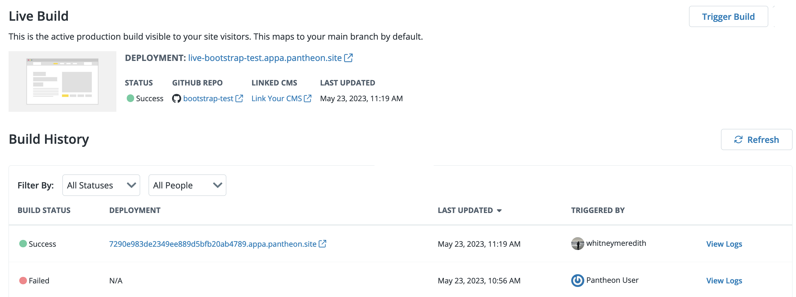

This section provides information on how to view Build details, how to trigger a new build manually in the Overview page, how to trigger a build with GitHub merges, Multidev branch builds, and pull request builds, as well as how to clear your build cache.

## Build Information

You can view build details and get information on your Front-End Site development and specifications. Build information is provided in the Overview page in three sections:

- Live Build
- Multidev Branches
- Pull Requests

Build history includes:

- **Status:** The build’s latest status. Possible status values are:
    - `In Progress`
    - `Success`
    - `Failed`
    - `Queued`

- **Build:** The build number and reference ID.
- **Branch:** The name of the latest GitHub branch.
- **Deployment:** The URL to the environment that the build was deployed to.
- **Last Updated:** The date the site content was last modified.
- **Triggered by:** The name of the user who deployed the site build.

### View Build History

1. [Go to the Site Dashboard](/guides/account-mgmt/workspace-sites-teams/sites#site-dashboard) and select the **Sites** page.

1. Click the **Front-End Sites** tab and select the site you want to view the build history for. The **Build History** section displays on the **Overview** page that opens automatically.



## View Build Log Details

The Build Details page provides a complete log of the build. You can also copy the build URL to share with others and download the log in CSV format on this page.

1. [Go to the Site Dashboard](/guides/account-mgmt/workspace-sites-teams/sites#site-dashboard) and select the **Sites** page.

1. Click the **Front-End Sites** tab and select the site you want to view the build details for.

1. Scroll down to the **Build History** section and click the **View Logs** link to open the **Build Details** page.

## Trigger a Manual Build

You can save time by quickly triggering a build from your Overview page.

1. Log in to your Front-End Site workspace and select the **Sites** page.

1. Click the **Front-End Sites** tab and select the site you want to trigger a build for.

1. Click the **Trigger Build** button in the top left corner of the **Overview** page.

## Trigger a Build with GitHub Merges

A build and deploy process is automatically triggered when you
push code to the default branch of your repository or merge a pull
request to that branch.

You can follow the steps below to observe the build and deployment process in real time. Note that the steps below assume that you have already cloned your Front-End Site repository from GitHub to your local.

1. Check out the `main` branch of your repository.

    ```bash{promptUser: user}
    git checkout main
    ```

1. Make a change to a file in your repository.

1. Add and commit the change to the `main` branch.

    ```bash{promptUser: user}
    git add .
    git commit -m <message>
    ```

1. Push the new commit.

    ```bash{promptUser: user}
    git push
    ```

1. Open your Site Dashboard, navigate to the **Overview** page and locate the **Live Build** section to observe the new build in progress.

## Multidev Branch Builds

You can build specific branches by naming the branch to begin with the prefix `multi-`. Refer to [Front-End Sites Multidev Development Workflow](/guides/decoupled/overview/considerations#front-end-sites-multidev-development-workflow) for a detailed outline of the development workflow for Multidev sites.

You can follow the steps below to observe the build and deployment process for a Multidev branch in real time. Note that the steps below assume that you have already cloned your Front-End Site repository from GitHub to your local.

1. Check out the `main` branch of your repository.

    ```bash{promptUser: user}
    git checkout main
    ```

1. Create a new branch using the `multi-` prefix, for example:

    ```bash{promptUser: user}
    git checkout -b multi-example-update
    ```

1. Make a change to a file in your repository.

1. Add and commit the change to the `main` branch.

    ```bash{promptUser: user}
    git add .
    git commit -m <message>
    ```

1. Push the branch:

    ```bash{promptUser: user}
     git push origin your-branch-name
    ```

1. Open your Site Dashboard, navigate to the **Overview** page and scroll down to the **Multidev Branches** section. You should see your Multidev branch begin to build after approximately a minute.

1. Use the **Actions** drop-down menu to visit the Multidev version of the site, view the logs, or get more information about the build.

Commits pushed on this branch will now be built and deployed to the Multidev. This allows you and your team to review the branch as work progresses. Pull requests opened against this branch will also trigger a build.

## Clear Caches and Build

1. Log in to your Front-End Site workspace and select the **Sites** page.

1. Click the **Front-End Sites** tab and select the site you want to clear the build cache for.

1. Click the **Trigger Build** button in the top left corner and select **Clear caches and Build** from the drop-down menu.