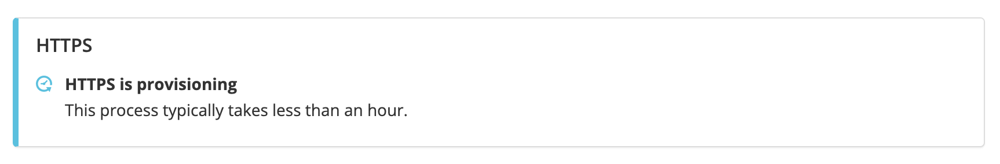
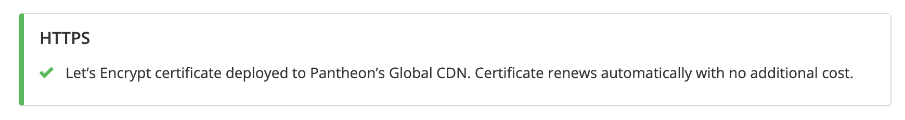

## Provision HTTPS

The process to provision certificates kicks off automatically after domain ownership has been verified, and is indicated by the following notice:

Both the bare domain and the `www` domain will be accessible over HTTPS after the HTTPS status turns green (which may take up to an hour):

