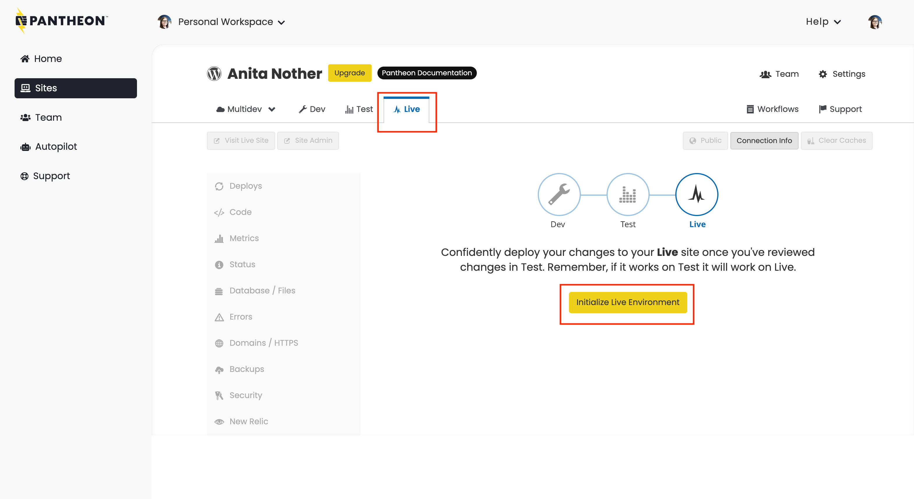
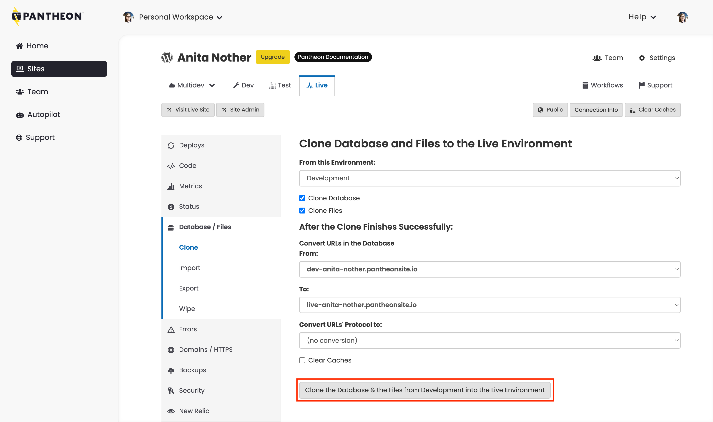

To create your Live environment:

1. [Go to the Site Dashboard](/guides/account-mgmt/workspace-sites-teams/sites#site-dashboard).
1. Click the <Icon icon="equalizer" text="Live"/> tab.
1. Click **Initialize Live Environment** to create your Live environment.

1. Go to the the <Icon icon="server" text="Database / Files"/> tab and select the following:

   - **From this Environment**: Development
   - **Clone Database**: Checked
   - **Clone Files**: Checked

1. Click **Clone the Database & the Files from Test into the Live Environment**.

   

1. Type "CLONE" and then click **Overwrite This Environment** when prompted to confirm you want to go live.

   
