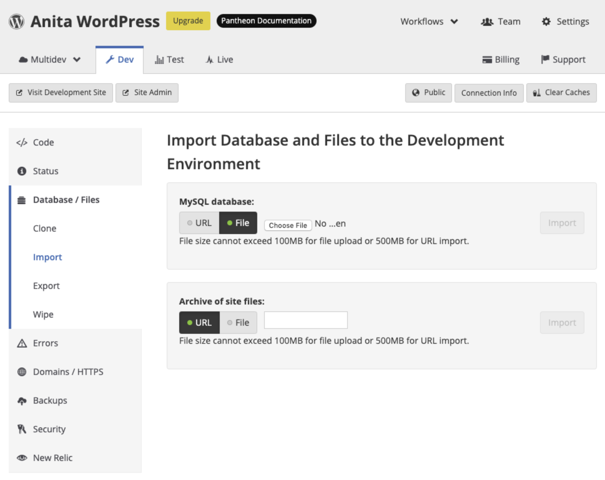

<Partial file="drupal/migrate-add-files-part1.md" />

1. Export a `tar.gz` or `.zip` file of your files directory:

  Navigate to your Drupal site's root directory to run this command, which will create an archive file in your user's home directory:

  ```bash{promptUser: user}
  cd sites/default/files
  tar -czf ~/files.tar.gz .
  ```

1. Select the **<Icon icon="wrench" /> Dev** environment in the Site Dashboard.

1. Select <Icon icon="server" /> **Database / Files**.

1. Click **Import** and add your archive accordingly (based on file size):

  <TabList>

  <Tab title="Up to 100MBs" id="100mbs" active={true}>

  If your archive is under 100MB, you can upload the file directly:

   1. Click **File** in the **MySQL database** field > **Choose File**.

   1. Select your local archive file and click **Import**.

      

  **Note:** If you recently imported the database and need to re-import, refresh the page and use a new filename for the database file.

  </Tab>

  <Tab title="Up to 500MBs" id="500mbsfiles">

  If your archive is less than 500MB, you can import it from URL:

   1. Click **URL** in the **Archive of site files** field.

   1. Paste a publicly accessible URL for the archive and click **Import**.

      - Change the end of the Dropbox URLs from `dl=0` to `dl=1` to ensure that your archive imports correctly.

  </Tab>

  <Tab title="Over 500MBs" id="500mbsplusfiles">

  Rsync is an excellent method for transferring a large number of files. After performing an initial rsync, subsequent jobs will only transfer the latest changes. This can help minimize the amount of time a site is in an unpredictable state (or offline) during the final step of a migration, as it allows you to bring over only new content, rather than re-copying every single file.

  We recommend looking into the [Terminus Rsync Plugin](https://github.com/pantheon-systems/terminus-rsync-plugin) as a helper when doing these operations, as the number of command line arguments and specifics of directory structure make it easy for human error to impact your operation.

  To sync your current directory to Pantheon, run the following command:

  ```bash{promptUser: user}
  terminus rsync . my_site.dev:files
  ```

  When using Rsync manually, the script below is useful for dealing with transfers that are interrupted due to connectivity issues. It uploads files to your Pantheon site's **<Icon icon="wrench" /> Dev** environment. If an error occurs during transfer, it waits two minutes and picks up where it left off:

  <Download file="manual-rsync-script.sh" />

  ```bash
  #!/bin/bash

  # manual-rsync-script.sh
  # runs Rsync and waits two minutes if it doesn't work

  ENV='dev'
  SITE='SITEID'

  read -sp "Your Pantheon Password: " PASSWORD
  if [[ -z "$PASSWORD" ]]; then
  echo "Whoops, need password"
  exit
  fi

  while [ 1 ]
  do
      sshpass -p "$PASSWORD" rsync --partial -rlvz --size-only --ipv4 --progress -e 'ssh -p 2222' ./files/* --temp-dir=../tmp/ $ENV$SITE@appserver.$ENV.$SITE.drush.in:files/
  if [ "$?" = "0" ] ; then
      echo "rsync completed normally"
  exit
  else
      echo "Rsync failure. Backing off and retrying..."
      sleep 180
  fi
  done
  ```

  </Tab>

  </TabList>
