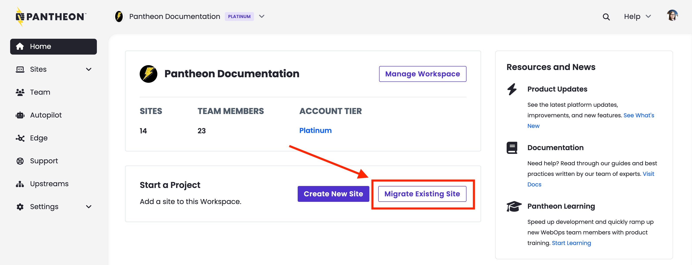

The recommended way to migrate Drupal sites from another host is to use `drush ard` (Drush 8 or 11) to create an archive that can be easily imported.

1. Open your Personal or Professional Workspace dashboard and click the **Migrate Existing Site** button.

   

1. Enter your current website URL, select **Drupal 7** and click **Continue**.

   

1. Enter the name of your new Pantheon site, select a workspace for the site (optional), and click **Create Site**.

   

1. Follow the instructions to **Create an Archive of Your Existing Site With Drush**:

  The Dashboard instructs you to put the archive on your existing website, but you can put the site archive on Dropbox, S3, or any number of other places. The important thing is that you have a site archive that can be downloaded via a publicly accessible URL.

  Click **Continue Migration**

  

1. Paste the publicly accessible URL to a download of your site archive on the right side of the page. If you are using a Dropbox URL, change the end of the URL from `dl=0` to `dl=1` so we can import your site archive correctly. Click **Import Archive**.

   

1.  Click **Visit the Site Dashboard** from the Site Dashboard on Pantheon after the import is complete.

   

