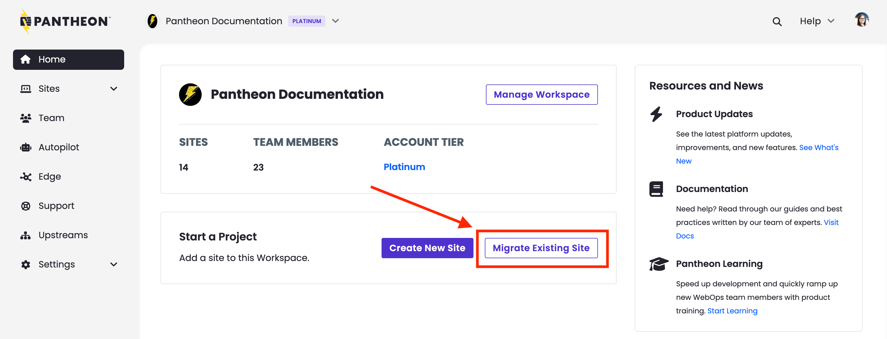
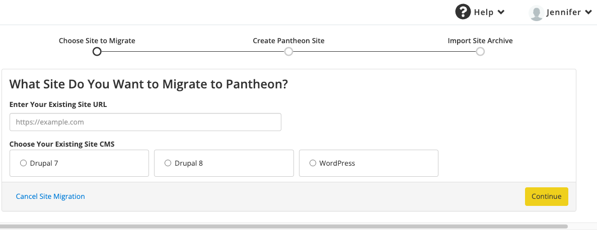
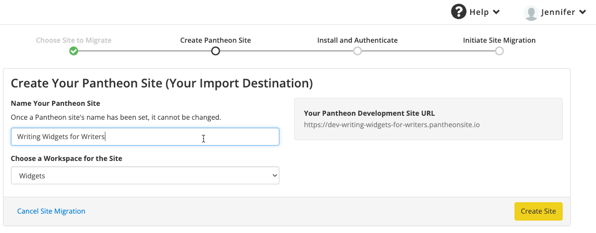
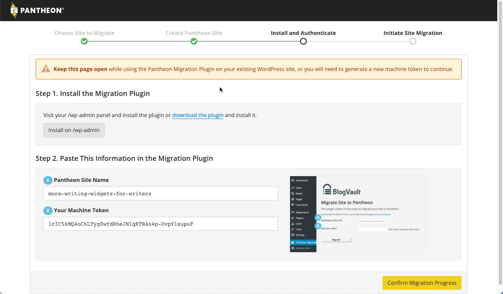
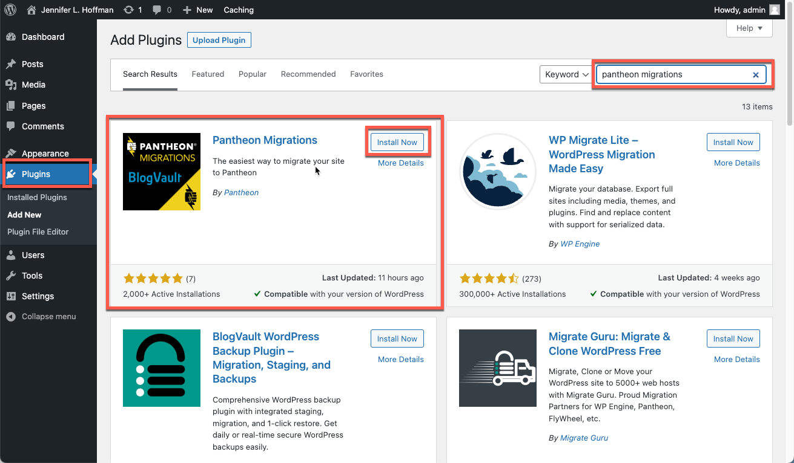
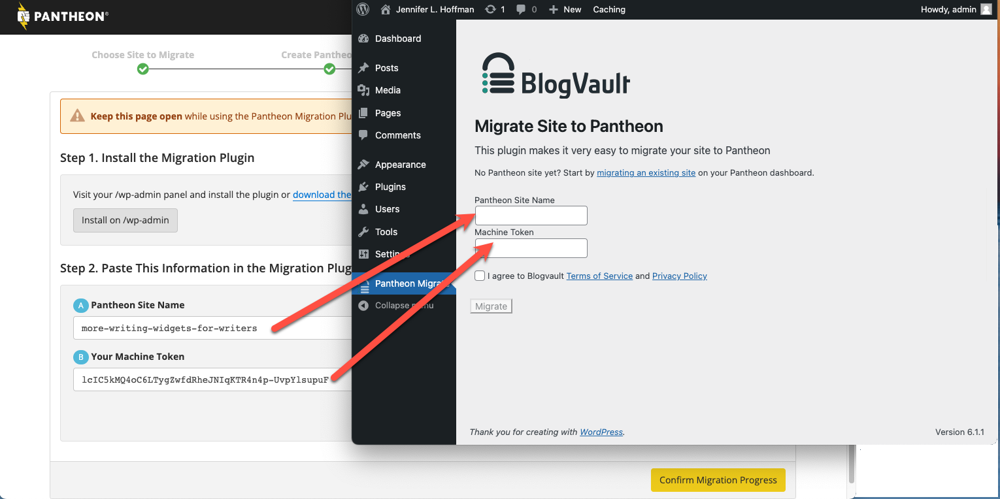

The recommended way to migrate WordPress sites from another host is to use the [Pantheon Migration](https://wordpress.org/plugins/bv-pantheon-migration/) plugin, developed by [BlogVault](https://blogvault.net/).

<Accordion title="Watch: Guided WordPress Migrations" id="wp-video" icon="facetime-video">

<Youtube src="ksg1XkH1da8" title="Guided WordPress Migrations" />

</Accordion>

1. Open your Personal or Professional Workspace dashboard and select the **Migrate Existing Site** button on the lower right side of the page.

   

1. Enter your current website URL, select **WordPress**, and click **Continue**.

   

1. Enter the name of your new Pantheon site, select a workspace for the site (optional), and click **Create Site**.

   

1. Select **Generate Machine Token** and re-authenticate if prompted.

   

1. Select **Install on /wp-admin**.  A new tab will open with your WordPress CMS for your existing site. Keep the Pantheon tab open in your browser.
   

1. Search for and install the plugin.

   

1. Click **Activate**.

   

1. Go back to the browser tab containing your Pantheon dashboard, copy the machine token from the Pantheon Dashboard, then go back to the WordPress Dashboard on your existing site. Paste the machine token and the site name, and click **Migrate**.

   

   When the migration is complete, the **Migration completed successfully** page appears.

   

   You will also receive an email when the migration completes. 

1. Go back to the Pantheon tab and click **Confirm migration progress**.  Your site's dashboard appears.

<Alert title="Note" type="info">

The [WordPress Native PHP Sessions](https://wordpress.org/plugins/wp-native-php-sessions) plugin is automatically installed during the migration process. For more details on this plugin, see [WordPress and PHP Sessions](/guides/php/wordpress-sessions).

</Alert>
