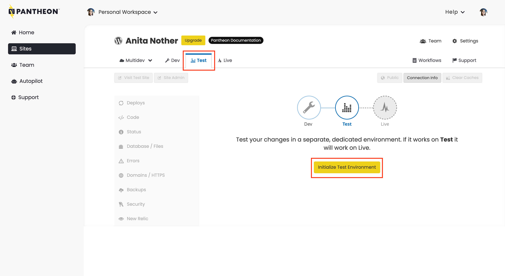
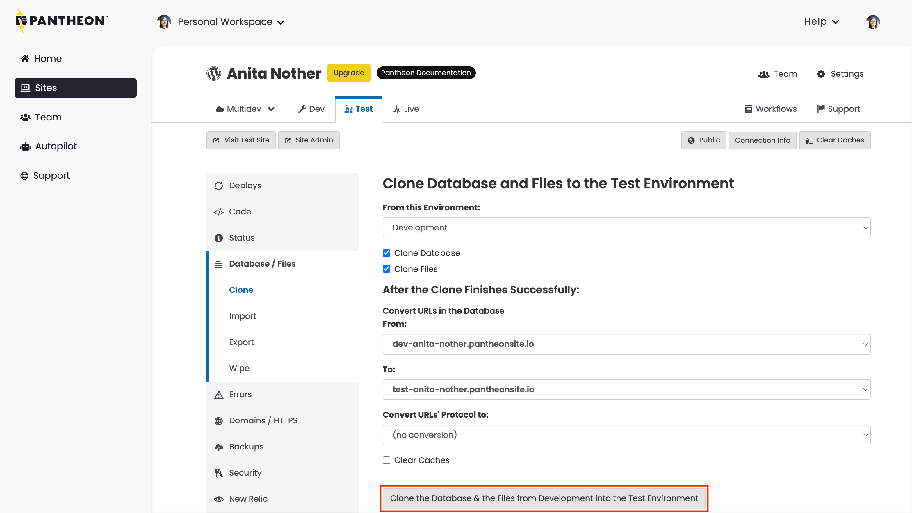

To create your Test environment:

1. [Go to the Site Dashboard](/guides/account-mgmt/workspace-sites-teams/sites#site-dashboard).
1. Click the <Icon icon="equalizer" text="Test"/> tab, then click **Initialize Test Environment** to create your Test environment.

   

   This takes a few moments.

1. Go to the <Icon icon="server" text="Database / Files"/> tab and select the following:

   - **From this Environment**: Development
   - **Clone Database**: Checked
   - **Clone Files**: Checked

1. Click **Clone the Database & the Files from Development into the Test Environment**.

   
