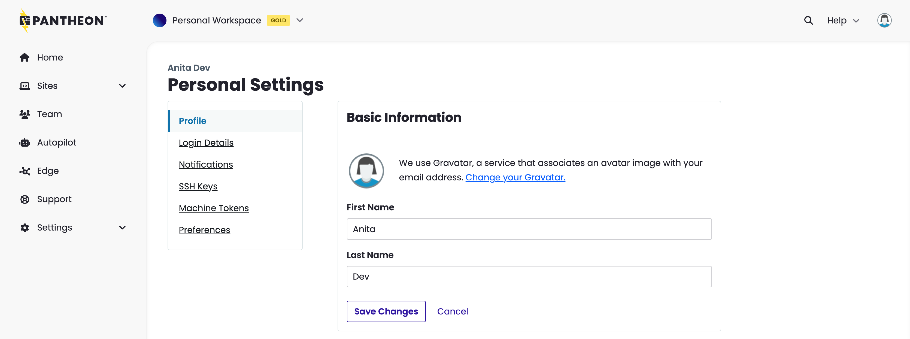
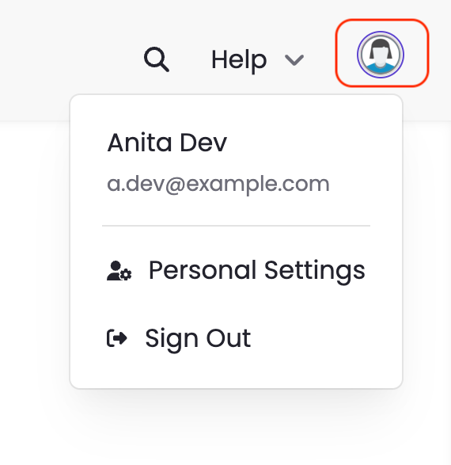

Personal Settings help you control several key aspects of the Dashboard, and can be accessed by clicking the user gravatar in the upper right corner, then **Personal Settings**.

## Profile

The user gravatar is a personalized image you can upload.  If you have not personalized your gravatar, it will appear as it does in the image below. To customize it, click **Change your Gravator**, to the right of the existing gravatar.

You can also add your name, email address, password, country and region, or [delete your account](/guides/account-mgmt/account/delete).

### Account and Security

You can update the current email address or password associated with your Dashboard. 

#### Email

To update the email address, click **Change Email Address**. Enter the updated email address in the **New Email Address** field and click **Save Changes**.

#### Password

To update the password, click **Change Password**. You are directed to a page where you are prompted to enter your current password and your desired new password. Enter the updated password in the **New Password** field, confirm your entry, and then click **Save Changes**.

When changing your password, make sure the new password meets the following requirements:

* At least 8 characters
* A mixture of both uppercase and lowercase letters
* A mixture of letters and numbers
* Inclusion of at least one special character. For example, use !, @, #, ?, %. Do not use < or > in your password.

You’ll need to log in again after your password is changed.

## Notifications

### Autopilot Email Notifications

You can configure email notifications for Autopilot alerts and activity digests.

<Partial file="autopilot/autopilot-email-notifications.md" />

### Email Preferences

Manage your email preferences and only receive the emails you want. Confirm your email, check off any relevant categories, and click **Update Settings**.

## SSH Keys

SSH keys allow you to establish a secure connection between your computer and Pantheon. Visit the SSH Keys tab to review your existing configured keys, and add or revoke SSH keys. Follow the steps in [SSH Keys](/ssh-keys) to generate, add, and revoke SSH keys. 

## Machine Tokens

Machine tokens are used to uniquely identify your machine and securely authenticate via Terminus.

The token key will only be shown once and provides the same access as your username and password. To learn more about machine tokens, refer to the [Creating and Revoking Machine Tokens](/machine-tokens) documentation.

## Preferences

### New Pantheon Features

#### Redesigned Dashboard Interface

If you would like to be directed to the redesigned Dashboard interface when you log into Pantheon, select **ON**. Otherwise to disable this feature, select **OFF**.

If you choose to use the redesigned Dashboard, you will not be able to navigate to your User or Workspace. Certain features, such as site billing, are not currently available in the redesigned Dashboard. 