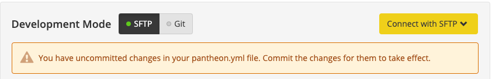
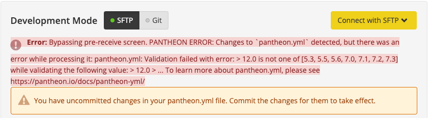

Upgrading your site's PHP version will improve the security, performance, and supportability of your site. See our blog post for an [example of 62% performance gains after upgrading](https://pantheon.io/blog/php-7-now-available-all-sites-pantheon).

## Before You Begin

Older software is more likely to contain code that is incompatible with recent PHP versions. Before you change your PHP version:

- Update core to the latest release. For details, see [WordPress and Drupal Core Updates](/core-updates).
- Update themes, plugins, and modules. For details, see [Working in the WordPress Dashboard and Drupal Admin Interface](/cms-admin).

## Verify Current PHP Versions

Verify current PHP settings from the Site Dashboard by clicking **Settings** > **PHP version**.

<Alert title="Note" type="info">

Changes made to the `pantheon.yml` file on a branch **are not** detected when creating the Multidev environment for that branch. See [Deploying Configuration Changes to Multidev](/pantheon-yml/#deploying-configuration-changes-to-multidev) for more information.

</Alert>

### All PHP Versions

| Version                                      | Recommended | Status |
| --------------------------------------------:| ----------- | ------ |
| [7.4](https://v74-php-info.pantheonsite.io/) | <span style="color:green">✔</span> | Active |
| [7.3](https://v73-php-info.pantheonsite.io/) | <span style="color:green">✔</span> | Active |
| [7.2](https://v72-php-info.pantheonsite.io/) | <span style="color:green">✔</span> | Active |
| [7.1](https://v71-php-info.pantheonsite.io/) | ❌           | EOL     |
| [7.0](https://v70-php-info.pantheonsite.io/) | ❌           | EOL     |
| [5.6](https://v56-php-info.pantheonsite.io/) | ❌           | EOL     |
| [5.5](https://v55-php-info.pantheonsite.io/) | ❌           | EOL     |
| [5.3](https://v53-php-info.pantheonsite.io/) | ❌           | Retired |

Click on the links above to see the complete PHP info for each version, including the list of supported PHP extensions.

<dl>

<dt>EOL</dt>

<dd>

End-of-life (**EOL**) versions are available on the platform but no longer under active development, and should not be used unless absolutely necessary.

</dd>

<dt>Retired</dt>

<dd>

Sites using retired versions of PHP will continue to serve pages, but new development cannot be done. To resume development on a site using a retired version of PHP, first upgrade the PHP version on the development environment.

</dd>

</dl>

### CMS Version Requirements

Before changing your PHP version, confirm that your CMS is compatible:

- [WordPress Requirements](https://wordpress.org/about/requirements/)
- [Drupal 8 and 9 PHP version support](https://www.drupal.org/docs/system-requirements/php-requirements#php_required)
- [Drupal 7 PHP version support](https://www.drupal.org/docs/7/system-requirements/php-requirements#php_required)
- As of Drupal 6.45, Drupal 6 is [compatible with PHP 7.2](https://www.mydropwizard.com/blog/announcing-drupal-645-and-selected-contrib-php-72). Older versions of Drupal 6 require PHP 5.4 and below.


## Configure PHP Version

Manage PHP versions by committing a `pantheon.yml` configuration file to the root of your site's code repository. If you have a local git clone of your site, this is the project root. When looking at the site over an SFTP connection, look in the `code` directory. If the `pantheon.yml` file is not present, create one to look like the following:

```yaml
api_version: 1

php_version: 7.0
```

You do not need to specify the PHP version's exact point release (e.g, `7.2.6`), as these are managed by the platform and deployed automatically.

Now your site’s PHP version is determined via `pantheon.yml`, and managed in version control.

The next time you [push your changes](/git#push-changes-to-pantheon) back to Pantheon, your site will begin using the newly specified PHP version.

### Verify Changes

#### Git Mode

The first place to determine if your changes have been successful is the output from your `git push` command. A correct implementation will return:

```none
remote: PANTHEON NOTICE:
remote:
remote: Changes to `pantheon.yml` detected.
remote:
remote: Successfully applied `pantheon.yml` to the 'dev' environment.
```

If you have an invalid `pantheon.yml` file, the `git push` operation will fail and your commit will be rejected. In this example, we've set an unavailable PHP version:

```none
remote: PANTHEON ERROR:
remote:
remote: Changes to `pantheon.yml` detected, but there was an error while processing it:
remote:
remote:
remote: Validation failed with error:
remote: >   8.0 is not one of [5.3, 5.5, 5.6, 7.0]
```

Modify `pantheon.yml` until valid and commit the fix before attempting to push again.

<Alert title="Note" type="info">

Changes to `pantheon.yml` [deployed as hotfixes](/pantheon-yml#deploying-hotfixes) are not detected.

</Alert>

#### SFTP Mode

When you upload a new or modified `pantheon.yml` file in SFTP mode, your site dashboard will detect the changes:



If the contents of `pantheon.yml` are valid, you can commit normally. If there is a problem with the file, the dashboard will fail to commit and display the error. In the example below we've attempted to set the PHP version to 12:



## Troubleshoot Post-Upgrade Errors

### Resolve PHP Version Compatibility Issues

We recommend working with theme, module, or plugin maintainers to resolve any issues upstream. For custom code, see the corresponding Backward Incompatible Changes documentation in the [PHP Manual](https://secure.php.net/manual/en/appendices.php) for migrating from one PHP version to another.

### Upgrading PHP Version May Require Upgrading Drush Versions

If you see errors on the Pantheon Dashboard when trying to auto-run `update.php`, for example, upgrading Drush should resolve the issue. For more information, see [Manage Drush Versions on Pantheon](/drush-versions/#configure-drush-version).

## See Also

- [PHP Supported Versions](https://secure.php.net/supported-versions.php)
- [Drupal specific version notes on PHP requirements](https://www.drupal.org/requirements/php#drupalversions) and [WordPress Requirements](https://wordpress.org/about/requirements/)
- [Log Files on Pantheon](/logs)
- [PHP Errors and Exceptions](/php-errors)
- [The pantheon.yml Configuration File](/pantheon-yml)
- [Securely Working with phpinfo](/phpinfo)
- [php.net - Backward Incompatible Changes](https://secure.php.net/manual/en/migration70.incompatible.php)
- [Debug Intermittent PHP 7 Notices](/deprecated-constructor-notices)
