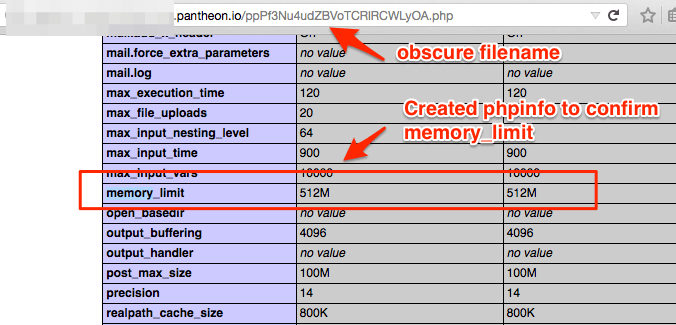

We serve our customers by provisioning isolated Linux containers with an optimized PHP stack. The php.ini is part of a highly tuned configuration and is not user-configurable. We continually deploy new builds of PHP and you also have the ability to [upgrade PHP versions](/php-versions). If you'd like to see a comprehensive list of what's installed with the version of PHP in use by a particular environment, you may use [phpinfo](https://secure.php.net/manual/en/function.phpinfo.php). We also have [example PHP info](/php-versions/#available-php-versions) for each version of PHP on the platform.

## Important Security Notes

- phpinfo exposes sensitive information like the password to connect to the DB
- If you create a `phpinfo` file, delete the file immediately after review

### Drupal Note

Drupal makes the phpinfo available to privileged users at `https://example.com/admin/reports/status/php`.

## Review phpinfo

1. [Lock environment](/security)  (if the environment does not currently need to be publicly accessible).

1. Create a php file with an obscure filename that uses phpinfo.

1. To minimize the information exposed over the web, omit sensitive sections from the phpinfo output. The recommended way to call `phpinfo` is:

   ```php
   phpinfo(INFO_GENERAL | INFO_CREDITS | INFO_MODULES | INFO_LICENSE);
   ```

1. Visit the file in a web browser to view phpinfo.

  

1. Delete the file immediately so you do not expose sensitive information, such as a password, to connect to the DB.

## Terminus

As an alternative to exposing these values on a web accessible URL, you can use [Terminus](/terminus) to check these values:

```bash{promptUser: user}
terminus remote:drush <SITE>.<ENV> -- ev "print(phpinfo())"
```
