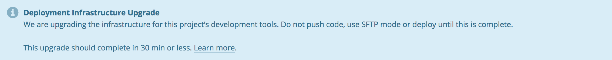

If your site dashboard displays the following **Deployment Infrastructure Upgrade** notice, we recommend waiting to make code changes until maintenance completes:

Refer to the following FAQs for more details and if you have concerns surrounding this process.
## Frequently Asked Questions

### Does it affect my site uptime?

No. We can assure you that there will be zero downtime on your site.

### What features are affected?

During this upgrade, services related to development may be interrupted. As a precaution, until the upgrade is complete, you should delay:

- Making changes using SFTP mode
- Pushing code with git
- Merging from multi-dev
- Cloning a database across environments
- Creating new multi-devs
- Deploying to LIVE environment

### How long will the upgrade take?

For most of the sites, we estimate the upgrade to complete in under 30 minutes. However, for some sites with large databases, the upgrade my take longer.

If you have questions around timing and duration of the upgrade, kindly [contact support](https://dashboard.pantheon.io/#support).

### What are you upgrading?

This upgrade is for the underlying infrastructure only. This upgrade does not change any runtime or software versions and there are no change to the behavior of Pantheon. Other that this brief interruption, there is no impact to the users.

Do not hesitate to contact support if you have any additional questions or concerns.
