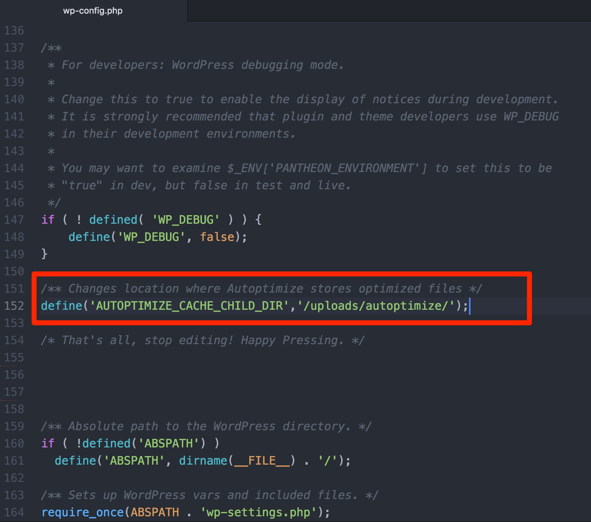
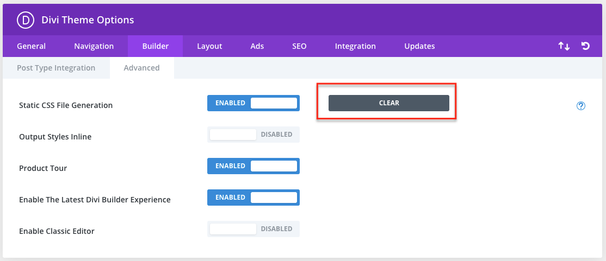
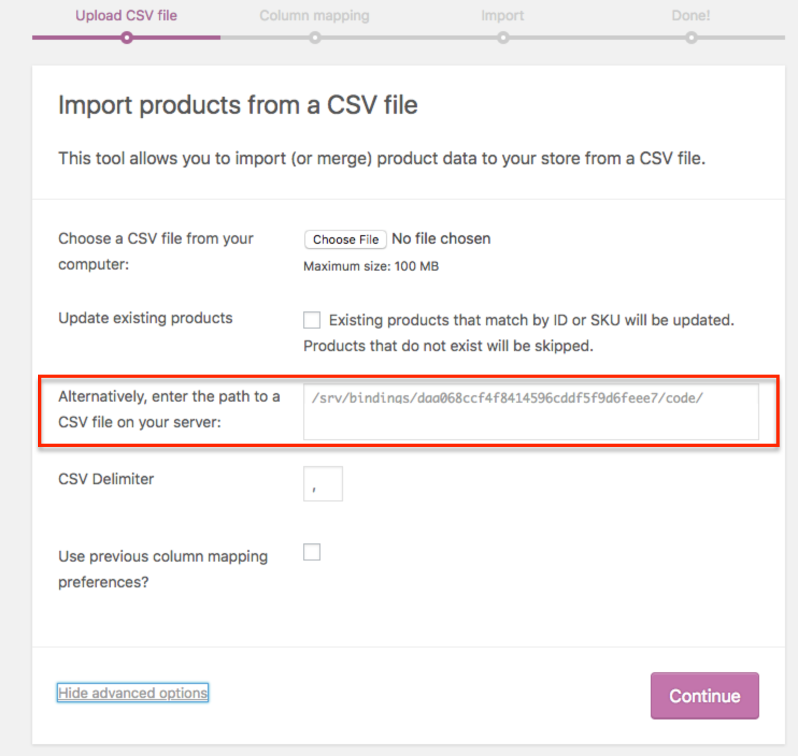
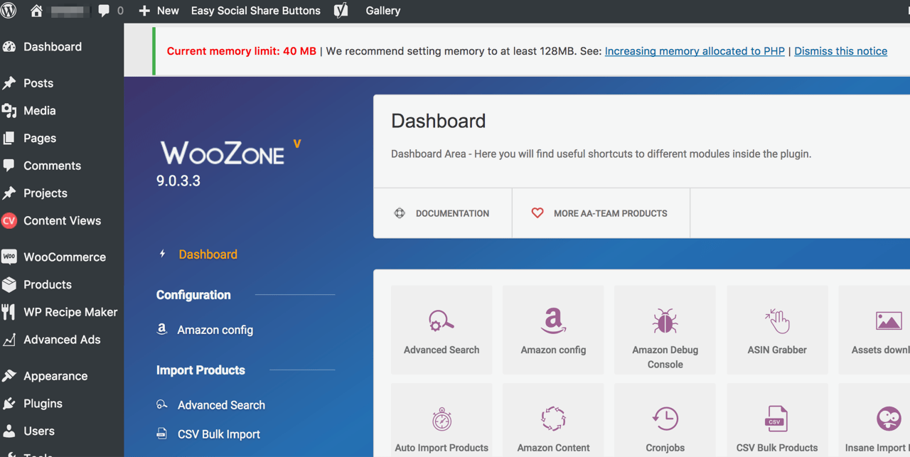
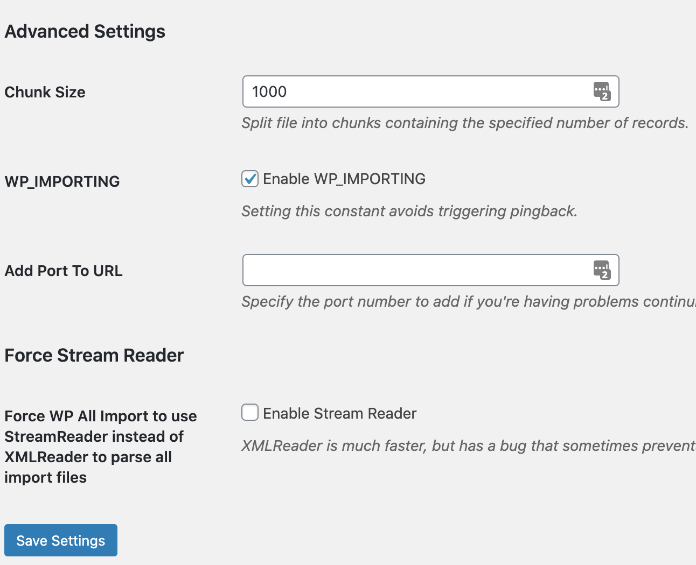
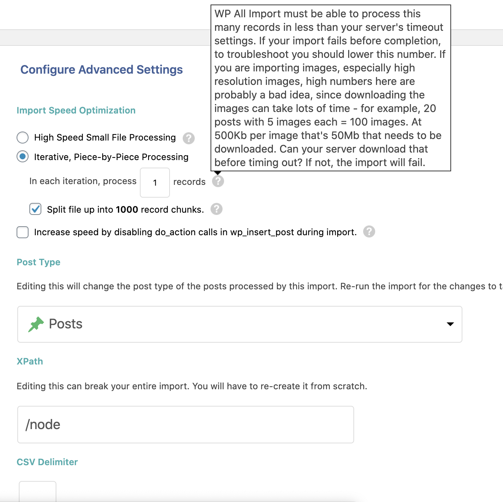
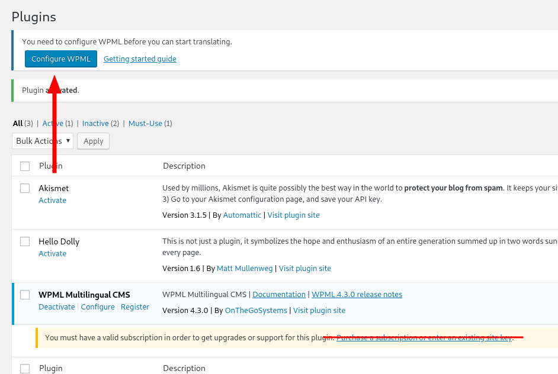

This page lists WordPress plugins, themes, and functions that may not function as expected or are currently problematic on the Pantheon platform. This is not a comprehensive list (see [other issues](#other-issues)). We continually update it as problems are reported and/or solved. If you are aware of any modules or plugins that do not work as expected, please [contact support](/support).

We do not prevent you from installing and using these plugins or themes. However, we cannot provide support for incompatible plugins and themes, or if they are used against the guidance provided here.

**Plugin & Theme Maintainers:** If your work is listed here, please [reach out to us](https://github.com/pantheon-systems/documentation/issues/new?title=Modules%20and%20Plugins%20with%20Known%20Issues%20Doc%20Update%20&body=Re%3A%20%5BModules%20and%20Plugins%20with%20Known%20Issues%5D(https%3A%2F%2Fpantheon.io/docs/modules-plugins-known-issues/)%0A%0APriority%20(Low%E2%80%9A%20Medium%E2%80%9A%20High)%3A%0A%0A%23%23%20Issue%20Description%3A%0A%0A%23%23%20Suggested%20Resolution%20&labels=fix%20content). We're happy to help provide information that can lead to conflict resolutions between your code and the platform.

If your work is already updated but still listed here, let us know so we can remove it, or [submit a pull request](https://github.com/pantheon-systems/documentation/edit/main/source/content/modules-plugins-known-issues.md).

### Assumed Write Access

Some plugins and themes are built on the assumption that the CMS has write access to the entire filesystem. While this is usually true of standard LAMP/LEMP stack server configuration, Pantheon and other specialized platforms do not. This can result in runtime errors when the software can't write to locations in the codebase in Test and Live environments.

See [Use the Pantheon WebOps Workflow](/pantheon-workflow) for more information on how Pantheon differentiates "code" from "files".

The solution to these issues is usually to create a symlink from the plugin's expected write location to a location in the writable filesystem (`/sites/default/files` for Drupal, `wp-content/uploads` for WordPress). This process is detailed in [Using Extensions That Assume Write Access](/symlinks-assumed-write-access).

The following is a list of plugins that assume write access, and the specific file or folder that needs to be symlinked to resolve:

+-----------------------------------------------------------------------------------------------+-------------------------------------------------------+--------------------------------------------------------------------------------------------------+
| Plugin                                                                                        | Assumed Write Path                                    | Notes                                                                                            |
+-----------------------------------------------------------------------------------------------+-------------------------------------------------------+--------------------------------------------------------------------------------------------------+
|                                                                                               | wp-content/ai1vm-backups                              | The platform is not designed for large backup files, and this plugin can cause                   |
|                                                                                               |                                                       | your deployment workflows to break. You can download full backups                                |
| [All-in-One WP Migration](https://wordpress.org/plugins/all-in-one-wp-migration/)             +-------------------------------------------------------+  [from the Site Dashboard](/backups). See [below](#all-in-one-wp-migration)                      |
|                                                                                               | wp-content/plugins/all-in-one-wp-migrations/storage   | for additional information.                                                                      |
+-----------------------------------------------------------------------------------------------+-------------------------------------------------------+--------------------------------------------------------------------------------------------------+
| [Autoptimize](https://wordpress.org/plugins/autoptimize/)                                     | wp-content/resources                                  | See the [Autoptimize](#autoptimize) section below for other solutions.                           |
+-----------------------------------------------------------------------------------------------+-------------------------------------------------------+--------------------------------------------------------------------------------------------------+
|                                                                                               | wp-content/et-cache                                   | Remember to repeat this process for each environment,                                            |
| [Divi WordPress Theme & Visual Page Builder](https://www.elegantthemes.com/gallery/divi/)     |                                                       | including Multidevs.                                                                             |
+-----------------------------------------------------------------------------------------------+-------------------------------------------------------+--------------------------------------------------------------------------------------------------+
|                                                                                               |                                                       | You can override this path on the plugin configuration page                                      |
| [NextGEN Gallery](https://wordpress.org/plugins/nextgen-gallery/)                             | wp-content/gallery                                    | (`/wp-admin/admin.php?page=ngg_other_options`) to use                                            |
|                                                                                               |                                                       | wp-content/uploads/gallery/ instead of creating a symlink.                                       |
+-----------------------------------------------------------------------------------------------+-------------------------------------------------------+--------------------------------------------------------------------------------------------------+
| [Nitropack](https://wordpress.org/plugins/nitropack/)                                         | wp-content/nitropack and `advanced.cache.php`         | Allows for the caching feature to be disabled so that other features, such as                    |
|                                                                                               |                                                       | optimization, can be used side-by-side.                                                          |
+-----------------------------------------------------------------------------------------------+-------------------------------------------------------+--------------------------------------------------------------------------------------------------+
| [WooZone](https://codecanyon.net/item/woocommerce-amazon-affiliates-wordpress-plugin/3057503) | wp-content/plugins/woozone/cache                                                                                                                         |
+-----------------------------------------------------------------------------------------------+-------------------------------------------------------+--------------------------------------------------------------------------------------------------+
| [WP Fastest Cache](https://wordpress.org/plugins/wp-fastest-cache/)                           | wp-content/cache                                      | This plugin uses `is_dir` to verify the target directory, which will return                      |
|                                                                                               |                                                       |false if the directory is a symlink. This causes a permissions error when                         |
|                                                                                               |                                                       |  deleting cache files.                                                                           |
+-----------------------------------------------------------------------------------------------+-------------------------------------------------------+--------------------------------------------------------------------------------------------------+
| [WP-Rocket](https://wp-rocket.me/)                                                            | wp-content/wp-rocket-config                                                                                                                              |
|                                                                                               +----------------------------------------------------------------------------------------------------------------------------------------------------------+
|                                                                                               | wp-content/cache                                                                                                                                         |
+-----------------------------------------------------------------------------------------------+-------------------------------------------------------+--------------------------------------------------------------------------------------------------+
| [WPML - The WordPress Multilingual Plugin](https://wpml.org/)                                 | wp-content/languages                                  | Alternate solutions are listed in the [WPML section](#wpml---the-wordpress-multilingual-plugin). |
+-----------------------------------------------------------------------------------------------+-------------------------------------------------------+--------------------------------------------------------------------------------------------------+

### Define FS_METHOD

There are several plugins and themes that have issues on Pantheon due to the way they access files. By defining the `FS_METHOD` as `direct` in `wp-config.php` above the line `/* That's all, stop editing! Happy Pressing. */`, we can easily avoid these issues:

```php:title=wp-config.php
if (isset($_ENV['PANTHEON_ENVIRONMENT'])) {
    define('FS_METHOD', 'direct');
}
```

Plugins and Themes with issues resolved (at least partially) by this include:

- [Blabber Theme](https://themeforest.net/item/blabber-allinone-elementor-blog-news-magazine-wordpress-theme/24305542/)
- [Divi WordPress Theme & Visual Page Builder](https://www.elegantthemes.com/gallery/divi/)
- [Event Espresso](https://eventespresso.com/)
- [SmartCrawl Pro](https://premium.wpmudev.org/project/smartcrawl-wordpress-seo/)
- [Thrive Theme Builder](https://thrivethemes.com/themebuilder/)
- [Visual Composer: Website Builder](https://wordpress.org/plugins/visualcomposer/)
- [WPBakery: Page Builder](https://wpbakery.com/)
- [Wordfence Security](https://wordpress.org/plugins/wordfence/)
- [YotuWP Easy YouTube Embed](https://wordpress.org/plugins/yotuwp-easy-youtube-embed/)

## All-in-One WP Migration

<ReviewDate date="2020-11-30" />

**Issue:** [All-in-One WP Migration](https://wordpress.org/plugins/all-in-one-wp-migration/) attempts to store all of the environment's code, database, and files in version control. This is too much for git to handle, and will cause all deployments to fail.

<Alert title="Warning" type="danger">

There is a very strong possibility this plugin will break the site's workflows, leaving you unable to deploy for a minimum of 24 hours.

</Alert>

**Solution:** Use the platforms automated backups [from the Site Dashboard](/backups).

___

## AMP for WP – Accelerated Mobile Pages

<ReviewDate date="2019-12-5" />

**Issue:** With the [AMP for WP – Accelerated Mobile Pages](https://wordpress.org/plugins/accelerated-mobile-pages/) plugin, enabling the Mobile Redirection feature within AMP for WP sends a session cookie which conflicts with platform-level page caching. See the [WordPress support forum](https://wordpress.org/support/topic/varnish-compatibility-issue-with-session-keys/) for details.

**Solution:** Disable the option for Mobile Redirection within the AMP for WP options page. Then handle mobile redirection via PHP within `wp-config.php`, for example:

```php:title=wp-config.php
if ((is_mobile())&&(strrpos($_SERVER['REQUEST_URI'],'amp') == false)) {
  header('HTTP/1.0 301 Moved Permanently');
  header('Location: https://'. $_SERVER['HTTP_HOST'] . $_SERVER['REQUEST_URI'] .'/amp');

  // Name transaction "redirect" in New Relic for improved reporting (optional).
  if (extension_loaded('newrelic')) {
    newrelic_name_transaction("redirect");
  }
  exit();
}
function is_mobile() {
  if ( empty($_SERVER['HTTP_USER_AGENT']) ) {
          $is_mobile = false;
  }
  elseif ( strpos($_SERVER['HTTP_USER_AGENT'], 'Mobile') !== false // many mobile devices (all iPhone, iPad, etc.)
          || strpos($_SERVER['HTTP_USER_AGENT'], 'Android') !== false
          || strpos($_SERVER['HTTP_USER_AGENT'], 'Silk/') !== false
          || strpos($_SERVER['HTTP_USER_AGENT'], 'Kindle') !== false
          || strpos($_SERVER['HTTP_USER_AGENT'], 'BlackBerry') !== false
          || strpos($_SERVER['HTTP_USER_AGENT'], 'Opera Mini') !== false
          || strpos($_SERVER['HTTP_USER_AGENT'], 'Opera Mobi') !== false ) {
                  $is_mobile = true;
  }
  else {
          $is_mobile = false;
  }
  return $is_mobile;
}
```

___

## Autoptimize

<ReviewDate date="2020-02-10" />

**Issue 1:** [Autoptimize](https://wordpress.org/plugins/autoptimize/) assumes write access to the site's codebase within the `wp-content/resources` directory, which is not granted on Test and Live environments on Pantheon by design. For additional details, refer to [Using Extensions That Assume Write Access](/symlinks-assumed-write-access).

**Solution:** Configure Autoptimize to write files within the standard `wp-content/uploads` path for WordPress (`wp-content/uploads/autoptimize`) by adding the following to `wp-config.php`:

```php:title=wp-config.php
/** Changes location where Autoptimize stores optimized files */
define('AUTOPTIMIZE_CACHE_CHILD_DIR','/uploads/autoptimize/');
```

Be sure to add this configuration _above_ the comment to stop editing:



For additional details, see the [Autoptimize FAQ](https://wordpress.org/plugins/autoptimize/faq). An alternative solution is to [create a symbolic link](/symlinks-assumed-write-access#create-a-symbolic-link).

**Issue 2:** Autoptimize attempts to generate the file `wp-content/autoptimize_404_handler.php` upon activation, and if not present will throw a php warning.

Enabling this setting requires write access and a [location directive](https://wordpress.org/plugins/autoptimize/#%0Awhat%20does%20%E2%80%9Cenable%20404%20fallbacks%E2%80%9D%20do%3F%20why%20would%20i%20need%20this%3F%0A) not configured in platform's Nginx configuration, generating the error:

```php
Warning: file_put_contents(/code/wp-content/autoptimize_404_handler.php):
failed to open stream: Permission denied in /code/wp-content/plugins/autoptimize/classes/autoptimizeCache.php on line 642
```

**Solution:** Uncheck **Enable 404 fallbacks** in the Autoptimize settings page `wp-admin/options-general.php?page=autoptimize`.
The Pantheon Platform does not provide support for custom HTTP server configurations, so file redirects will not work. More information can be found in the [redirect files](/advanced-redirects#redirect-files) section of [Advanced Redirects and Restrictions](/advanced-redirects).

___

## Better Search And Replace

<ReviewDate date="2019-09-27" />

**Issue:** The [Better Search and Replace](https://wordpress.org/plugins/better-search-replace/) plugin is not accessible in Test or Live (read-only environments in Pantheon) due to the `install_plugins` capability check of the plugin. [Follow this issue on the WordPress support forum](https://wordpress.org/support/topic/not-appearing-on-test-and-live-environments-in-pantheon/).

**Solution 1:** There is an undocumented filter in place to override the capability check. Adding this in the your theme’s `function.php` can make it work:

```php:title=function.php
function better_search_replace_cap_override() {
    return 'manage_options';
}
add_filter( 'bsr_capability', 'better_search_replace_cap_override' );
```

**Solution 2:** Use an alternative Search and Replace plugin like [WP Migrate DB](https://wordpress.org/plugins/wp-migrate-db/)

___

## Bookly

**Issue:** Sessions are implemented in a way that will not allow [Bookly](https://wordpress.org/plugins/bookly-responsive-appointment-booking-tool/) to function with the WP Native Sessions plugin, either installed as a regular plugin or an mu-plugin. [Follow this issue on the WordPress support forum](https://wordpress.org/support/topic/incompatibility-with-wp-native-sessions/).

___

## Broken Link Checker

**Issue:** For the [Broken Link Checker](https://wordpress.org/plugins/broken-link-checker/), a low value set for "Check link every X hours" can consume a large amount of server resources.

**Solution:** Ensure that the value is set for the default of 72 hours or greater.

___

## Caching Plugins

This includes but is not limited to:

- [Batcache](https://wordpress.org/plugins/batcache/)
- [W3 Total Cache](https://wordpress.org/plugins/w3-total-cache/)
- [WP Super Cache](https://wordpress.org/plugins/wp-super-cache/).

**Issue:** Conflicts with platform-level page caching.

**Solution:** See [Caching: Advanced Topics](/caching-advanced-topics) for details on how to bypass the platform page cache.

___

## Coming Soon

<ReviewDate date="2018-10-03" />

**Issue:** The [Coming Soon](https://wordpress.org/plugins/coming-soon/) plugin's `Maintenance mode` gives the `ERR_TOO_MANY_REDIRECTS` error in the frontend. This plugin returns the error `503 Header status - Service Temporarily Unavailable` which creates a redirect loop. Please see [this issue](https://wordpress.org/support/topic/plugin-give-err_too_many_redirects-in-pantheon-hosting/) for more details regarding the error.

**Solution:** This plugin only works in the `Coming Soon Mode` on Pantheon. You need to add content to the **Page Settings** > **Message**, so the Coming Soon page won't appear as a blank page.

Alternatively, if you don't want your site to be crawled by search engines, you can lock it via the platform and you can use a [custom lock page](/security#customize-lock-page).

___

## Contact Form 7

<ReviewDate date="2021-08-21" />

**Issue 1:** The [Contact Form 7](https://wordpress.org/plugins/contact-form-7/) plugin relies on `$_SERVER['SERVER_NAME']` and `$_SERVER['SERVER_PORT']`, which pass static values subject to change over time during routine platform maintenance.

**Solution:** Add the following to `wp-config.php`:

```php:title=wp-config.php
$_SERVER['SERVER_NAME'] = $_SERVER['HTTP_HOST'];

if (isset($_ENV['PANTHEON_ENVIRONMENT'])) {
  if (isset($_SERVER['HTTP_USER_AGENT_HTTPS']) && $_SERVER['HTTP_USER_AGENT_HTTPS'] === 'ON') {
    $_SERVER['SERVER_PORT'] = 443;
  }
  else {
    $_SERVER['SERVER_PORT'] = 80;
  }
}
```

For more details, see [SERVER_NAME and SERVER_PORT on Pantheon](/server_name-and-server_port).

**Issue 2:** In order to attach or upload files, local file attachments set in the admin panel cannot come from the `uploads` folder. Therefore, you must direct attachments to a temporary folder.


**Solution:** You can customize the upload path for the temporary folder using the following:  

`define( 'WPCF7_UPLOADS_TMP_DIR',  WP_CONTENT_DIR . '/uploads/wpcf7_uploads' );`  

Please note that the temporary folder needs to reside in a folder that can be accessed by Dev, Test, Live, or whichever [Multidev](/multidev) you are using.

At this time, this setting alone does not resolve the issue. An issue has been submitted by the community and is being worked on [here](https://wordpress.org/support/topic/attached-files-are-not-sent-anymore/).

The suggested temporary workaround is to comment out the following code in your `/contact-form-7/includes/mail.php` file:
```php
# Comment out the following code:
if ( ! wpcf7_is_file_path_in_content_dir( $path ) ) {
  if ( WP_DEBUG ) {
    trigger_error(
      sprintf(
        /* translators: %s: Attachment file path. */
        __( 'Failed to attach a file. %s is not in the allowed directory.', 'contact-form-7' ),
        $path
      ),
      E_USER_NOTICE
    );
  }
  return false;
}
```

___

## Constant Contact Forms

<ReviewDate date="2018-08-24" />

**Issue:** The [Constant Contact Forms](https://wordpress.org/plugins/constant-contact-forms/) plugin adds dependencies using Composer and provides a .gitignore file which prevents these dependencies from being picked up by Git. This leads to problematic deployments as not all code moves forward to Test and Live.

**Solution:** Remove .gitignore files from the `constant-contact-forms` and `constant-contact-forms/vendor/psr/log` directories.

___

## Disable REST API and Require JWT / OAuth Authentication

<ReviewDate date="2019-04-01" />

**Issue:** When the [Disable REST API and Require JWT / OAuth Authentication](https://wordpress.org/plugins/disable-rest-api-and-require-jwt-oauth-authentication/) plugin is enabled along with WooCommerce, WP-CLI and Pantheon dashboard workflows like **Cache Clear** can fail. This issue may not happen for environments where WP-CLI is not installed (local machine, other platforms, etc):

```none
Fatal error: Uncaught Error: Call to undefined method WP_Error::get_data() in /srv/bindings/.../code/wp-content/plugins/woocommerce/includes/cli/class-wc-cli-runner.php:64
```

For WooCommerce, the CLI runner needs some of the REST endpoints for it to function. The plugin is only allowing a specific set of paths for allowed access.

**Solution:** In the `plugin.php` file, edit the `if ( ! is_user_logged_in() ) ` conditional to include a check for CLI PHP requests:

```php:title=plugin.php
    if ( ! is_user_logged_in() && php_sapi_name() != 'cli' ) {

        // Only allow these endpoints: JWT Auth.
        $allowed_endpoints = array(
            '/jwt-auth/v1/token/validate',
            '/jwt-auth/v1/token',
            '/oauth/authorize',
            '/oauth/token',
            '/oauth/me',
    );
    $allowed_endpoints = apply_filters( 'reqauth/allowed_endpoints', $allowed_endpoints );

```

___

## Divi WordPress Theme & Visual Page Builder

<ReviewDate date="2020-10-09" />

**Issue 1:** [Divi WordPress Theme & Visual Page Builder](https://www.elegantthemes.com/gallery/divi/) may produce the following error when attempting to edit pages because the page builder is attempting to write to three different nested folders in the web root:

```php
.../data/Utils.php:758  ET_Core_Data_Utils::WPFS():
[ERROR]: Unable to write to filesystem. Please ensure that the web server process has write access to the WordPress directory.
```

**Solution 1:**  The most reliable solution is to access the Divi Theme Options > Builder > Advanced section and disable Static CSS File Generation.

**Solution 2:**

1. Disable Static CSS file generation in the Divi theme.

1. Disable Dynamic CSS at **Divi** > **Theme Options** > **General** > **Performance** and click to disable Dynamic CSS.

1. Create a [symlink](/plugins-known-issues#assumed-write-access) in `wp-content/et-cache`.

1. Define the [FS_METHOD in the wp-config](#define-fs_method).

1. Purge the contents of `et-cache` but not the `et-cache` file itself.

**Issue 2:** The WordPress admin dashboard becomes slow when editing posts using Divi.

**Solution:**  When the `wp-content/uploads/et-cache` directory gets too full, it tends to slow down. Clear the cache from **Theme Options** > **Builder** > **Advanced** > **Static CSS File Generation**:

  

___

## Elementor

<ReviewDate date="2020-10-08" />

**Issue:** [Elementor](https://wordpress.org/plugins/elementor/) Uses the current full URI to link to styled assets, which are invalid when the code is pushed from one environment to another. This path cannot be changed via the WP-CLI search-replace function, or any other search & replace plugin.

**Solution:** Use the search-replace feature built in to Elementor, found at `/wp-admin/admin.php?page=elementor-tools#tab-replace_url`.

___

## Event Espresso

<ReviewDate date="2018-11-15" />

**Issue 1:** [Event Espresso](https://eventespresso.com/) displays the following error:

```none
PHP Fatal error: Uncaught EE_Error: An attempt to access and/or write to a file on the server could not be completed due to a lack of sufficient credentials.
```

**Solution:** [Define `FS_METHOD`](#define-fs_method).

**Issue 2:** Enabling Event Espresso sends a session cookie which conflicts with platform-level page caching.

**Solution:** Session autostart can be disabled conditionally using `FHEE_load_EE_Session` [filter](https://developer.wordpress.org/plugins/hooks/filters/#add-filter).
___

## Facebook for WordPress (official-facebook-pixel)

<ReviewDate date="2021-11-22" />

**Issue:** The plugin includes Git submodules in `code/wp-content/plugins/official-facebook-pixel/vendor/techcrunch/wp-async-task/`

which throws a PHP error because the`wp-async-task/*` can't be promoted to other environmentsd due to the Git submodules.

```php
Warning: include(/code/wp-content/plugins/official-facebook-pixel/vendor/composer/../techcrunch/wp-async-task/wp-async-task.php): failed to open stream: No such file or directory in /code/wp-content/plugins/webp-converter-for-media/vendor/composer/ClassLoader.php
```

**Solution:** Download the plugin from [https://wordpress.org/plugins/official-facebook-pixel/](https://wordpress.org/plugins/official-facebook-pixel/) and extract it to your desktop, then navigate to ```official-facebook-pixel/vendor/techcrunch/wp-async-task``` delete the `.git` & `.gitignore` files before uploading to Dev.
___

## FacetWP

<ReviewDate date="2019-10-15" />

**Issue:** The [FacetWP](https://facetwp.com) plugin [conflicts with New Relic](https://facetwp.com/new-relic-compatibility/).

**Solution:** [Disable New Relic](/new-relic#disable-new-relic-browser-monitoring-agent) when using FacetWP.

___

## Fast Velocity Minify

<ReviewDate date="2019-10-12" />

**Issue:** When using the [Fast Velocity Minify](https://wordpress.org/plugins/fast-velocity-minify/), the Site suddenly shows a white screen of death.

**Solution:** Because the binding path can change on our Platform, the cache folder path may change. To manually reconfigure the cache path, go to Fast Velocity Minify's Settings tab, and click **Cache Location**. Remember to [clear the cache from Pantheon](/clear-caches) and [flush the Redis cache](/object-cache#clear-cache).

___

## Force Login

<ReviewDate date="2018-07-26" />

**Issue:** The [Force Login](https://wordpress.org/plugins/wp-force-login/) plugin appends a port number using `$_SERVER['SERVER_PORT']` at the end of the URL when the user logs in to the site.

**Solution:** See [Set SERVER_PORT Correctly](/server_name-and-server_port#set-server_port-correctly).

___

## GDPR Cookie Consent

<ReviewDate date="2020-02-20" />

**Issue:** The [GDPR Cookie Consent](https://wordpress.org/plugins/cookie-law-info/) plugin sends two `set-cookie` headers in each response, which breaks caching on Pantheon's Global CDN. For example:

```bash{outputLines: 2-20}
curl -I https://www.example.com
HTTP/2 200
cache-control: public, max-age=600
content-type: text/html; charset=UTF-8
server: nginx
//highlight-start
set-cookie: cookielawinfo-checkbox-necessary=yes; expires=Thu, 20-Feb-2020 17:31:51 GMT; Max-Age=3600; path=/
set-cookie: cookielawinfo-checkbox-non-necessary=yes; expires=Thu, 20-Feb-2020 17:31:51 GMT; Max-Age=3600; path=/
//highlight-end
x-pantheon-styx-hostname: styx-fe1-a-789d66bff9-tztp6
x-styx-req-id: 7f93c166-53fe-11ea-803e-b26d7703e33f
date: Thu, 20 Feb 2020 16:31:51 GMT
x-served-by: cache-mdw17379-MDW, cache-chi21146-CHI
x-cache: MISS, MISS
x-cache-hits: 0, 0
x-timer: S1582216311.492451,VS0,VE204
vary: Accept-Encoding, Cookie, Cookie
age: 0
accept-ranges: bytes
via: 1.1 varnish
```

**Solution:** Several users have reported that [upgrading to the premium version of this plugin](https://www.webtoffee.com/product/gdpr-cookie-consent/) and disabling the included script blocker fixed the issue. For additional support, work with the plugin maintainers and review [related documentation for the premium version](https://www.webtoffee.com/cache-plugin-compatibility/).

___

## H5P

<Partial file="h5p-known-issues.md" />

___

## HM Require Login

<ReviewDate date="2021-11-04" />

**Issue:** When using the [HM Require Login](https://github.com/humanmade/hm-require-login) plugin, WordPress's cookies disappear shortly after a user successfully logs in. When the user attempts to access a second page in the WordPress Admin, the login screen is displayed.

**Solution:** Use an alternative plugin such as [Force Login](https://wordpress.org/plugins/wp-force-login/) or [Restricted Site Access](https://wordpress.org/plugins/restricted-site-access/).

___

## InfiniteWP

<ReviewDate date="2019-10-01" />

**Issue 1:** Installing the [InfiniteWP](https://infinitewp.com) plugin admin panel on a Pantheon hosted site is not possible, because the plugin hardcodes the database credentials and uses a custom port in the URL. Our platform offers database credentials and offers them as an environment variable, and does not allow web access on ports other than `80` and `443`.

**Issue 2:** Cannot remotely update core, or install/update themes and plugins in the Test and Live environments.

**Solution:** Due to the [read only nature of Test and Live environments](/pantheon-workflow/#understanding-write-permissions-in-test-and-live), remote updates can only be done in Dev, then deployed to Test and Live environment. Consider using a [Custom Upstream](/custom-upstream) or [WP Site Network](/guides/multisite) instead if you are deploying similar codebase, theme and plugins for a group of sites hosted on Pantheon.

___

## Instashow

**Issue:** The [Instashow](https://elfsight.com/instagram-feed-instashow/) plugin relies on query parameters that are not compatible with Pantheon's Edge Cache. See [PANTHEON_STRIPPED](/pantheon_stripped) for more information. This inhibits the ability to set the authorization token required to make the plugin function.

___

## iThemes Security

<ReviewDate date="2020-02-10" />

**Issue 1:** The "File Change Detection" check in the [iThemes Security](https://wordpress.org/plugins/better-wp-security/) plugin, warns site admins when files are modified. On Pantheon, automated backups will trigger this warning.

**Solution:** Disable the "File Change Detection" component of the plugin. Code files in the Test and Live environments are not writable, so this is not a security risk on Pantheon.

**Issue 2:** iThemes Security attempts to modify `nginx.conf`, `.htaccess` and `wp-config.php`. Components that need write access to these files will not work since `nginx.conf` [cannot be modified](/platform-considerations/#nginxconf) and code files on the Test and Live environments are not writable.

**Solution:** Modifications to `wp-config.php` should be done in Dev or Multidev environments, then deployed forward to Test and Live.

___

## ManageWP Worker

<ReviewDate date="2018-10-12" />

**Issue 1:** The [ManageWP Worker](https://wordpress.org/plugins/worker/) plugin displays an error when adding a site in the ManageWP dashboard:

> Site could not be added - Bad HTTP response (403 Forbidden)

This error sometimes leads users to believe that ManageWP's IP addresses need to be allowlisted on the platform.

**Solution:** Pantheon does not block any IPs, and there is nothing that would require an allowlist. Most likely there is a security plugin that temporary blocks the connection, or a conflicting plugin like those listed [here](https://managewp.com/user-guide/known-issues). Temporary disable all other plugins, or the security plugins, then try adding your site again. For full troubleshooting, consult the [ManageWP troubleshooting page](https://managewp.com/troubleshooting/site-connection/why-cant-i-add-some-of-my-sites).

**Issue 2:** Cannot remotely update core, or install/update themes and plugins in the Test and Live environments.

**Solution:** Due to the [read only nature of Test and Live environments](/pantheon-workflow/#understanding-write-permissions-in-test-and-live), remote updates can only be done in Dev, then deployed to Test and Live environment. Consider using a [Custom Upstream](/custom-upstream) or [WP Site Network](/guides/multisite) instead if you are deploying similar codebase, theme and plugins for a group of sites hosted in Pantheon.

**Issue 3:** Cannot remotely update core, or install/update theme and plugins in the Dev environment.

**Solution:** Make sure you are in [SFTP mode](/sftp/#sftp-mode) instead of Git mode.

___

## Monarch Social Sharing

**Issue:** The[Monarch Social Sharing](https://www.elegantthemes.com/plugins/monarch/) plugin appears to break WP-CLI, which is used by many of our workflows (clone, clear cache).

___

## New Relic Reporting for WordPress

<ReviewDate date="2019-05-08" />

**Issue:** The [New Relic Reporting for WordPress](https://wordpress.org/plugins/wp-newrelic/) plugin sets up redundant configurations (`appname` and `framework`) with the [New Relic&reg; Performance Monitoring](/new-relic) configuration, resulting in new applications in New Relic. This behavior may break compatibility with New Relic integrations such as [QuickSilver scripts](/quicksilver).

___

## Popup Builder – Responsive WordPress Pop up – Subscription & Newsletter

<ReviewDate date="2019-12-06" />

**Issue:** The [Popup Builder](https://wordpress.org/plugins/popup-builder/) plugin stores full file paths to the options table, which breaks across multiple application containers.

**Solution:** A [user patch](https://gist.github.com/kshaner/7fcbc7e3e967c5694fd38638bff1cc17/revisions) has been [submitted](https://wordpress.org/support/topic/absolute-path-causes-issues-on-environments-with-multiple-containers/) to the plugin maintainers.

___

## PolyLang

<ReviewDate date="2019-12-19" />

**Issue:** The [PolyLang](https://wordpress.org/plugins/polylang/) plugin adds a cache-busting cookie (ex. `pll_language=en`) for each request.

**Solution:** Define the constant `PLL_COOKIE` to false in `wp-config.php` to remove the cookie:

```php:title=wp-config.php
define('PLL_COOKIE', false)
```

The value of `PLL_COOKIE` defaults to `pll_polylang`. This defines the name of the cookie used by Polylang to store the visitor's language. When `PLL_COOKIE` is set to false, Polylang does not set any cookie. Be aware that in this case some features of the plugin may not work completely. For example, the login page will not be translated.

See the [plugin documentation](https://polylang.pro/doc/php-constants/) for more information on its PHP constants.

___

## Posts 2 Posts

<ReviewDate date="2020-12-10" />

**Issue:** [Posts 2 Posts](https://wordpress.org/plugins/posts-to-posts/) can have incompatible index values for `meta_key` on database tables when installed on a site imported from a host using [3-byte character sets](/migrate#maximum-index-size), resulting in the following error on import:

```none
Index column size too large. The maximum column size is 767 bytes
```

**Solution:** You can apply [this patch](https://gist.github.com/rachelwhitton/a348b3aff2aabf867dccd8188bcddb12) to ensure new tables created by the plugin use the supported `meta_key(191)` index value. You can fix existing tables via the MySQL commandline, for example:

```sql
ALTER TABLE wp_18_p2pmeta DROP INDEX meta_key, ADD INDEX meta_key(meta_key(191));
ALTER TABLE wp_29_p2pmeta DROP INDEX meta_key, ADD INDEX meta_key(meta_key(191));
ALTER TABLE wp_30_p2pmeta DROP INDEX meta_key, ADD INDEX meta_key(meta_key(191));
ALTER TABLE wp_31_p2pmeta DROP INDEX meta_key, ADD INDEX meta_key(meta_key(191));
ALTER TABLE wp_33_p2pmeta DROP INDEX meta_key, ADD INDEX meta_key(meta_key(191));
```

___

## Query Monitor

**Issue:** The [Query Monitor](https://wordpress.org/plugins/query-monitor/) plugin creates a symlink with an absolute path, which will only work on the appserver where the plugin was installed. The plugin is not fully designed for cloud or multi server environments.

**Alternatives:** Pantheon has tools in place to monitor database queries:

- [MySQL Slow Log](/mysql-slow-log)
- [MySQL Troubleshooting with New Relic Pro](/debug-mysql-new-relic)

___

## Object Sync for Salesforce

<ReviewDate date="2018-08-24" />

**Issue:** The [Object Sync for Salesforce](https://wordpress.org/plugins/object-sync-for-salesforce/) plugin adds dependencies using Composer, and one of these dependencies provides a .gitignore file which prevents files from being picked up by Git. This leads to problematic deployments as not all code moves forward to Test and Live.

**Solution:** Remove the `.gitignore` file from the `object-sync-for-salesforce/vendor/pippinsplugins/wp-logging` directory.

___

## Redirection

<ReviewDate date="2021-07-19" />

**Issue 1:** When using the [Redirection](https://wordpress.org/plugins/redirection/) plugin, customers have reported issues with 404 logging creating large database tables, reducing site performance.

**Solution:** Consider using PHP code to set up your redirects. See [Configure Redirects](/redirects) for more information.

**Issue 2:** [Redirection](https://redirection.me/) prefers `$_SERVER['SERVER_NAME']` over `$_SERVER['HTTP_HOST']` for [URL and server](https://redirection.me/support/matching-redirects/) redirects. By default, `$_SERVER['SERVER_NAME']` returns Pantheon's internal server name and not the current hostname. As a result, Redirection's "URL and server"-based redirects never match.

**Solution:** In `wp-config.php`, add the following above the line `/* That's all, stop editing! Happy Pressing. */`:

  ```php:title=wp-config.php
  // Map $_SERVER['HTTP_HOST'] to $_SERVER['SERVER_NAME']
  // to allow the Redirection plugin to work when using
  // "URL and server" based redirects. By default,
  // $_SERVER['SERVER_NAME'] returns Pantheon's internal
  // server name and not the current hostname, as a
  // result, Redirection's "URL and server"-based
  // redirects never match.
  $_SERVER['SERVER_NAME'] = $_SERVER['HTTP_HOST'];
  ```

Visit the [SERVER_NAME and SERVER_PORT on Pantheon](/server_name-and-server_port) doc for more information about how to use `HTTP_Host` on Pantheon.

<Alert title="Warning" type="danger">

This workaround may potentially break other functionality that depends on the default Pantheon return value for `$_SERVER['SERVER_NAME']`.

</Alert>

___

## Revive Old Post

**Issue:** The [Revive Old Post](https://wordpress.org/plugins/tweet-old-post/) plugin does not set a proper callback via OAuth and the Twitter module. It attempts to use `['SERVER_NAME']` instead of the recommended `['HTTP_HOST']`. Visit the [SERVER_NAME and SERVER_PORT on Pantheon](/server_name-and-server_port) doc for more information about `['HTTP_HOST']`.

___

## SendGrid Subscription Widget

<ReviewDate date="2021-11-04" />

<Alert title="Note"  type="info" >

This section exists for reference purposes, as SendGrid for WordPress has been [deprecated](https://wordpress.org/plugins/sendgrid-email-delivery-simplified/)  as of July 13, 2021. [Support](/support) can continue to help with platform issues, but may not be able to troubleshoot SendGrid-specific issues.

</Alert>

**Issue:** The email confirmation link sent from the [SendGrid Subscription Widget](https://wordpress.org/plugins/sendgrid-email-delivery-simplified/) goes to a redirect loop (see the [open issue on wp.org](https://wordpress.org/support/topic/email-sent-from-the-subscription-widget-goes-to-a-redirect-loop-in-pantheon)). The link created uses a URL `GET` parameter `__sg_api`, which has double underscores. The platform strips this type of parameter to improve [caching performance](/pantheon_stripped/#which-query-parameters-are-optimized).

**Solution:** Manually change the the parameter `__sg_api` to any variable (like `sg_api`) without double underscores as prefix in the following lines of `sendgrid-email-delivery-simplified/lib/class-sendgrid-mc-optin.php`:

- Line 25:  `$vars[] = '__sg_api';`
- Line 40:  `if( isset( $wp->query_vars['__sg_api'] ) )`
- Line 146: `$confirmation_link = site_url() . '/?__sg_api=1&token=' . $token;`

<Alert title="Warning" type="danger">

This workaround may potentially break again with the next plugin update, and you will need to manually reapply the modification.

</Alert>

___

## Site24x7

<ReviewDate date="2021-10-20" />

**Issue:** [Site24x7](https://wordpress.org/plugins/site24x7-rum/) is an uptime monitor that pings a site in order to monitor various functions and stability. Each time a site is pinged, Site24x7 uses a unique user agent string or various IP addresses, which may falsely inflate [traffic metrics](/traffic-limits) with Pantheon. 

**Solution:** Consider using New Relic (/new-relic) or Pingdom (/guides/pingdom-uptime-check) to monitor uptime. Pantheon maintains partnerships with these services and does not meter or bill requests from their user agents. 

___

## Slider Revolution

<ReviewDate date="2020-10-01" />

**Issue:** [Slider Revolution](https://www.sliderrevolution.com/) video backgrounds will not auto-play when added to a layer, and throws this error in the Javascript console:

```js
Failed to execute 'postMessage' on 'DOMWindow': The target origin provided ('https://www.youtube.com') does not match the recipient window's origin ('https://<env>-example.pantheonsite.io').
```

The plugin generates the site's URL using `$_SERVER['SERVER_NAME']` instead of `$_SERVER['HTTP_HOST']`. Due to the dynamic nature of Pantheon's cloud architecture, [`$_SERVER['HTTP_HOST']` is considered best practice.](/server_name-and-server_port#use-http_host-instead-of-server_name)

**Solution:** Add the following line to `wp-config.php`:

```php:title=wp-config.php
$_SERVER['SERVER_NAME'] = $_SERVER['HTTP_HOST'];
```

___

## SmartCrawl Pro

<ReviewDate date="2018-10-17" />

**Issue:** The sitemap URL linked by the [SmartCrawl Pro](https://premium.wpmudev.org/project/smartcrawl-wordpress-seo/) plugin produces a `500 Internal Server Error` on Test and Live environments. This results in a PHP error: `class not found WP_Filesystem_Direct`. See more [details about the issue](https://premium.wpmudev.org/forums/topic/smartcrawl-pro-class-wp_filesystem_direct-not-found).

**Solution:** [Define `FS_METHOD`](#define-fs_method).

Alternative plugins that have an XML sitemap feature that works well on the platform include:

- [Google Sitemap Generator](https://wordpress.org/plugins/google-sitemap-generator/)
- [Yoast](https://wordpress.org/plugins/wordpress-seo/)

___

## Timthumb

**Issue:** [Timthumb](https://code.google.com/p/timthumb/) is no longer supported or maintained.

___

## TubePress Pro

**Issue:** Sites running PHP version 5.3 produce a WSOD after activating the [TubePress Pro](https://tubepress.com/).

**Solution:** [Upgrade your site's PHP version](/php-versions) to 5.5, 5.6, or 7.0.

___

## Unbounce Landing Pages

<ReviewDate date="2019-02-13" />

**Issue:** For the [Unbounce Landing Pages](https://wordpress.org/plugins/unbounce/) plugin, clicking to call conversions aren't tracked even if the pages are not cached because the cookies are stripped.

 **Solution:** Usually these type of issues can be solved if the cookie name can be renamed with a prefix starting with `STXKEY_`, but it is inadvisable to modify the plugin directly. It is suggested by the Unbounce team to separate your Pantheon site domain (eg. example.com) and the Unbounce landing page in a subdomain (e.g., unbounce.example.com), because your Unbounce landing pages can't live at exactly the same URL as your homepage. See the outlined solution [here](https://documentation.unbounce.com/hc/en-us/articles/203661044-Connecting-Your-Domain-to-Unbounce) or get in touch with Unbounce support for more help.

___

## UNLOQ Two Factor Authentication (2FA)

<ReviewDate date="2018-10-08" />

**Issue:** `This widget does not work on this domain` error message shown after deploying  the [UNLOQ Two Factor Authentication (2FA)](https://wordpress.org/plugins/unloq/) plugin across environments on Pantheon. This is because the API credentials used on the original environment are being used on a new environment URL, which is not allowed by the plugin. This is by design.

**Solution:** Manually change `unloq_credentials` key in the`wp_options` table. Alternatively, you can re-create an application by resetting your plugin installation (deactivate, delete entries, etc.).

For an alternative 2FA plugin, see [Secure Your Site with Two-Factor Authentication](/guides/two-factor-authentication/#single-site-tfa).

___

## Unyson Theme Framework

<ReviewDate date="2018-10-05" />

**Issue:** The [Unyson Theme Framework](https://wordpress.org/plugins/unyson/) plugin has an internal extension system which installs additional files aside from the plugin itself. Some of those extensions have an additional `.gitignore` file that prevents it from being deployed to Test and Live environment. See [this GitHub issue](https://github.com/ThemeFuse/Unyson/issues/3615) for more information.

**Solution:** When using these Unyson Extensions, manually delete the `.gitignore` files in the corresponding locations:

Page builder:

- `wp-content/plugins/unyson/framework/extensions/shortcodes/.gitignore`
- `wp-content/plugins/unyson/framework/extensions/shortcodes/extensions/page-builder/.gitignore`

WordPress Shortcodes:

- `wp-content/plugins/unyson/framework/extensions/shortcodes/.gitignore`

Translate Press:

- `wp-content/plugins/unyson/framework/extensions/shortcodes/.gitignore`

Events:

- `wp-content/plugins/unyson/framework/extensions/events/.gitignore`

Brizy:

- `wp-content/plugins/brizy/vendor/twig/twig/.gitignore`

___

## Visual Composer: Website Builder

<ReviewDate date="2018-08-27" />

**Issue:** The [Visual Composer: Website Builder](https://visualcomposer.io/) plugin fails to download additional assets during the internal plugin activation procedure on Test and Live environments.

**Solution 1: New sites, without existing Test and Live environments:** If this plugin is installed and activated on a new site _before_ the Test and Live environments are created, it will properly transfer all assets and database settings to the additional environments.

**Solution 2: Sites with existing Test and Live environments:** To activate the plugin on sites with existing Test and Live environments, [define `FS_METHOD`](#define-fs_method).

___

## WebP Express

<ReviewDate date="2019-08-25" />

**Issue:** [WebP Express](https://wordpress.org/plugins/webp-express/) assumes write access to paths in the codebase that are write-only in non-dev environments. Because the plugin uses `is_dir` to check for the path, a symlink to `files/` does not resolve the issue.
___

## Weather Station

**Issue:** The [Weather Station](https://wordpress.org/plugins/live-weather-station/) plugin uses [`php-intl`]( https://secure.php.net/manual/en/intro.intl.php), which is not currently supported by Pantheon.

___

## WooCommerce

<ReviewDate date="2018-01-10" />

**Issue:** For the [WooCommerce](https://wordpress.org/plugins/woocommerce/) plugin, the "batch upload" process can fail during large uploads. The platform has a 120 second timeout limit for scripts, and large upload processes can hit this limit.

**Solution 1:** The suggested workaround is to clone the site locally, import the items, then sync the database back up to the platform.

**Solution 2:** If you don't have a local copy, SFTP into any environment's `wp-content/uploads` folder and upload the CSV file that you wish to import. Under the advanced settings of the WooCommerce import, specify the exact path where you uploaded the CSV file and import from there:



There is a feature request on [WooCommerce's GitHub page](https://github.com/woocommerce/woocommerce/issues/21624) for a WP-CLI import command which would be less prone to timeouts. To express your interest to the developers, click the thumbs up on the feature request.

___

**Issue 2:** A change introduced in WooCommerce 3.6.0 breaks template loading in environments with [multiple application containers](/application-containers#multiple-application-containers).

**Solution:** The issue and a few workarounds possible are described in this [WooCommerce Issue](https://github.com/woocommerce/woocommerce/issues/23751) We hope this issue will result in future code changes to WooCommerce so mitigations are not needed.

___

## WooZone

**Issue 1:** The [WooZone](https://codecanyon.net/item/woocommerce-amazon-affiliates-wordpress-plugin/3057503) plugin checks `WP_MEMORY_LIMIT`, which defaults to 40MB, instead of `ini_get('memory_limit')`, creating this notice:



**Solution:** Add the following line to `wp-config.php`:

```php:title=wp-config.php
  define('WP_MEMORY_LIMIT', '256M');
```

___

## Wordfence

<ReviewDate date="2020-07-15" />

**Issue:** [Wordfence](https://wordpress.org/plugins/wordfence/) assumes write access to several files in the codebase to store configuation and log files.

**Solution:** Prepare your environment before installing Wordfence with the proper symlinks and configuration files:

<Alert title="Exports" type="export">

This process uses [Terminus](/terminus) commands. Before we begin, set the variables `$site` and `$env` in your terminal session to match your site name and the Dev (or [Multidev](/multidev)) environment:

```bash{promptUser: user}
export SITE=yoursitename
export ENV=dev
```

</Alert>

1. Set your Dev (or [Multidev](/multidev)) environment to [Git connection mode](/guides/quickstart/connection-modes):

  ```bash{promptUser: user}
  terminus connection:set $SITE.$ENV git
  ```

1. If you haven't already, clone your site's codebase locally. You can get the path to your codebase from the [Site Dashboard](/git#clone-your-site-codebase):

  ```bash{promptUser: user}
  git clone ssh://codeserver.dev.xxx@codeserver.dev.xxx.drush.in:2222/~/repository.git my-site
  ```

1. From the codebase directory, create the following symlinks:

  ```bash{promptUser: user}
  ln -s ../../files/private/wflogs ./wp-content/wflogs
  ln -s ../files/private/wordfence-waf.php ./wordfence-waf.php
  ln -s ../files/private/.user.ini ./.user.ini
  ```

1. Open `pantheon.yml` and add a [protected web path](/private-paths) for `.user.ini`:

  ```yml:title=pantheon.yml
  protected_web_paths:
    - /.user.ini
  ```

1. [Set the `FS_METHOD` to `direct` in `wp-config.php`](#define-fs_method).

1. Commit and push the changes to the platform:

  ```bash{promptUser: user}
  git add .
  git commit -m "Prepare environment for Wordfence"
  git push origin master #Or Multidev branch name
  ```

1. Create the empty files `wordfence-waf.php` and `.user.ini` to push to the site. In this example, we're using [`touch`](https://man7.org/linux/man-pages/man1/touch.1.html) to create them in the `/tmp` directory:

  ```bash{promptUser: user}
  touch /tmp/wordfence-waf.php /tmp/.user.ini
  ```

1. Connect to your environment over SFTP, create the required directories, and push the new files. You don't need to switch the environment back to SFTP mode, since you're not changing anything in the [codebase](/pantheon-workflow#code). You can get the SFTP path from the Site Dashboard under **Connection Info**.  
Complete this step in Dev, Test, and Live Environments. 

  ```bash{promptUser: user}
  sftp -o Port=2222 env.UUID@appserver.env.UUID.drush.in
  ```

  ```bash{promptUser: sftp}{outputLines: 4-5,7-8}
  mkdir files/private
  mkdir files/private/wflogs
  put /tmp/wordfence-waf.php /files/private
  Uploading /tmp/wordfence-waf.php to /files/private/wordfence-waf.php
  /tmp/wordfence-waf.php                           100%    0     0.0KB/s   00:00    
  put /tmp/.user.ini /files/private/
  Uploading /tmp/.user.ini to /files/private/.user.ini
  /tmp/.user.ini                                   100%    0     0.0KB/s   00:00    
  exit
  ```

1. Set the environment connection mode to SFTP, then install and activate Wordfence. You can do both with Terminus:

  ```bash{outputLines: 2,4-25}
  terminus connection:set $SITE.$ENV sftp
  [notice] Enabled on-server development via SFTP for "env"
  terminus wp $SITE.$ENV -- plugin install --activate wordfence
  Installing Wordfence Security – Firewall & Malware Scan (7.4.9)
  Warning: Failed to create directory '/.wp-cli/cache/': mkdir(): Read-only file system.
  Downloading installation package from https://downloads.wordpress.org/plugin/wordfence.7.4.9.zip...
  Unpacking the package...
  Installing the plugin...
  Plugin installed successfully.
  Activating 'wordfence'...
  Warning: fopen(/code/wp-content/wflogs/rules.php): failed to open stream: No such file or directory in /code/wp-content/plugins/wordfence/vendor/wordfence/wf-waf/src/lib/waf.php on line 325
  Warning: flock() expects parameter 1 to be resource, bool given in /code/wp-content/plugins/wordfence/vendor/wordfence/wf-waf/src/lib/waf.php on line 326
  Warning: include(/code/wp-content/wflogs/rules.php): failed to open stream: No such file or directory in /code/wp-content/plugins/wordfence/vendor/wordfence/wf-waf/src/lib/waf.php on line 328
  Warning: include(): Failed opening '/code/wp-content/wflogs/rules.php' for inclusion (include_path='.:/usr/share/pear:/usr/share/php') in /code/wp-content/plugins/wordfence/vendor/wordfence/wf-waf/src/lib/waf.php on line 328
  Warning: flock() expects parameter 1 to be resource, bool given in /code/wp-content/plugins/wordfence/vendor/wordfence/wf-waf/src/lib/waf.php on line 329
  Warning: fclose() expects parameter 1 to be resource, bool given in /code/wp-content/plugins/wordfence/vendor/wordfence/wf-waf/src/lib/waf.php on line 330
  Plugin 'wordfence' activated.
  Success: Installed 1 of 1 plugins.
  [notice] Command: wordpress-docs-testbed.waf5 -- wp plugin install [Exit: 0]
  ```

  You can safely ignore the warning messages.

1. Navigate to the **Wordfence** plugin in the site's WordPress Admin and **Resume Installation** if prompted, or click **CLICK HERE TO CONFIGURE**. The plugin requires that you download `.user.ini` to continue. As this file is blank at this point, you can delete it after downloading.

**Issue:** When enabling the Web Application Firewall (WAF), it can result in an "Error Connecting to the Database" message, in which the Wordfence plugin generates a bad `wordfence-waf.php` file.

**Solution:** To mitigate this issue, replace `/code/wordfence-waf.php` with `/code/includes/prepend.php`. Change the following code on `wordfence-waf.php` 
from:

```
if (file_exists('/code/wordfence-waf.php')) {
include_once '/code/wordfence-waf.php';
}
```
to:

```
if (file_exists('/code/wordfence-waf.php')) {
	include_once '../../includes/prepend.php';
}
```
___

## WordPress Social Login

**Issue 1:** The [WordPress Social Login](https://wordpress.org/plugins/wordpress-social-login/) plugin attempts to access PHP native sessions [before WordPress has been bootstrapped](https://wordpress.org/support/topic/plugin-starts-before-wordpress/), which prevents the Pantheon PHP native sessions plugin from being called. This leads to a 500 error when authenticating with external services.

**Solution:** While *not recommended*, you can add the following lines to `wp-config.php` before the first call to `session_start`:

```php:title=wp-config.php
if (defined( "PANTHEON_BINDING" )) {
  include_once( "/srv/bindings/". PANTHEON_BINDING ."/code/wp-blog-header.php" );
}
```

You will need to make this change every time the plugin is updated.

**Issue 2:** This plugin creates a session on every page, which can prevent [page level caching](https://wordpress.org/support/topic/cannot-cache-pages-due-to-sessions-on-every-page-with-wsl-plugin/).

___

## WP Reset

<ReviewDate date="2021-11-04" />

**Issue 1:** Some features of the [WP Reset](https://wordpress.org/plugins/wp-reset/) plugin can not be used on the Pantheon platform. Features such a file reset and restore do not work because Staging and Production environments are immutable and backups help with restore and data rollbacks. 

**Solution:** Use an alternate plugin that resets the WordPress database to the default installation.

___

## WP Rocket

<ReviewDate date="2020-10-19" />

**Issue:** As with other caching plugins, [WP Rocket](https://wp-rocket.me/) conflicts with [Pantheon's Advanced Page Cache](https://wordpress.org/plugins/pantheon-advanced-page-cache/). The caching feature can be disabled so other features like file optimization, media, etc. can be used side-by-side. Note that if not disabled, WP Rocket will auto-create the `advanced-cache.php` file.

**Solution:**

1. In SFTP mode, install the WP Rocket plugin to the dev environment by uploading via SFTP or from the WP dashboard.
1. Activate the plugin from the dashboard.
1. Disable WP Rocket caching by finding the `WP_CACHE` value defined by WP-Rocket in `wp-config.php`, and setting it to false:

   ```php:title=wp-config.php
   define('WP_CACHE', false);
   ```

1. **Optional on writable environments:** The WP Rocket plugin automatically tries to set `WP_CACHE` to `true` in `wp-config.php`, if it is writable. To prevent this behavior on Dev and Multidev environments, you can optionally add this [helper plugin](https://docs.wp-rocket.me/article/61-disable-page-caching), which disables the attempted write.

**Issue 2:** WP rocket [assumes write access](/symlinks-assumed-write-access) to read-only file paths in Pantheon.

**Solution 1:** WP version 3.5 and higher allows setting a [custom cache folder and config path](https://docs.wp-rocket.me/article/1118-specify-a-custom-cache-folder):

```php:title=wp-config.php
define( 'WP_ROCKET_CONFIG_PATH', $_SERVER['DOCUMENT_ROOT'] . '/wp-content/uploads/wp-rocket-config/' );
```

```php:title=wp-config.php
define( 'WP_ROCKET_CACHE_ROOT_PATH', $_SERVER['DOCUMENT_ROOT'] . '/wp-content/uploads/new-path/cache/' );
```

Version 3.2 through 3.4 allows setting only the cache path, and still requires a symlink for the other paths (see below).

**Solution 2:** [Create symlinks](#assumed-write-access) as noted above.

After symlinking, make sure to manually create these folders in *ALL* environments.

```none
files/cache/wp-rocket
files/cache/busting
```

or

```none
code/wp-content/uploads/cache/wp-rocket
code/wp-content/uploads/cache/busting
```

___

## WPBakery: Page Builder

<ReviewDate date="2018-09-14" />

**Issue:** The Custom CSS and Design Options pages of the [WPBakery: Page Builder](https://wpbakery.com/) plugin (`?page=vc-custom_css`, `?page=vc-color`) try to create new files when saved. Due to problems related to incorrect `FS_METHOD`, files are not created or saved in the expected folder, `wp-content/uploads/js_composer`.

**Solution:** [Define `FS_METHOD`](#define-fs_method).

___

## WPFront Notification Bar

<ReviewDate date="2020-10-20" />

**Issue:** [WPFront Notification Bar](https://wordpress.org/plugins/wpfront-notification-bar/) sends a `set-cookie` header in each response, which breaks caching on Pantheon's Global CDN. For example:

```bash{outputLines: 2-23}
curl -I https://www.example.com
HTTP/2 200
cache-control: public, max-age=600
content-type: text/html; charset=UTF-8
link: <https://www.example.com/wp-json/>; rel="https://api.w.org/"
link: <https://www.example.com/wp-json/wp/v2/pages/47>; rel="alternate"; type="application/json"
link: <https://www.example.com/>; rel=shortlink
server: nginx
//highlight-start
set-cookie: wpfront-notification-bar-landingpage=1
//highlight-end
strict-transport-security: max-age=300
x-pantheon-styx-hostname: styx-fe1-a-789d66bff9-tztp6
x-styx-req-id: 7f93c166-53fe-11ea-803e-b26d7703e33f
date: Tue, 20 Oct 2020 21:16:09 GMT
x-served-by: cache-mdw17356-MDW
x-cache: MISS
x-cache-hits: 0
x-timer: S1603228567.134579,VS0,VE2847
vary: Accept-Encoding, Cookie
age: 0
accept-ranges: bytes
via: 1.1 varnish
```

**Solution:** You can apply [this patch](https://gist.github.com/rachelwhitton/ef0bb148e3942145fae759032bbed77e) to disable landing page tracking and fix caching.

___

## WP All Import / Export

<ReviewDate date="2020-06-15" />

**Issue 1:** With [WP All Import / Export](http://www.wpallimport.com/),large batch processes can fail if they take longer than the platform will allow. See [Timeouts on Pantheon](/timeouts) for more information.

**Solution:** To avoid hitting a timeout, you can try:

- Clean up temporary files
- Lower the chunk size to fewer than 100 records:

  

- Cron Processing Time Limit should be set not more than 50 seconds to be safe with the 59 second platform PHP timeout.

- Set the plugin to only process 1 record at a time:

  

The optimal number of records to process at one time depends on how many post_metas and custom functions are associated with each post imported.

- Instead of importing one large file, it is best to set it up as recurring cron import as outlined in WP All Import's [documentation](https://www.wpallimport.com/documentation/recurring/cron/).

- If this will be a recurring import, increasing this number may help speed the completion of the task.

- For busy sites while doing recurring cron, you can add cron sleep of at least 10 seconds to free up some php workers on recurring cron imports.

**Issue 2:** Getting invalid file paths when importing / exporting on environments with multiple appservers like test and live.

**Solution:** Upload the import file directly to the plugin's designated writable path `wp-content/uploads/wpallimport/files/`. When creating a new import using `existing file`, the file uploaded should appear there as an option.

**Issue 3:** Upload count does not match the import file.

**Solution:** Under WP All Import Settings:

- Check the Enable Stream Reader
- Cron Processing Time Limit should be set not more than 50 seconds
- Clean up temporary files
- Lower the chunk size to less than 100

___

## WP-Ban

<ReviewDate date="2021-02-23" />

**Issue:**  [WP-Ban](https://wordpress.org/plugins/wp-ban/) returns a [200-level](/metrics#available-metrics) response code to banned IPs. These responses are cached and count towards Site Visits. In addition, the Pantheon [Global CDN](/global-cdn) may cache the result as successful, leading future visitors to think they've also been banned.

**Solution:** See the doc on how to [Investigate and Remedy Traffic Events](/optimize-site-traffic) for alternative methods.

___

## WP Migrate DB

<ReviewDate date="2018-10-17" />

**Issue:** When using the [WP Migrate DB](https://wordpress.org/plugins/wp-migrate-db/) plugin on Test and Live environments, the **Compatibility** settings cannot be configured because this feature requires write access to `wp-content/mu-plugins`. This issue prevents plugins from being included in DB exports and search-and-replace tasks.

**Solution:** The normal search-and-replace and DB export functions of this plugin work, but will leave all plugins disabled while in operation. If a specific plugin is required to remain active during the DB export and search-and-replace operations, add a filter for it as described in the [plugin's debugging page](https://deliciousbrains.com/wp-migrate-db-pro/doc/compatibility-mode/).

___

## WPML - The WordPress Multilingual Plugin

<ReviewDate date="2019-10-22" />

**Issue 1:** Locking an environment prevents the [WPML - The WordPress Multilingual Plugin](https://wpml.org/) plugin from operating and returns the following error:  `It looks like languages per directories will not function`.

**Solution:** Make the environment public within the Site Dashboard. For details, see [Security on the Pantheon Dashboard](/security).

___

**Issue 2:** When registering the plugin, accessing `/wp-admin/plugin-install.php?tab=commercial` returns "Sorry, you are not allowed to access this page".

**Solution:** Activate the plugin individually for each environment you want to use the plugin with, as it requires a separate key for each domain. Instead of clicking on **Purchase a subscription or enter an existing site key**, use the **Configure WMPL** button:



You can also add the registration keys to `wp-config.php`:

```php:title=wp-config.php
define( 'OTGS_INSTALLER_SITE_KEY_WPML', 'your-site-key' );
```

Learn more in the [WPML Guide](https://wpml.org/faq/install-wpml/#registration-using-php).

___

**Issue 3:** Upon activating WPML String Translation plugin, you may see this error:

>WPML String Translation is attempting to write .mo files with translations to folder:
>
>/srv/bindings/*******/code/wp-content/languages
>
>This folder appears to be not writable. This is blocking translation for strings from appearing on the site.
>To resolve this, please contact your hosting company and request that they make that folder writable.
>For more details, see WPML's documentation on troubleshooting .mo files generation.

**Solution 1:**

1. In `wp-config.php`, add the following above the line `/* That's all, stop editing! Happy Pressing. */`:

  ```php:title=wp-config.php
  define('WP_LANG_DIR', $_SERVER['HOME'] .'/files/languages');
  ```

2. Create the `languages` directory inside `/files` for each environment.

**Solution 2:**

Create a symlink for `wp-content/languages` pointing to `wp-content/uploads/languages`. See [Using Extensions That Assume Write Access](/symlinks-assumed-write-access) for more information.

___

## Yoast SEO

<ReviewDate date="2018-06-12" />

**Issue:** The redirects for the [Yoast SEO](https://wordpress.org/plugins/wordpress-seo/) plugin setting will detect two options for redirect methods, "PHP", and "Web Server". The Web Server option expects write access to the `nginx.conf` file, which is not writable on Pantheon.

**Solution:** Only use the "PHP" redirect method.

___

## YotuWP Easy YouTube Embed

<ReviewDate date="2019-11-27" />

**Issue:** The [YotuWP Easy YouTube Embed](https://wordpress.org/plugins/yotuwp-easy-youtube-embed/) plugin asks for SFTP credentials after installation.

**Solution:** [Define `FS_METHOD`](#define-fs_method).

___

## WordPress Themes

### Self-Updating Themes

Several WordPress themes, including [Jupiter](https://jupiter.artbees.net/), [Nanosoft](https://themeforest.net/item/nanosoft-wp-theme-for-it-solutions-and-services-company/22064051), and [Uncode](https://undsgn.com/uncode/), present a form requesting FTP credentials in order to automatically update its components. This will appear on Dev, Test and Live environments and can be hidden with CSS, but is still present.

The form can be disabled by adding the following to `wp-config.php`, above the line `/* That's all, stop editing! Happy Pressing. */`:

```php:title=wp-config.php
/** Disable theme FTP form */
define('FS_METHOD', 'direct');
define('FS_CHMOD_DIR', ( 0755 & ~ umask() ) );
define('FS_CHMOD_FILE', ( 0755 & ~ umask() ) );
define('FTP_BASE', __DIR__);
define('FTP_CONTENT_DIR', __DIR__ .'/wp-content/');
define('FTP_PLUGIN_DIR', __DIR__ .'/wp-content/plugins/');
```

___

### Uncode

<ReviewDate date="2019-06-19" />

**Issue:** The [Uncode](https://undsgn.com/uncode/) theme throws a PHP Fatal error in its settings page for Dev's and Multidev's Git mode, Test and Live.

**Solution:** This theme assumes write access to theme folders `wp-content/themes/uncode/core/assets/css` and `wp-content/themes/uncode/library/css` for it to work properly in git mode. For additional details, see [Using Extensions That Assume Write Access](/symlinks-assumed-write-access#uncodetheme).

___

## WordPress Functions

### add_management_page()

**Issue:** For the [add_management_page()](https://developer.wordpress.org/reference/functions/add_management_page/), adding a submenu page to the Tools main menu using WordPress roles and capabilities that would read or write files to core, themes, or plugins, is not supported.

For example, the `install_plugins` capability isn't present on the Test or Live environment, therefore  menus created with it will not display. For example:

```php
hook = add_management_page( 'My WP Tool Page', 'My WP Tool',
  'install_plugins', 'mywptool', array( $this, 'admin_page' ), '' );

add_action( "load-$hook", array( $this, 'admin_page_load' ) );
```

This is because write permissions are restricted in Test and Live per the [Pantheon Workflow](/pantheon-workflow/#understanding-write-permissions-in-test-and-live).

**Solution:** You can use another capability such as `read_private_posts` instead.

The list of [WordPress roles and capabilities](https://codex.wordpress.org/Roles_and_Capabilities) that should not be relied upon include:

- `update_core`
- `update_plugins`
- `update_themes`
- `install_plugins`
- `install_themes`
- `upload_plugins`
- `upload_themes`
- `delete_themes`
- `delete_plugins`
- `edit_plugins`
- `edit_themes`

### wp_filesystem->get_contents()

**Issue:** With [wp_filesystem->get_contents()](https://developer.wordpress.org/reference/classes/wp_filesystem_base/get_contents/), the function `wp_filesystem->get_contents()` can fail when an environment is in Git mode (as Test and Live always are) because it is aware of filesystem-level permissions which are restricted in this mode.

**Solution:** As described in [this StackExchange answer](https://wordpress.stackexchange.com/questions/166161/why-cant-the-wp-filesystem-api-read-googlefonts-json/166172#166172), for cases where file ownership doesn't matter this function could be replaced with `file_get_contents()`. This is true of most cases where the file in question is only being read, not written to.

## Other Issues

Plugins and themes will not work on Pantheon if they:

- Require Apache.
- Require customized `.htaccess` files.
- Need to modify Nginx configuration files.
- Require PostgreSQL or other non-MySQL compatible databases.
