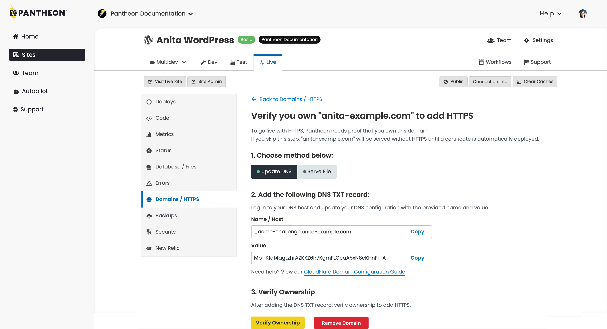

Sites are considered to have launched on Pantheon after traffic is routed through a custom domain(s). Relaunching a previously launched site is done by rerouting traffic from the existing Site Dashboard to an entirely new Site Dashboard.

<Alert title="Note" type="info">

The relaunch process applies exclusively to live sites already hosted on Pantheon. For more information on launching a site that is not already on the Pantheon platform, refer to [Launch Essentials](/guides/launch).

</Alert>

## Prepare for Relaunch

### Expected Disruption

During this procedure, there will be a brief period of disruption where requests to the custom domain will serve a `404 Unknown Site` error.

The `404 Unknown Site` error will be returned as soon as the custom domain is removed from the old site, and once connected to the new site dashboard with ownership verified, requests will immediately start to return a `200 OK` status once again. Requests will start routing to the new site dashboard after the TTL for the DNS records expires.

Due to the brief period of disruption when a `404 Unknown Site` error is returned to site visitors, we recommend planning a relaunch based on historical traffic patterns for the given site and scheduling the switch during off-peak hours.

When following the below procedure for relaunch, the duration of the disruption should be low, usually less than a few minutes.

### Before You Begin:

  <Alert title="Note" type="info">

If your site uses [Advanced Global CDN](/guides/agcdn), please [contact Support](https://pantheon.io/support) and your Customer Success Manager before proceeding. There may be configuration specific to your domain that Pantheon staff will have to update.

  </Alert>


1. Log in to the new Pantheon Site Dashboard as an [Admin, Team Member, or Privileged User](/guides/account-mgmt/workspace-sites-teams/teams#roles-and-permissions).

1. Open a new tab for the old Pantheon Site Dashboard.

1. In another tab, log in to the domain's DNS service provider (e.g., Cloudflare, Amazon Route 53, etc.).

1. Examine existing records pointing to Pantheon.

  <Partial file="standard-dns-config.md" />

  <Alert title="Note" type="info">

  For subdomains that are using Custom Certificates, use the bare domain's recommended A/AAAA records instead of using CNAME records.

  </Alert>

1. Set the TTL of existing DNS records as low as possible to minimize the impact of upcoming DNS changes

  <Accordion title="Learn More" id="ttl" icon="info-sign">

  #### Time to Live (TTL)

  The TTL dictates the lifespan of a DNS record; a shorter time means less time to wait until the changes go into effect. TTLs are always set in seconds with a few common ones being 86400 (24 hours), 43200 (12 hours), and 3600 (1 hour).

  When you make a change to the TTL of an existing record, you need to wait for the old TTL time to pass - that is, if it had been set to 86400, you would need to wait a full 24 hours for the new setting to begin propagating everywhere.

  </Accordion>

1. In your terminal, use [`dig`](https://en.wikipedia.org/wiki/Dig_(command)) to obtain the new site's A and AAAA records:

  ```bash{promptUser: user}
  dig +short live-site-name.pantheonsite.io
  dig +short AAAA live-site-name.pantheonsite.io
  ```

  You can also use the Google [web implementation](https://toolbox.googleapps.com/apps/dig/) of dig.

  <Alert title="Note" type="info">

  The `dig` command will not provide the correct DNS information for domains using Custom Certificates. If you are using a Custom Certificate, DNS records should not be changed.

  </Alert>

### Roles & Permissions

The permission to manage billing and plans is granted only to the role of **Site Owner** / **Workspace Administrators**. Other roles do not have access as described on this page.

<Alert title="Note" type="info">

If you need to assume site and billing ownership, the current Site Owner must [transfer it to you directly](/guides/legacy-dashboard/site-billing#transfer-ownership-and-billing-for-this-site).

To retain Preferred Pricing an updated [invitation to pay](/guides/legacy-dashboard/add-client-site/#send-an-invitation-to-pay-to-your-client) must be sent from the Supporting Workspace for the new site.

The new Site Plan will be billed immediately.

</Alert>

## Relaunch Procedure

<TabList>

<Tab title="All others" id="all-others" active={true}>

For a fast, smooth relaunch, consider having two browser tabs open, one with the old Site Dashboard, and one with the new.

1. In the new Site Dashboard, [upgrade the site from free to a paid plan](/guides/legacy-dashboard/site-plan#purchase-a-new-plan).

1. In the old Site Dashboard, remove the custom domain affected by the relaunch:

  **<Icon icon="wavePulse" /> Live** > **<Icon icon="global" /> Domains / HTTPS** > **Details** > **Remove Domain**

1. In the new Site Dashboard, connect the custom domain affected by the relaunch:

  **<Icon icon="wavePulse" /> Live** > **<Icon icon="global" /> Domains / HTTPS** > **Connect Domain**

1. Complete domain validation by adding a new DNS TXT record or by uploading a file to a specific URL, then click **Verify Ownership**:

  

1. In the Live environment tab of the Site Dashboard for the old site, click **Clear Caches**.

1. Repeat on the Live environment of the new site.

1. From the DNS hosting service (not Pantheon), replace values in DNS records pointed to Pantheon with new values provided in the Site Dashboard.

  <Partial file="standard-dns-config.md" />

1. Wait for TTL to expire.

1. Test and confirm that the new site is accessible via the custom domain over HTTPS (e.g., `https://www.example.com/`).

1. Repeat steps 2-6 above for each affected domain. Note `www.example.com` and `example.com` are different domains.

1. In the new Site Dashboard, [standardize traffic for the primary domain](/guides/domains).

1. In the old Site Dashboard, [downgrade the site from a paid plan to Sandbox](/guides/legacy-dashboard/site-plan/#cancel-current-plan).

1. In the old Site Dashboard, [remove the existing card as a payment method for the site](/guides/legacy-dashboard/site-billing/#do-not-bill-this-site-to-a-card). If you're a contract customer, you can skip this step.


</Tab>

<Tab title="Diamond and Platinum Customers" id="diamond-and-platinum">

For a fast, smooth relaunch, consider having two browser tabs open, one with the old Site Dashboard, and one with the new.

1. In the new Site Dashboard, [upgrade the site from free to a paid plan](/guides/legacy-dashboard/site-plan#purchase-a-new-plan).

1. In the old Site Dashboard, remove the custom domain affected by the relaunch:

  **<Icon icon="wavePulse" /> Live** > **<Icon icon="global" /> Domains / HTTPS** > **Details** > **Remove Domain**

1. In the new Site Dashboard, connect the custom domain affected by the relaunch and **skip** ownership verification.

  **<Icon icon="wavePulse" /> Live** > **<Icon icon="global" /> Domains / HTTPS** > **Connect Domain**
  <Alert title="Warning" type="danger">

  Do *not* update DNS yet. The Site Dashboard instructs you to configure DNS after connecting the domain, however for this relaunch procedure you should not change record values until instructed in step 7 below.

  Once you make this change, traffic will be routed to the new site. However, if you do not complete the rest of the steps as outlined here, you may run into cases where the new site has an invalid HTTPS certificate.

  </Alert>

1. In the Live environment tab of the Site Dashboard for the old site, click **Clear Caches**.

1. Repeat on the Live environment of the new site.

1. Wait for HTTPS to provision for the newly connected domains:

  **<Icon icon="wavePulse" /> Live** > **<Icon icon="global" /> Domains / HTTPS** > **Details**

   This process typically takes about an hour.

1. From the DNS hosting service (not Pantheon), replace values in DNS records pointed to Pantheon with new values provided in the Site Dashboard.

 <Partial file="standard-dns-config.md" />

1. Wait for TTL to expire.

1. Test and confirm that the new site is accessible via the custom domain over HTTPS (e.g., `https://www.example.com/`).

1. Repeat steps 2-6 above for each affected domain. Note `www.example.com` and `example.com` are different domains.

1. In the new Site Dashboard, [standardize traffic for the primary domain](/guides/domains).

1. In the old Site Dashboard, [downgrade the site from a paid plan to Sandbox](/guides/legacy-dashboard/site-plan/#cancel-current-plan).

1. In the old Site Dashboard, [remove the existing card as a payment method for the site](/guides/legacy-dashboard/site-billing/#do-not-bill-this-site-to-a-card). If you're a contract customer, you can skip this step.


</Tab>

</TabList>


## Frequently Asked Questions

### Why is this process needed?

Custom domains can only be attached to a single site environment at any given time. For scenarios where you want to move a custom domain to a new site, you must first remove the custom domain before it may be re-connected elsewhere on Pantheon.

### Will my site experience downtime?

If you follow the process outlined above, downtime will be minimal.

Once you complete step 2 above, the domain is unreachable until you complete the relaunch procedure. We recommend that you open the new site's Dashboard in another browser tab, then copy and paste the domain name from the old site to the new for a quick transition. You can also use [Terminus](/terminus) to run the two commands in immediate succession.

Set the TTL as low as possible (most DNS providers set a lower limit of 300 seconds, or 5 minutes). Having a long TTL on the changing DNS records increases how long you have to wait until you start getting routed to the new site dashboard.

Finally, the relaunch procedure should be done as a single process, as quickly as possible. Once you remove a domain from a site, you must quickly re-connect it to the new site dashboard and update DNS to mitigate disruption.

### Why do I need to lower my DNS TTL?

DNS records propagate across many different servers and aren't refreshed until the record on *each server* expires. This means that a record with a 24 hour TTL can take several days to be updated across DNS servers globally. We recommend lowering the TTL before a site relaunch.

Best practices during normal operation (e.g. not during a site relaunch) suggest a longer TTL (for example, 86400 seconds, or one day) because a long TTL helps reduce the number of DNS lookups that visitors' browsers need to perform. During a site relaunch, a long TTL can extend the time frame that return visitors are pointed to the old site, while new visitors are pointed to the new site.

### When do I switch the site from the old site to the new one?
As soon as the TTL expires after making the DNS changes (after step 5 above), visitors to your domain will start to see the new site. For some time afterwards, your visitors may still see the new site with the old site's HTTPS certificate, that will be spun down by the platform automatically once the new certification is provisioned and deployed.


## More Resources

- [Launch Essentials](/guides/launch)
- [Manage Plans in the Site Dashboard](/guides/legacy-dashboard/site-plan)
- [Billing in the Site Dashboard](/guides/legacy-dashboard/site-billing)
