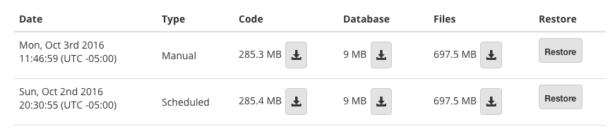
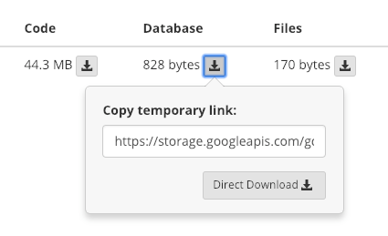
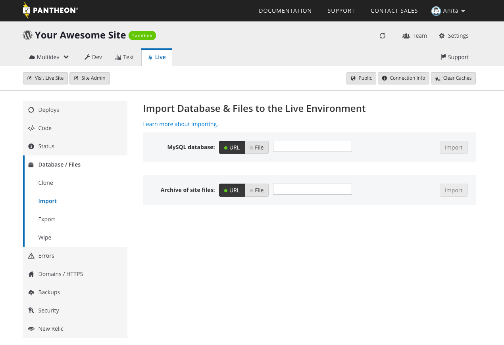
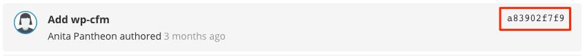

Each site environment's backups are located on the Backups tab for that environment in the Pantheon Dashboard.

<Alert title="Warning" type="danger">

We do not recommend directly restoring a Live environment from a backup; instead, restore to Dev or Test, then  pull the code change and clone the content to Live. This will minimize user-facing downtime.

</Alert>

If you need to restore your site to before the latest deployment, we recommend [undoing your last commit or deploy](/undo-commits) **before** attempting a site restore.

If you need to restore your database or file uploads, we recommend using the [Dashboard Import tool](/restore-environment-backup/#restore-database-and-files), using the URL from the appropriate backup. If your backup files are larger than 500MB, you will need to need to save them locally and [manually import the database](/migrate-manual/#add-your-database) or [sftp/rsync your file uploads](/rsync-and-sftp).

## Before you Begin the Restore Process

It is important that you and your team know that this is a **destructive** process that will **wipe** your database and files, and restore them from the backup. It will also restore the codebase to the state the environment was in when backed up.

When a restore starts, it is placed in a queue and executed. Depending on the size of the site, this operation may take some time; be patient and do not attempt to restart the restore unless you are confident that it completed. During the process of the restore, files may show as missing and the site may show as unavailable. When in doubt, [contact support](/support).


## Restore an Environment From Its Own Backup

Restore a manual or automatic backup (Code, Database, and Files) by clicking the **Restore** button to the right of a backup. This is the recommended and easiest method.

<Alert title="Note" type="info">

For development environments (e.g., Dev and Multidevs), the **Restore** button is only available when **Development Mode** is set to Git mode. This does not apply to production environments (e.g., Test and Live). For details, see [The Site Dashboard](/sites/#code).

</Alert>



## Restore an Environment From Another Environment's Backup

From within the source environment, find the backup you want to restore and click the download link for Database and Files:



This provides a temporary private link directly from Google Cloud Storage, the external backup host. These links will expire after a few minutes; if the link is no longer working, return to the Dashboard and get a new link. If you want to directly download the backup part (required for code), click **Direct Download**. Otherwise, copy the provided URL.

If you want to download a backup using wget, put the provided temporary link in double quotes (`"`) and include the `-O` option to specify the output file and extension based on which backup you are downloading. In the following example, replace both the temporary link and `output-file`:

```bash{promptUser: user}
wget "https://storage.googleapis.com/gcs-pantheon-backups/..." -O output-file
```

### Restore Database and Files

To restore Database and Files, navigate to the target environment and click the **Workflow** tab. Choose **File** and upload the backups for Database and Files if you downloaded the archives directly, otherwise provide the temporary URL for each backup. Click **Import** for each backup part to restore.

If you have an existing database or file archive that you want to import from an external source, you can also upload the content here.


### Restore Code

Code archives contain the full remote Git repository and reflect the state of code for the given environment. Backups created on the Test and Live environments automatically checkout the [`git tag`](https://git-scm.com/book/en/v2/Git-Basics-Tagging) associated with the most recent deployment. However, if you would like to rewind an environment's codebase to a previous state we recommend using `git revert` or `git reset` instead of a code archive.

#### Revert Commits and Preserve History

This method is recommended for distributed teams working collaboratively. To undo commits while preserving the site's Git history:

1. Identify the commit you want to undo using the commit history provided in the Site Dashboard or by reviewing `git log` locally.

1. Copy the commit ID:

 

1. Replace **ID** with the commit ID and run: `git revert ID --no-edit`

1. Push the reverted codebase to Pantheon: `git push origin master`

1. Deploy the change from Dev up to Test and Live.

For more information, see [git-revert](https://git-scm.com/docs/git-revert).

#### Reset Commits and Overwrite History

This is a destructive process. If you're not comfortable with this technique, use `git revert` instead. To reset the codebase and overwrite history:

1. Identify the last commit you want included using the commit history provided within the Site Dashboard or by reviewing `git log` locally.

1. Copy the commit ID:

 

1. Replace **ID** with the commit ID you want to reset and run: `git reset ID --hard`

1. Push the reset codebase to Pantheon: `git push origin master --force`
 The `--force` option should be used sparingly, especially in distributed team environments. For more information, see [git push](https://git-scm.com/docs/git-push).

1. Deploy the change from Dev up to Test and Live.

For more information, see [git reset](https://git-scm.com/docs/git-reset).

## Restore the Live Environment

As mentioned at the top of this page, we do _not_ recommend restoring  backups directly to the Live environment. This method increases the chance and possible duration of downtime to your public-facing site.

The restore process removes any recent content or changes applied to your site since the date the backup was created. Restoring directly to Live means you will lose code or content updates _forever_ with no way to recover.

If you still want to restore a backup to the Live environment, we recommend the following steps:

- [Lock the environment first](/security)
- [Run a backup](/backups) of LIVE, in order to have a copy of files and the database that will be overwritten
- Run the restore while the site is still locked

These steps allow you to recreate any new content manually after the process is complete. It also restricts access while the restore process is still running, which is a good practice to avoid conflicts or data corruption.

## Restoring Large Sites

Large sites that have more than 100GB files can take too long to restore and are likely to fail. We recommend the same steps as [restoring to the Live environment](#restore-the-live-environment) for a safer process.

Alternately, consider restoring only the code and database from backups, and move the content back up over [rsync](/rsync-and-sftp), as documented below:

### Restore Large Site with Terminus and Rsync

Using [Terminus](/terminus), you can restore all or part of a site from the command line. This is useful if you need to only restore one part of the site (code, database, files), or want to script a restoration process.

<Alert title ="Variables" type="export">

The commands below assume environment variables for `SITE` which is equal to your Site ID, and `ENV` for the environment you're working with (dev|test|live). You can determine your site's Site ID with the `terminus site:info` command.

Replace instances of `$SITE` and `$ENV` with your Site ID and environment, or define environment variables:

```bash{promptUser:user}
export SITE=11111-1111-1111111-1111111
export ENV=dev # or different environment name
```

</Alert>

1. Download the **Files** backups using the link provided in the Site Dashboard <span class="glyphicons glyphicons-download-alt"></span> **Backups** Tab:

  ```bash{promptUser:user}
  wget https://storage.googleapis.com/gcs-pantheon-backups/... -O file-backup.tar.gz
  ```

1. Restore Code and/or Database backups:

  ```bash{promptUser:user}
  terminus backup:restore $SITE.$ENV --element=code
  terminus backup:restore $SITE.$ENV --element=db
  ```

1. Expand the `file-backup.tar.gz` file:

  ```bash{promptUser:user}
  tar -xzvf file-backup.tar.gz
  ```

1. This will create a `files_env` directory. `cd` to it, and use rsync to copy your content back to the environment you're restoring. For example:

  ```bash{promptUser:user}
  cd files_$ENV
  rsync -rvlz --progress -e'ssh -p 2222' ./ --temp-dir=~/tmp/ $ENV.$SITE@appserver.$ENV.$SITE.drush.in:files/
  ```

See [rsync and SFTP](/rsync-and-sftp/#rsync) for more information on constructing your rsync command.

## Frequently Asked Questions

### How long does the restore process take?

When the Restore button is pressed, three (3) separate workflow process are triggered in the dashboard. One each for code, database, and assets (media files like images or other attachments). One workflow may complete ahead of the others.

There is no way to determine specifically how long any one restore job will take, as it varies per site. The usual factor that extends the restore process is the *count*, or number of files in the codebase or files backup. We've seen sites take more than one (1) hour to restore when they have 10,000 files or above, though this is not a strict ratio as individual file sizes also affect the time.

One way to estimate time to restore is to check the last backup duration. The Terminus `workflow:list` command will show workflow durations in the **Time Elapsed** field, in seconds.

```bash{outputLines: 2-9}
terminus workflow:list yoursite-name --fields id,env,workflow,time --format table
 -------------------------------------- ------------- --------------------------------------------- --------------
  Workflow ID                            Environment   Workflow                                      Time Elapsed
 -------------------------------------- ------------- --------------------------------------------- --------------
  31442e94-9e34-11e9-b40b-42010a800275   dev           Automated backup for the "dev" environment    2292s
  cce72480-9e2c-11e9-bece-42010a8001a4   live          Automated backup for the "live" environment   1290s
  cdb6df62-9d6a-11e9-85d1-42010a800117   dev           Automated backup for the "dev" environment    4328s
  f194a2fa-9d62-11e9-b1a0-42010a800117   live          Automated backup for the "live" environment   5152s
  de32c0fa-9ca1-11e9-a9aa-42010a800117   dev           Automated backup for the "dev" environment    2335s
```
