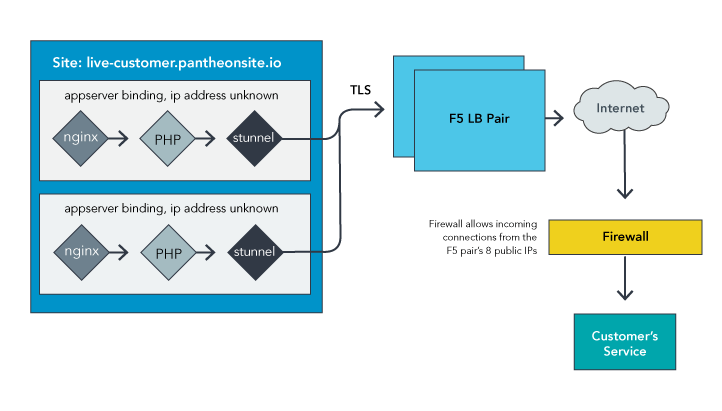

[Pantheon Secure Integration](https://pantheon.io/features/secure-integration), formerly known as Pantheon Enterprise Gateway (PEG), creates a secure tunnel between your firewall and your public facing website. This is available for customers with an annual contract. [Contact us](https://pantheon.io/contact-us) for more information.

One of the effects of the elastic nature of Pantheon's platform is that sites have a [dynamic outgoing IP](/outgoing-ips). Container IP addresses are not constant, so direct connections aren't sustainable. This can be a problem if your site needs to communicate with another service that restricts traffic by source IP. Secure Integration provides a solution.

## How It Works

Secure Integration uses TLS encryption to create a tunnel from the application containers to a pair of [F5 load balancers](https://f5.com/glossary/load-balancer), offering a consistent IP address range (*not* a single address) from which requests are made to your local service.



## Create a Secure Tunnel

[Contact support](/support) and provide the following for each of your remote services:

- IP address
- Port number
- Name to identify connection
  - Uppercase letters and underscores allowed
  - Used for [PHP Constant](https://secure.php.net/manual/en/language.constants.php) that will replace the numeric port number in your code

Once setup is complete on our end, we'll provide you with the information you need to use Secure Integration, including a PHP constant in the format `PANTHEON_SOIP_EXAMPLE`, where `EXAMPLE` is replaced with the service name you specify.

## Configure Your Site

Once the gateway has been established, you must update your code to use it. This process varies depending on the modules or plugins in use, and the type of service you're routing through the gateway.

### PHP Constants as Port Numbers

Once your Secure Integration is configured, we update your site environment with the PHP constant `PANTHEON_SOIP_EXAMPLE`. This constant translates to the port number, internal to your Pantheon Site, through which your external service can be accessed.

### Example LDAP Connection with PHP Constants

Please note that any code you're using to connect to the remote service must accept a PHP Constant for the port number. For example: If you have two LDAP servers, one for staff and another for students, you may choose `PANTHEON_SOIP_LDAP_STAFF` and `PANTHEON_SOIP_LDAP_STUDENTS` as names to identify the connections.

Direct connection, no Secure Integration:

```php
123.45.6.22:443
223.23.4.33:443
```

With Secure Integration:

```php
127.0.0.1:PANTHEON_SOIP_LDAP_STUDENTS
127.0.0.1:PANTHEON_SOIP_LDAP_STAFF
```

In cases where you cannot supply a direct PHP constant, consider wrapping it into a variable. For example:

```php
$externalconnection = "http://127.0.0.1:" . PANTHEON_SOIP_EXAMPLE;
```

See also: [FAQ and Troubleshooting for LDAP](/ldap-and-ldaps/#frequently-asked-questions)

## Considerations

### Set Reasonable Timeouts

<Alert title="Note" type="info" >

It is very important to set reasonable timeouts for requests sent via Secure Integration, since [normal PHP timeouts](https://secure.php.net/manual/en/function.set-time-limit.php) are not considered on external requests. Outages can occur when timeouts are not appropriately set, due to failing gateway connection requests that build up and consume resources.

</Alert>

Set reasonable timeouts using [PHP's cURL functions](https://secure.php.net/manual/en/function.curl-setopt.php) by setting `CURLOPT_TIMEOUT` and `CURLOPT_CONNECTTIMEOUT`. For a more complete example, see: [Single-origin IP example code](https://github.com/pantheon-systems/soip-example).

### Patch LDAP Module (Drupal 7 Only)

WordPress and Drupal both work with Secure Integration. If you’re using the Drupal 7 LDAP module, apply the [patch](https://www.drupal.org/files/issues/ldap_php-constant-port_1.patch) prepared by one of our engineers [listed on Drupal.org](https://www.drupal.org/node/2283273). The patch allows the use of a PHP constant for the port number, and gives a good example should you need to write a similar patch for another module.

## FAQ

### Does Secure Integration work from all site environments?

Yes, it's configured on a site-by-site basis and works from all environments (Dev, Test, Live, and Multidev).

### Does Secure Integration support connections to multiple external resources?

Secure Integration connects to the same external resource from all environments. If you need to connect to a separate resource, or test against a “test” version of the external resource, you will need an additional Integration configured to point to that resource. The additional Integration would be available to all environments.

### Is Secure Integration a replacement for authentication?

No, Secure Integration is not a replacement for authentication, but rather is a [defense-in-depth](https://en.wikipedia.org/wiki/Defense_in_depth_%28computing%29) measure.
