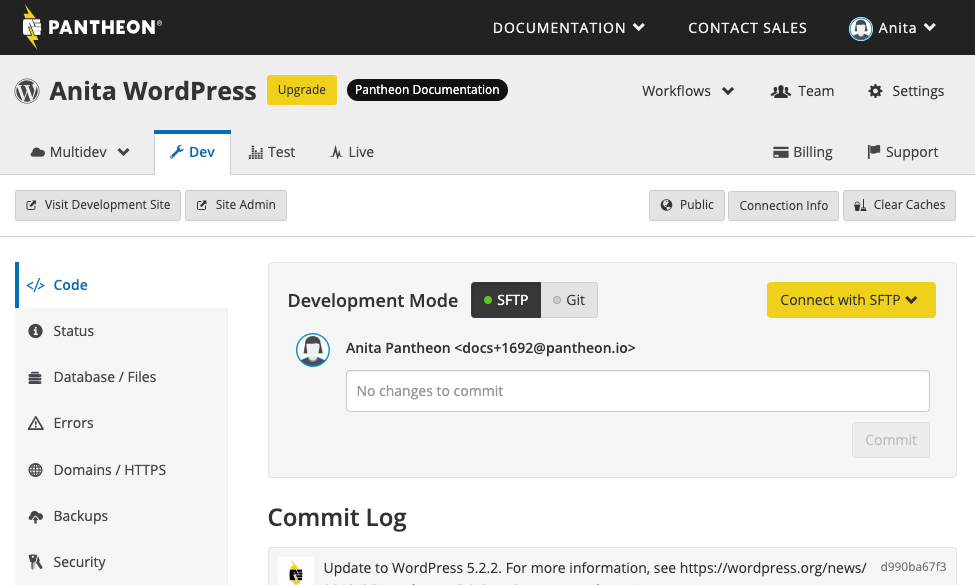
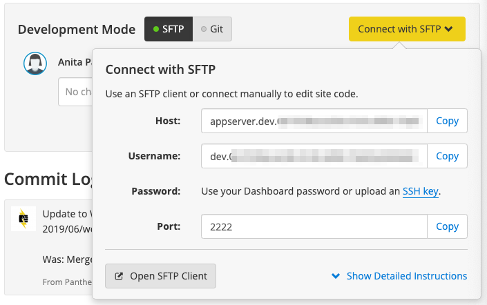
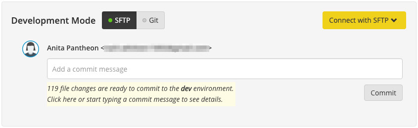

<Enablement title="Get WebOps Training" link="https://pantheon.io/learn-pantheon?docs">

Optimize your dev team and streamline internal workflows. Pantheon delivers on-demand training to help development teams master our platform and improve their internal WebOps.

</Enablement>

In some cases, working via Git may not be the best option. You may not like local development, or you may want to show work to a remote collaborator (or client) immediately, or need to debug a platform-specific problem.

SFTP mode allows you to develop directly on Pantheon. If you want to use the WordPress or Drupal Dashboard (e.g. the `apps.module` in Drupal, or the plugin/theme manager in WordPress), enable SFTP mode first. For details, see [Working in the WordPress Dashboard and Drupal Admin Interface](/cms-admin).

<Alert title="SFTP Mode Considerations" type="danger">

#### Commit Frequently

Keep in mind:

- SFTP changes to code that have not been committed will *not be saved in backups and not included in deployments* as they are not part of your code repository yet.
- Changing your site's connection mode from SFTP to Git will discard all uncommitted file changes. If you want to keep work in progress, commit before toggling the connection mode.
- Containers are migrated as a regular part of maintenance.  This can delete uncommitted changes.
- You won't be able to save anything that's been excluded from version control via `.gitignore`.

</Alert>

## SFTP Mode

Every Development environment has a toggle to switch between SFTP and Git modes. This is to prevent you from accidentally overwriting changes from a different source. To enable SFTP mode, click the **SFTP** button next to Development Mode.

When in SFTP mode, there's comment box above the commit log. As you make changes to the codebase, the Dashboard will track your pending changes for you to see. You can then commit them to version control once you are happy with the results without having to ever use Git directly.

 

## SFTP Connection Information

To get your SFTP login credentials, click **Connect with SFTP**. You will see your connection credentials and a button to connect directly with your preferred client.

 

The connection information is a bit different than what you might be used to. It's based on your unique "Site ID". This is the long string at the end of your Dashboard URL.

Your connection data is as follows:

**host:** `appserver.dev.site-id.drush.in`

**user:** `dev.site-id`

**port:** `2222`

<Alert title="Note" type="info">

When you set up your SFTP client, remember to specify the SFTP protocol and connect to your environment using port 2222.

</Alert>

You can connect to an environment over SFTP using the terminal. The command is easily accessible from the Connection Information widget.

There is also a one-click option so you can connect with a GUI client. The main directory listing includes Pantheon, logs, environment data and configuration. Your website is in the `code` directory. For instance, in Cyberduck on MacOS :


For instructions for other client, jump down to [SFTP clients](#sftp-clients).

<Partial file="auth.md" />

## Committing SFTP Changes

Even though you are unable to use Git to push remotely with SFTP mode enabled, you still need to commit your changes to save them, or push them to Test/Live. **Commit early and commit often**.

Large sets of code changes taking longer than two minutes to commit may timeout and fail to commit. In those cases, temporarily remove some of your code changes (new modules or plugins), then try again.

After making a change to your code, you will see a message on the Dashboard, below the comment box, letting you know you have uncommitted changes. Click the notification message to expand the listing of pending changes.



Write a helpful commit message to go with your changes. This make maintaining your code a saner process, and make it easier for any other developers to understand what you've done.

Once your message is ready, click **Commit**.

<Alert title="Note" type="info">

Your Dashboard tracks all changes made within your codebase. File change notifications will not include changes in the content files directory (e.g. `wp-content/uploads` or `sites/default/files/`) since these are not tracked in version control. For more information, see [Use the Pantheon WebOps Workflow](/pantheon-workflow).

</Alert>

## Discard & Abandon SFTP Changes

Toggle the **Connection Mode** from **SFTP** to **Git** to *permanently* discard all SFTP changes that have not been committed, such as the 119 file changes shown above.

This can be useful when you have many changes you wish to undo or if it would otherwise be difficult to manually revert all the changes. Toggle back to **SFTP** mode when you're ready to resume SFTP development.

## SFTP Clients

SFTP mode works with any standards-compliant SFTP client, including many GUI tools and IDEs. We have specific guides to some:

- PHPStorm with [WordPress](/wordpress-phpstorm) and [Drupal](/drupal-phpstorm)
- [WinSCP](/winscp)
- [Visual Studio Code](/visual-studio-code)

## Troubleshooting

### I can't connect via SFTP to the site

Make sure your site has not [spun down after being idle](/application-containers/#idle-containers). Visit the site in your web browser and let it fully load then try connecting again.

If your site is not idle and your [SFTP settings are correct](/sftp/#sftp-connection-information) (including SFTP mode and port `2222`) you may be on a network that restricts what outbound ports you can access. An example may be an office or public wifi that only allows web traffic on port `80` (HTTPS)  and `443` (HTTPS).

A simple way to test for outbound network restrictions is to load a special web site that listens on all ports. To test your access outbound on port `2222`, try to load this web page in your web browser:

- [http://portquiz.net:2222/](http://portquiz.net:2222/)

If you **cannot** access that web page then your network or firewall is likely preventing you from accessing port `2222` outbound. Contact your network administrators to allow outbound access on port `2222`. Advanced users may also be comfortable [establishing an SSH tunnel through another server](/port-2222) instead.

If you **can** access that web page on port `2222` then your issue does not appear to be network or firewall related.  Be sure to double-check or re-enter your [SFTP settings](/sftp/#sftp-connection-information), including SFTP mode and port `2222`. Contact Pantheon Support if you still have trouble.

### I registered my Pantheon account via Google. How do I connect to SFTP?

We recommend [adding an SSH Key](/ssh-keys), which allows more security than a simple password. If you've registered via social login (Connect with Google) and you'd still like to add a password to your account, logout and visit [https://dashboard.pantheon.io/reset-password](https://dashboard.pantheon.io/reset-password)

### I can't write to my codebase on Test or Live.

This is part of the [Pantheon WebOps workflow](/pantheon-workflow) that keeps code and content safe. Please see [Using the Pantheon Workflow](/pantheon-workflow#understanding-write-permissions-in-test-and-live) to learn more about why.

### SFTP changes do not show up in the Site Dashboard.

Uncommitted SFTP changes may not be recognized by the Dev environment when the Site Dashboard is open in multiple tabs or windows. Close all windows and tabs then access the Site Dashboard in a single tab to resolve.

### How do I find my site's remote path?

<Alert title="Note" type="info">

You should *not* manually set the "Remote Path" in your SFTP client's settings, as this path changes from time to time due to the platform architecture. It is strongly recommended that you leave the Remote Path blank, and you will automatically be redirected to the proper directory when logging in.

</Alert>

You can find the Remote Path, also known as the **binding path**, after [connecting to SFTP](#sftp-connection-information) via command line, using the `pwd` (print working directory) command:

```bash
sftp> pwd
Response: Remote working directory: /srv/bindings/daa068ccf4f8414596cddf5xxxxx
```

### I am receiving errors connecting to my server with an SFTP client.

This is caused by using the SFTP application's default connection settings. We recommend you set the connection limit to **1** and then connect to your site.

Do not specify a default remote directory within your SFTP client. When application containers are migrated, which can be done at anytime, the remote directory will change.

### I can't move files or folders from one directory to another.

This is a known limitation of using SFTP for on-server development on the platform. Our SFTP mode doesn't support the `mv` command, which most SFTP applications use when moving or renaming files. You can work around the limitation by transferring the files from your local machine or using rsync.

### DNS Connection Issues

```none
Status: Connecting to appserver.dev.dc82c743-3088-426f-bfcf-e388e4add2b3.drush.in:2222...
Response:    fzSftp started
Command:    open "dev.dc82c743-3088-426f-bfcf-e388e4add2b3@appserver.dev.dc82c743-3088-426f-bfcf-e388e4add2b3.drush.in" 2222
Error:  ssh_init: Host does not exist
Error:  Could not connect to server
```

Trouble resolving the server hostname or other DNS-related issues can generally be resolved by using Google's Public DNS service in place of your ISP's name servers. See [Google's Public DNS](https://developers.google.com/speed/public-dns/) for instructions.

If you're already using Google's DNS, or you're still having connection issues after updating your name-servers, consider trying an alternative SFTP client. Many times when FileZilla won't connect, Cyberduck (or another client) will. View a list of [SFTP clients](https://en.wikipedia.org/wiki/Comparison_of_FTP_client_software).

### DNS Hijacking Issues

There have been observed cases in which Internet Service Providers (specifically Indonesian Telecom) hijack DNS, leaving you unable to connect via SFTP due to a timeout error:

```none
Unable to connect to host codeserver.dev.<xxx>.drush.in, or the request timed out.
Be sure that the address is correct and that you have the necessary privileges, or try increasing the connection timeout (currently 10 seconds).
```

Replace `SITE_UUID` with your site's [UUID](/sites/#site-uuid) and run the following to obtain the returned IP address:

```bash{promptUser: user}
dig codeserver.dev.<SITE_UUID>.drush.in
```

The returned IP is found within the ANSWER portion of the output:

```bash
;; ANSWER SECTION:
codeserver.dev.<SITE_UUID>.drush.in. 188 IN A xx.xx.xx.xxx
```

Run the address through [IP WHOIS Lookup](https://www.whatismyip.com/ip-whois-lookup/) and review the results. The following is an example of DNS hijacking:

```none
% [whois.apnic.net]
% Whois data copyright terms    https://www.apnic.net/manage-ip/using-whois/bulk-access/copyright/

% Information related to 'xx.xx.xx.0 - xx.xx.xx.255'

inetnum:        xx.xx.xx.0 - xx.xx.xx.255
netname:        TLKM_BB_SERVICE_36_86
descr:          PT TELKOM INDONESIA
                STO Gambir 3rd Floor
                Jl. Medan Merdeka Selatan No. 12
                Jakarta 10110
country:        ID
admin-c:        AR165-AP
tech-c:         HM444-AP
status:         ALLOCATED NON-PORTABLE
mnt-by:         MAINT-TELKOMNET
mnt-irt:        IRT-IDTELKOM-ID
changed:        hostmaster@telkom.net.id 20130123
source:         APNIC
```

Unfortunately, no permanent solution has been found aside from changing Internet Service Providers. In some cases, you may be able troubleshoot the issue with your ISP or connect using a VPN.
