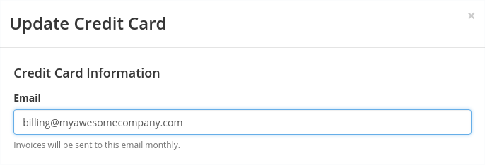

<Alert title="Note" type="info">

Did you know Pantheon offers savings for sites purchased with annual billing plans? See [Pantheon Annual Billing](/annual-billing) for more information.

</Alert>

## Access Site Billing

1. From the User Dashboard, click on the site you want to access billing for.

1. Go to the Site Dashboard and click the **Billing** tab.

<Alert title="Note" type="info">

Changing your site billing is typically done at launch time. For a comprehensive step-by-step guide to going live, refer to [Launch Essentials](/guides/launch).

</Alert>

### Roles and Permissions

The permission to transfer ownership or update payment method is granted only to the role of **Site Owner**. You can see who is assigned the role of Site Owner by clicking ** Team** in the Site Dashboard. Other roles do not have access to billing as described on this page.

<Alert title="Note" type="info">

If you need to assume site and billing ownership, the current Site Owner must transfer it to you directly, as described [below](#transfer-ownership-and-billing-for-this-site).

</Alert>

## View a Recent Invoice from the Dashboard

<Partial file="view-invoices.md" />

## Transfer Ownership and Billing for This Site

<Partial file="transfer-ownership-billing-intro.md" />
<Partial file="transfer-ownership-billing-steps.md" />

## Your Credit Cards

### Add a New Credit Card

If the site is currently in Sandbox mode (free), [upgrade the site plan](/guides/launch/plans/) to add and begin billing to a credit card. For all other plans, this process will add a new credit card profile in ** Account** > **Billing** of your User Dashboard.

1. Go to the Site Dashboard and click the **Billing** tab.

1. Find the existing card under **Billing Information** and click **Change** next to it, then click **Add New Card**.

1. Enter your credit card information and click **Add Card**.

1. To add the card to the site, select the new card and click **Update Credit Card**.
    - Skip this step to store the card without adding it to the site.

Once you have added the card, set it as the new payment method for the site as described in the [next section](#bill-this-site-to-a-new-card).

### Bill This Site to a New Card

Select the card you want the site to use as the new payment method _after_ it has been added as described in the [previous section](#add-new-credit-card).

1. Go to the Site Dashboard and click the **Billing** tab.

1. Find the existing card under BILLING INFORMATION and click **Change** next to it.

1. Select the new card and click **Update Credit Card**.

 You should get a message saying "Your billing information has been updated!"

### Do Not Bill This Site to a Card

A credit card can only be removed from a site when that site is set to [bill another card](#bill-this-site-to-a-new-card) or when the site is [downgraded to Sandbox](/site-plan/#cancel-current-plan).

After downgrading from a paid plan to Sandbox, remove the card as a payment method for the site:

1. Go to the Site Dashboard and click the **Billing** tab.
1. Find your card under BILLING INFORMATION and click **Remove Card**.

 You should get a message saying "**Your credit card is removed.** This site is no longer associated with the credit card."

### Replace or Update an Old or Expired Credit Card

<Partial file="replace-credit-card.md" />

## Frequently Asked Questions

### What forms of payment are accepted?

Sites purchased online through the Pantheon Site Dashboard accept credit card payments only. Pantheon does not currently accept alternative methods of payment for online site purchases (e.g., checks, PayPal, etc.).

### Does Pantheon accept PayPal?

Pantheon currently does not accept PayPal.

### Can there be more than one site owner?

A site can only have one site owner.

### Can the payment for a site be split between multiple cards.

No, payment for a site can only come from one card at a time.

### Why don't I get email notifications about upcoming billing?

When a billing cycle approaches, billing emails are only sent to the billing contact email. The billing contacts is set by the [Site Owner](#roles-and-permissions) when they enter a credit card for payment:

If you are the billing contact for an online site plan, check your spam folder, and try adding `cse-billing@pantheon.io` and `noreply@getpantheon.com` to your contacts. You can also reach out to your IT department to see if the emails are in quarantine.

## See Also

- [Account Billing in the User Dashboard](/account-billing)
- [Manage Plans in the Site Dashboard](/site-plan)
- [Traffic Limits and Overages](/traffic-limits)
- [Site Plans FAQs](/site-plans-faq)
