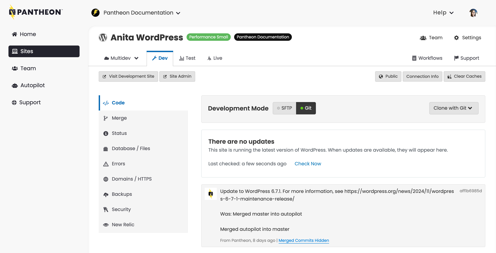

The Pantheon Site Dashboard is the hub of all development and activity for an individual site.

## Header Elements

On the top left of the page, you will see the following information:

- The icon for the CMS you have installed
- The name of the site.
- If applicable, a yellow **Upgrade** button, that will allow you to [upgrade the site](/guides/account-mgmt/plans/site-plans).
- If applicable, the name of the Professional Workspace containing this site.

On the right side, there are two rows of options:

- Workflows: displays information about any active workflows.
- Team: [manage the team](/guides/account-mgmt/workspace-sites-teams/teams#manage-teams) specific to this site.
- Settings: [manage add ons](/guides/account-mgmt/plans/site-plans), [delete site](https://docs.pantheon.io/guides/account-mgmt/workspace-sites-teams/sites), and site information, including the PHP version.
- Billing: [payment methods](/guides/account-mgmt/billing/methods) specific to this site.
- Support: search for documentation, or start a chat with a Pantheon Customer Success Engineer.

## Environment Tabs

### <Icon icon="cloud" size="lg"/> Multidev

Multidev enables developers to design and build in multiple concurrent development environments with just a few clicks without touching the live site.

### <Icon icon="wrench" size="lg"/> Dev

By default, you’ll find yourself on this tab. This is your development environment. It provides access to a stand-alone copy of your site, with its own codebase, database, and files.

Within the safety of this isolated environment, you can edit code and make updates to your site. All development on your Pantheon sites starts here.

### <Icon icon="equalizer" /> Test

This environment is for reviewing the changes made in your Dev environment with the most recent content from your live site.

### <Icon icon="wavePulse" size="lg"/> Live

This environment is for your live site, where content creators actively post and upload media files. After passing review, you push your new code “up” from the Test environment to this Live environment.

## Left Navigation

The following buttons are found above the lefthand navigation menu on every environment in the site dashboard:

- **Visit `Environment` Site**: Where `Environment` is a placeholder for the active environment you're currently looking at in the dashboard, such as **Visit Test Site** or **Visit Development Site** etc. This will open the homepage of your site for the given environment in a new tab.

- **Site Admin**: This will open your sites admin login page for the given environment in a new tab. If you're not already logged into your sites admin interface, this button will open `/user/login` for Drupal and `/wp-login.php` for WordPress. Once you've logged in and have an active admin session, this button will take you to `/user` for Drupal and `/wp-admin` for WordPress.

<Alert title="Note" type="info">

By default, the buttons described above will open links that are served via their respective [platform domains](/guides/domains/platform-domains) (e.g., `test-example.pantheonsite.io`). If you want these buttons to open your site using your own custom domain instead (e.g., `test.example.com`) you can connect a [custom domain](/guides/domains/custom-domains) then configure it as the [primary domain](/guides/domains/primary-domain) for the target environment. This is typically only done for the Live environment as part of launch however you can do this anytime for any environment based on your preferences and requirements.

</Alert>

The following navigation items are found on the lefthand side in the site dashboard:

- **Code:** Switch between SFTP Connection Mode and Git Connection Mode. Obtain SFTP Connection Info, and commit changes to your Dev environment. In the center of this page you will find the site's commit log with an activity feed of all code changes. (This tab is only accessible within your Dev or Multidev environments.)

- **Deploys:** View a deploy log for the environment. (This link is only accessible within your Test and Live environments.)

- **Merge:** If you have a Multidev environment, use this tab to merge branches into your master branch. (This tab is only accessible within your Dev environment.)

- **Status:** Check this page on a regular basis (especially before you go live the first time) to catch common problems and follow best-practice recommendations for site configuration.

- **Database / Files:** Workflow tools are provided to clone your database and files between environments with the click of a button.

  - **Clone:** Clone the database and/or files from one environment to another.

  - **Import:** Replace your current database and files with an archive.

  - **Export:** Package and download your database and files in an archive.

  - **Wipe:** Reset the database and files, and start fresh with your codebase.

- **Errors:** This page provides links on how to access error logs on Pantheon. You can find all your error logs by connecting via SFTP.

- **Domains/HTTPS:** Add custom domains to your site, enable SSL and manage certificates. (This feature is only available on paid plans.)

- **Backup:** Create a backup of the environment.

  - **Backup Log:** View existing backups of the environment. Click the <Icon icon="download" text="Download"/> icon to download individual archives within a backup.

  - **Backup Schedule:** Schedule daily or weekly automatic backups of the environment. (This feature is only available on paid plans.)

- **Security:** Set a password for accessing this environment.

- **New Relic:** Use this server-side performance monitoring tool to identify bottlenecks and optimize your site.
