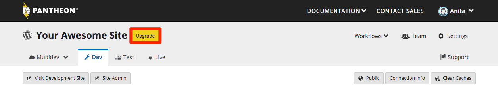
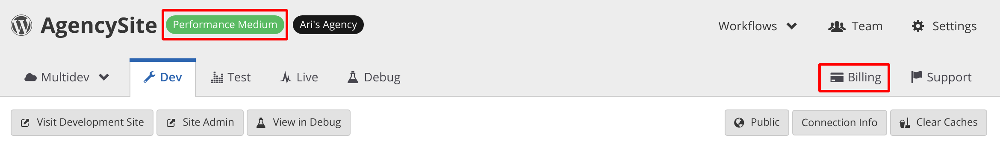
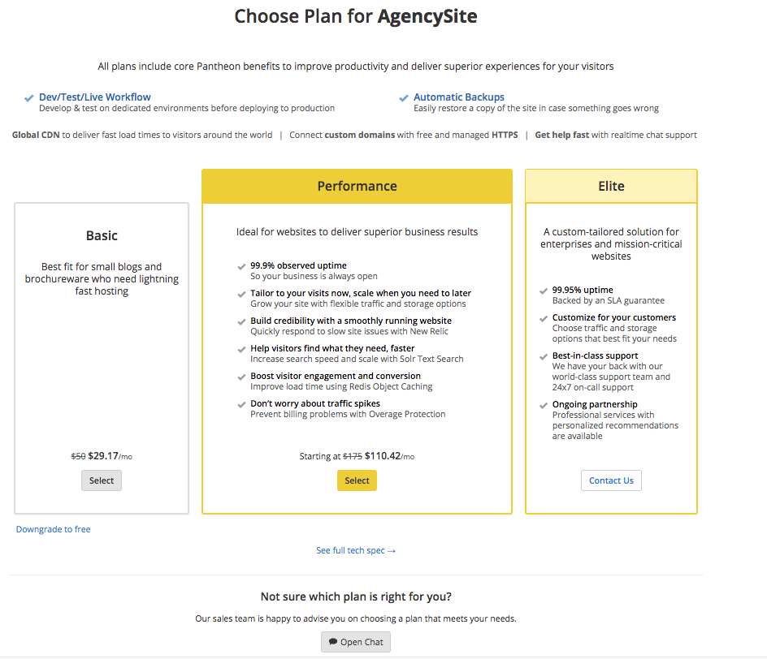

Changing your site plan is typically done at launch time. For a comprehensive step-by-step guide to going live, refer to [Launch Essentials](/docs/guides/launch/).

If your site benefits from [Preferred Pricing](https://pantheon.io/plans/agency-preferred-pricing){.external}, contact your Supporting Organization for assistance and to maintain your special pricing rate.

## Access Site Plan
1. Go to the Site Dashboard.
2. For Sandbox sites, click the **Upgrade** button:
 
 Otherwise, click the **current plan**:
 

<Alert title="Note" type="info">

Changing your site plan is typically done at launch time. For a comprehensive step-by-step guide to going live, refer to [Launch Essentials](/docs/guides/launch/).

</Alert>

## Upgrades
Site plan upgrades will change your site's resources and access to features immediately. The associated card will be charged a prorated amount for the remainder of the current billing period.

## Downgrades
Site plan downgrades will change your site's resources and access to features immediately. Beginning on the next billing cycle, the associated card will be charged for the new site plan.

## Roles & Permissions
The permission to manage a site's plan is granted only to the roles of **Site Owner** / **Organization Administrator**. Other roles do not have access to change the site plan as described on this page. For details, see [Role-Based Permissions & Change Management](/docs/change-management/#site-level-roles-and-permissions).

<Alert title="Note" type="info">

If you need to assume site and billing ownership, the current Site Owner must [transfer it to you directly](/docs/site-billing#transfer-ownership-and-billing-for-this-site).

</Alert>

## Considerations
Consider the following changes to feature access _before_ upgrading or downgrading the site's plan. Certain scenarios require code changes in order to safely change the site plan.

### Sandbox
[Custom domains](/docs/domains/#custom-domains) are not available to Sandbox sites. Downgrading to a Sandbox site will **automatically delete** existing custom domains across all environments of the site. If you decide to return to a paid plan in the future, you will need to add the domains again.

Downgrading to a Sandbox site will disable automatic backups. You will still be able to create backups manually. For details, see [Backups Tool](/docs/backups/).

### Basic Plan
[New Relic](/docs/new-relic/), [Redis](/docs/redis/), and [Solr](/docs/solr) are not available for Basic sites. These features must be disabled in order to select Basic as the new site plan when upgrading or downgrading plans.

For Redis and Solr, the following code changes are required before the feature can be safely disabled:

<TabList>

<Tab title="WordPress" id="wp-id" active={true}>

#### Safely Remove Redis

`markdown:remove-addons/wp-redis.md`

#### Safely Remove Solr

`markdown:remove-addons/wp-solr.md`

</Tab>

<Tab title="Drupal 8" id="d8-id">

#### Safely Remove Redis

`markdown:remove-addons/drupal-redis.md`

#### Safely Remove Solr

`markdown:remove-addons/d8-solr.md`

</Tab>

<Tab title="Drupal 7" id="d7-id">

#### Safely Remove Redis

`markdown:remove-addons/drupal-redis.md`

#### Safely Remove Solr

`markdown:remove-addons/d7-solr.md`

</Tab>

</TabList>

### Elite Plan
Elite sites cannot manage plans from the Site Dashboard. [Contact our sales team](https://pantheon.io/contact-us) or reach out to your dedicated Client Sales Executive for details.

### Enterprise Organizations
Plan prices are not shown in the Site Dashboard, and you will not be prompted to enter billing information as described below.

If the site is associated with an Enterprise Flagship organization, additional Performance plans not shown in the Site Dashboard are available to purchase.

[Contact our sales team](https://pantheon.io/contact-us) or reach out to your dedicated Client Sales Executive for details.

## Purchase a New Plan
This section covers purchasing a new plan. Review the [previous section](#basic-plan) on feature availability before switching plans to Basic.

<Alert title="Note" type="info">

Did you know Pantheon offers savings for sites purchased with annual billing? See [Pantheon Annual Billing](/docs/annual-billing/) for more information.

</Alert>

### Select Plan
1. Go to the Site Dashboard.
2. For Sandbox sites, click the **Upgrade** button. Otherwise, select the lable for the site's current plan.
3. Click **Select** to switch plans:

 

### Enter Billing Information
Site ownership is designated to the user account entering billing information.

<TabList>

<Tab title="Add New Card" id="add-cc-id" active={true}>

If this is your first time taking a site live on Pantheon, you'll likely need to add a new card to your account:

1. Click the ** Add New Card** link.
2. Enter the email address you would like invoices sent to.
3. Enter your credit card information and click **Add Card**.
4. Make sure the desired card is selected and click **Continue**.

</Tab>

<Tab title="Select Existing Card" id="existing-cc-id">

To associate an existing card from your account as the payment method for this site:

1. Select the desired card.
2. Click **Continue**.

</Tab>

<Tab title="Send a Request" id="request-payment-id">

`markdown:transfer-ownership-billing-intro.md`
`markdown:transfer-ownership-billing-steps.md`

</Tab>

</TabList>

### Confirm Your Purchase
1. Make sure the **Plan** details are correct.
2. Verify the card shown in **Billing** details.
3. Click the **Submit** button.

The Site Owner will receive an email confirmation of this change, a new invoice will be issued, and a prorated amount for the current billing cycle will be credited or charged to the associated card automatically.

Invoices and transaction history related to this change can be found in ** Account** > **Billing**.

## Cancel Current Plan
Review the [previous section](#sandbox) on feature availability before downgrading to Sandbox.

<Alert title="Note" type="info" >

While all site plans downgrades will be effective immediately, no partial refunds will be issued, per our [terms of service](https://pantheon.io/terms-of-service#tos-11).

</Alert>

1. Go to the Site Dashboard.
2. Select the current plan:
 
3. Click the **Downgrade to free** link to cancel the current plan:
 
4. Check **Yes, cancel my plan** then click **Continue**:
 
5. Make sure the change details are correct, then click **Submit**.
6. Remove the existing card as a payment method for the site. For details, see [Billing in the Site Dashboard](/docs/site-billing/#do-not-bill-this-site-to-a-card).

Optionally, you can remove the Sandbox site after downgrading. For details, see [Deleting a Site on Pantheon](/docs/delete-site/).

## See Also
- [Billing in the Site Dashboard](/docs/site-billing/)
- [Account Billing in the User Dashboard](/docs/account-billing/)
- [Traffic Limits and Overages](/docs/traffic-limits/)
- [New Site Plans FAQs](/docs/new-plans-faq/)
