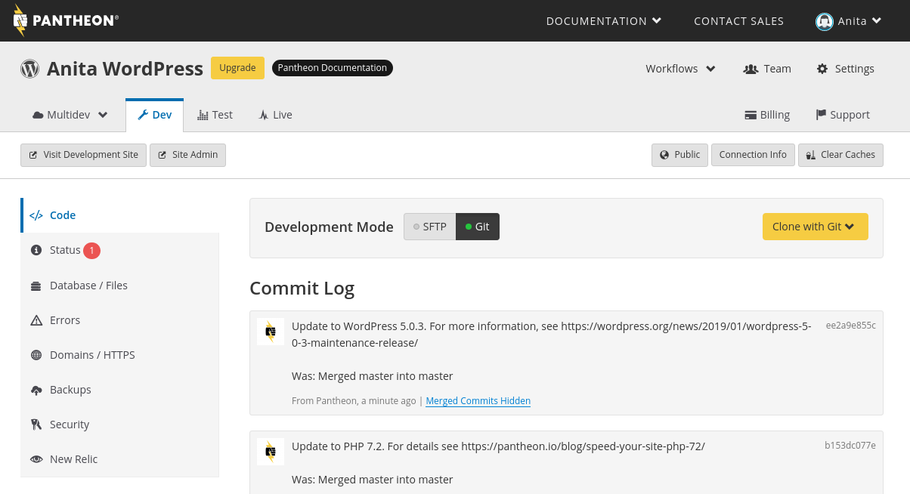
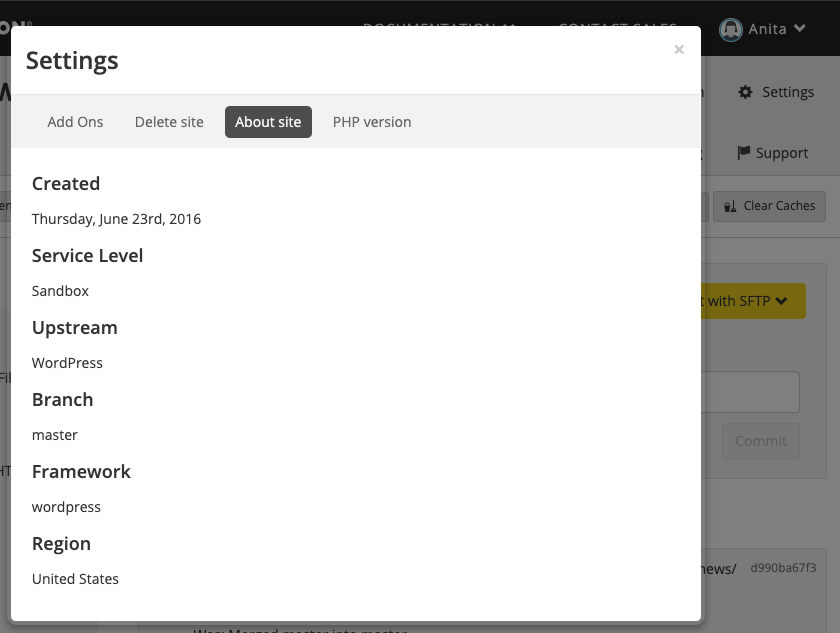
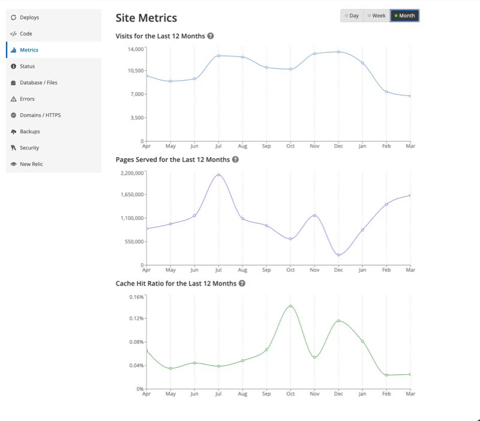

The Site Dashboard is where you can find all the tools you need to successfully build, launch, and manage your site.



At the top of the page you'll find all the environments for your site: Dev, Test, and Live. Additional development environments are available with [Multidev](/multidev).

The **Visit Site** button is available for each environment so you can view the site in each environment. This helpful to view changes in Dev or Test before moving them to Live.

## Workflows

When there is a change to the structure of the site, such as a site plan change, newly committed code changes, cleared code cache, an automated backup completes, etc., the status of that event appears in the <dfn id="workflows">Workflows</dfn> dropdown. If the status is red, the transaction failed and more information may be available in the Status or Errors sections.

When an event has triggered a Workflow, an animated <span class="fa fa-spinner"></span> icon appears to the left of **Workflows**.

## Team

The Team tab allows you to change the site owner; add supporting agencies; and add, manage, and delete users. For more information, see [Team Management](/team-management).

## Settings

### Add-Ons

Pantheon offers several add-ons to help you build dynamic sites. These include [Apache Solr](/solr) and [Redis](/object-cache).

### Delete Site

If you no longer need your site, you can remove it here.

<Alert title="Warning" type="danger">

This is a permanent change and once you delete it your site cannot be restored.

</Alert>

### About Site

This tab shows general information about your site, such as the framework, upstream, date it was created, and your current plan.

#### View your Site's Upstream

To find your site's upstream, click **Settings**, then **About Site**.



### PHP Version

The site default PHP version is applied to every environment unless a PHP version is explicitly selected for each environment. For more information, see [Upgrading PHP Versions](/php-versions).

## Billing

Here you can select or change your plan and payment method. For more information, see [Manage Plans in the Site Dashboard](/site-plan).

## Support

If you need assistance, our expert Customer Support team is here to help make building and managing your sites easier. You can [contact support](/support) from your Dashboard.

## Environment Specific Options

### Connection Info

Here you can find the [SSH clone URL](/git), [Database Connection Information](/mysql-access), and [SFTP](/sftp) connection information.

### Code

The core of the Pantheon Workflow is to move code up from Dev to Test to Live and content down from Live to Test to Dev.

- **Code** includes plugins, modules, themes, CSS, JS—anything that's under Git version control.
- **Content** includes files not under Git version control, like images and PDFs, and the database.

The [Code tool](/code) on Dev/Multidev environments includes a Connection Mode toggle to switch between SFTP and Git. The Code tool on the Test and Live environments displays a Commit Log that displays all the commits that are on the environment.

Learn how to use the [Pantheon workflow](/pantheon-workflow) to manage your site's code.

### Metrics

Within the **<span class="glyphicons glyphicons-cardio"></span> Live** environment, the **<span class="glyphicons glyphicons-charts"></span> Metrics** tab provides insight into your site's traffic. Learn more in our guide on [Metrics in the Site Dashboard](/metrics).



### Status

Pantheon provides static site analysis as a service for your site to make best practice recommendations on site configurations and to help detect common problems. This mechanism does not perform requests on your site, and in doing so avoids the observer effect. It's non-intrusive, so no installation or configuration is required. Finally, it's completely automated for consistent reports and results. Learn more about our Launch Check for
[Drupal sites](/drupal-launch-check) or [WordPress sites](/wordpress-launch-check).

### Database / Files

#### Clone

Use this tool to clone database and files from an environment.

#### Import

You can import an archive of site files or a MySQL database via URL or file upload.

#### Export

With the Export tool, you can export the database or files from an environment to use in local development or a migration process. These exports are available for 365 days from the time of creation.

#### Wipe

Use this tool if you need to completely wipe your database and files for a single environment. Wiping completely resets the database and files and you will lose all content for that specific environment. For example, if you wipe the Dev environment, Test and Live are not affected. You will then need to import the database and files from a backup, clone them from another environment, or re-install Drupal or WordPress for that environment.

Learn more about the [Pantheon Workflow](/pantheon-workflow).

### Errors

All fatal PHP errors are shown on this tab. If any are found, recommendations are made. Learn more about [PHP Errors and Exceptions](/php-errors).

<Alert title="Note" type="info">

This is not intended to replace reviewing your error logs. Learn more about [accessing all your server logs](/logs).

</Alert>

### Domains / HTTPS

Use the [Domains/HTTPS tab](/guides/launch/domains) to connect custom domain(s) and provision HTTPS. For more details, see [HTTPS on Pantheon's Global CDN](/https).

### Backups

On this tab you can create backups, restore from an existing backup, or view the backup log to see a list of your prior backups. For detailed information, see [Backups](/backups).

### Security

Set a common password for accessing an environment to add an extra layer of security to prevent unwanted access to an environment. For more details, see [Security on the Pantheon Dashboard](/security).

## Site UUID

Every user, organization, product, and site is assigned a <dfn id="UUID">UUID</dfn> which is internal to Pantheon. The site UUID is unique combination of 32 alphanumeric characters, found within the URL for the site Dashboard.

A UUID resembles the following:

```none
de305d54-75b4-431b-adb2-eb6b9e546014
```

You can also use Terminus to find the UUID of any site on your user Dashboard:

```bash{promptUser: user}
terminus site:list
```

For example uses, see the following:

- [Port 2222 Blocked Workaround](/port-2222#set-up-the-tunnel)
- [rsync and sftp](/rsync-and-sftp/#sftp)
- [Secure Connections to Pantheon Services via TLS or SSH Tunnels](/ssh-tunnels/#prerequisites)
