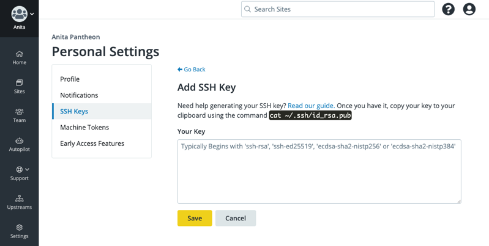
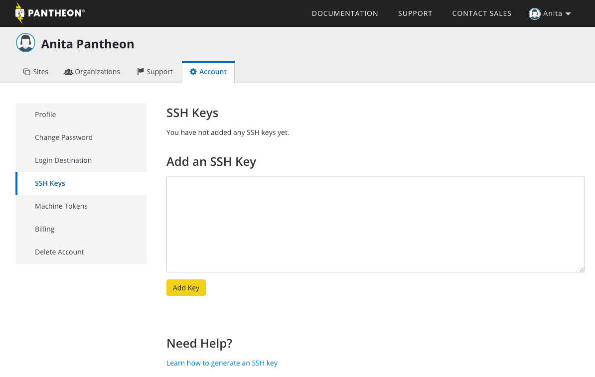
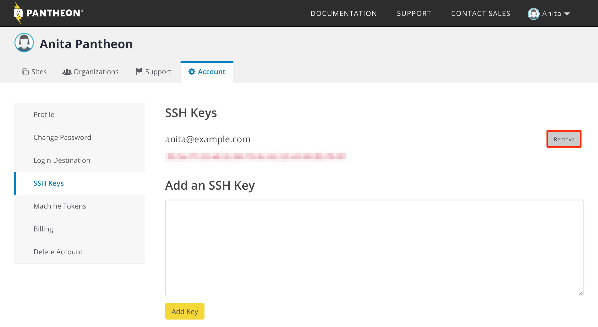

To take full advantage of Pantheon, you should load your public SSH key into your account. SSH keys are a best practice for authentication, allowing you more security than a simple password. You will only need to do this once for each work environment (laptop, desktop, etc.), no matter how many sites you work on.

<Accordion title="Watch: Generate a SSH Key and Add it to Your Dashboard" id="ssh-video" icon="facetime-video">

<Youtube src="U8sfuvrjroY" title="Generate a SSH Key and Add it to Your Dashboard" />

</Accordion>

<Alert title="Note" type="info">

Pantheon does not provide access to a shell environment over SSH. These directions allow you to have passwordless access if you configure Git, SFTP, or Drush to use SSH keys.

</Alert>

## Generate SSH Key

1. Open your terminal and enter the following command to generate a key:

   ```bash{promptUser: user}
   ssh-keygen
   ```

  This command works on Linux, MacOS, and Windows 10.

1. Unless you have reason to change it, leave the default location of `~/.ssh/id_rsa`. If the command says the key already exists, you can either overwrite it or continue onto the next step with your existing key.

1. A passphrase is recommended to provide greater security, but can conflict with tools that cannot handle them.

1. Once the files are created, copy the contents of `~/.ssh/id_rsa.pub` to your clipboard.

   Linux and Mac users can `cat`the file to the terminal and copy the output:

   ```bash{promptUser: user}
   cat ~/.ssh/id_rsa.pub
   ```

   Windows users can achieve the same result with `type`:

   ```bash{promptUser: winshell}
   type .ssh\id_rsa.pub
   ```

## Add Your SSH Key to Pantheon

### Add SSH Key - New Dashboard

1. Log in to your Pantheon Dashboard, and go to the **SSH Keys** tab of your **User Profile's** [Personal Settings](/guides/new-dashboard/personal-settings) page.

1. Click **Add New Key**.

1. Paste the copied public key into the box, and click **Save**.

  

  Your computer is now set up to securely connect to the Pantheon Git server. You can view a list of available keys on the same page.

### Add SSH Key - Classic Dashboard

1. Log in to your Pantheon Dashboard and go to the **<span class="glyphicons glyphicons-cogwheel"></span> Account** tab in your User Dashboard.

1. Click **SSH Keys**.

1. Paste the copied public key into the box, and click **Add Key**.

  

  Your computer is now set up to securely connect to the Pantheon Git server. You can view a list of available keys on the same page.

### Clone Your Site Code

1. In your Terminal environment, copy the **SSH clone URL** from the **Connection Info** of any site's Dev environment to clone your site code to your workstation.

1. If prompted, enter the passphrase you set above.

## Remove SSH Key from Pantheon

### Revoke SSH Key from Pantheon - New Dashboard

To revoke a key, go to the **SSH Keys** tab of your **User Profile's** [Personal Settings](/guides/new-dashboard/personal-settings) page. Click the **Revoke** button next to the key you want to remove:



### Remove SSH Key from Pantheon - Classic Dashboard

To delete a key, go to the **<span class="glyphicons glyphicons-cogwheel"></span> Account** tab of your User Dashboard and click **SSH Keys**. Click the **Remove** button next to the key you want to delete:


### Site Access After Removing Keys

If you have active sites and no keys remaining, you can still access the sites. Make site changes via SFTP or Git using your account password to authenticate. If you sign in through Google and haven't defined a password, you can set one on the [Reset Password](https://dashboard.pantheon.io/reset-password) page.

## Troubleshooting

<Partial file="host-keys.md" />

### Control Path Error

You may receive the following error:

```none
ControlPath too long fatal: Could not read from remote repository.
```

Check your SSH config files (by default, `$HOME/.ssh/config and /etc/ssh/ssh_config`) for a declaration like this:

```none:title=ssh_config
Host *
ControlMaster auto
ControlPath ~/.ssh/control-%l.%r@%h:%p
```

There are two ways to fix this. First, try adjusting the `Controlpath` line as shown below:

```none:title=ssh_config
Host *
ControlMaster auto
ControlPath ~/.ssh/control-%r
```

If this doesn't fix the issue, try creating an entry in your SSH configuration for your site specifically by its hostname. Don't use the `ControlMaster` option, instead use the `ControlPath` line as shown below, replacing `SITE_UUID` with your [site's UUID](/sites/#site-uuid):

```none:title=ssh_config
Host *.SITE_UUID.drush.in
ControlPath ~/.ssh/control-%r
```

### Server Refused to Allocate pty

This error occurs when a user is attempting to make a direct connection to Pantheon via SSH. Pantheon does not support [direct SSH connections](/faq/#does-pantheon-have-ftp-or-shell-access?).

### Authentication Prompts

Password requests may still occur after adding an SSH key to your Pantheon account if the corresponding key is not found by your local ssh-agent. Verify by listing the SSH fingerprints already loaded in your device's ssh-agent:

```bash{promptUser: user}
ssh-add -L | ssh-keygen -l -E md5 -f - | awk '{print substr($2,5)}'
```

The resulting string should match one of the keys [listed in your User Dashboard](https://dashboard.pantheon.io/users/#account/ssh-keys).

To resolve, add your SSH key to the ssh-agent using the following command, replacing `id_rsa` with the name of your private key, if different:

```bash{promptUser: user}
ssh-add ~/.ssh/id_rsa
```

If you are using a Linux distribution such as Fedora 33 or later, make sure RSA keys are enabled in `~/.ssh/config`:
```
Host *.drush.in
  PubkeyAcceptedKeyTypes=ssh-rsa
```
