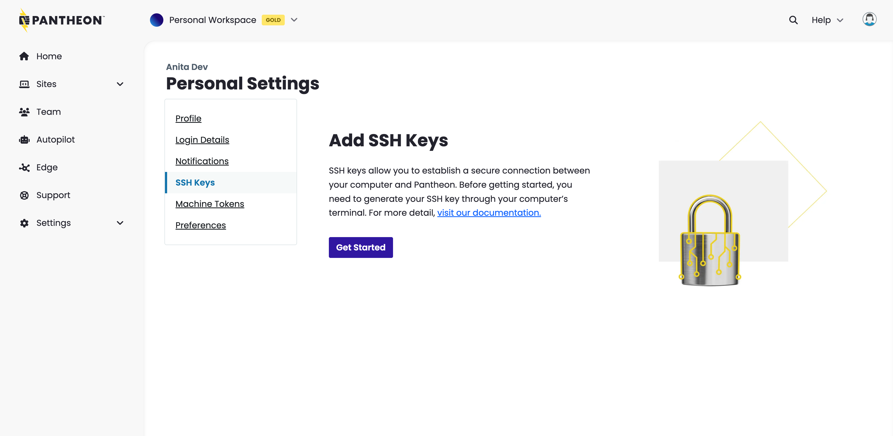
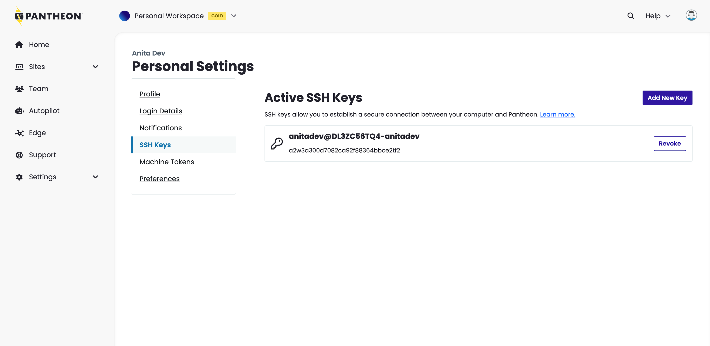

Interacting with remote Pantheon environments via Git, SFTP, WP-CLI, and Drush requires an SSH key for authentication. This is configured by adding your public SSH key to your user account on Pantheon. If you interact with your sites from multiple workstations (laptop, desktop, etc.), you must add a separate SSH key for each machine.

<Alert title="Note" type="info">

Pantheon does not provide access to a shell environment over SSH. These directions allow you to authenticate operations on Pantheon like  Git, SFTP, WP-CLI or Drush via SSH keys.

Pantheon supports ECDSA and RSA SSH keys. Currently, we do not support `ed25519` keys.

</Alert>

## Generate an SSH key

Use the steps in this section to generate your SSH key.

<Accordion title="Watch: Generate a SSH Key and Add it to Your Dashboard" id="ssh-video" icon="facetime-video">

<Youtube src="U8sfuvrjroY" title="Generate a SSH Key and Add it to Your Dashboard" />

</Accordion>

### Create the key locally
The following steps are compatible with MacOS, Linux, and the Windows Subsystem for Linux (WSL). Windows users must [install WSL](https://learn.microsoft.com/en-us/windows/wsl/) before proceeding to the steps below.

1. Open your terminal and enter the following command to generate a key:

   ```bash{promptUser: user}
   ssh-keygen -t rsa -m PEM
   ```

  Do not edit the default location of `~/.ssh/id_rsa` unless you have a reason to change it. If the command says the key already exists, you can either overwrite it, or continue to the next step with your existing key.

1. Set a passphrase for better security.

   We recommend using a passphrase, but it can conflict with some tools.

1. Copy the contents of `~/.ssh/id_rsa.pub` to your clipboard after the files are created.

   ```bash{promptUser: user}
   cat ~/.ssh/id_rsa.pub
   ```

1. Run `eval` to start the SSH agent. The `Agent pid` output confirms that the agent started:

      ```bash{outputLines: 2}
      eval `ssh-agent`
      Agent pid 86810
      ```

1. Add the newly created key to the ssh-agent:

   ```bash{promptUser: user}
   ssh-add ~/.ssh/id_rsa
   ```

## Add your SSH key to Pantheon
<TabList>

<Tab title="New Dashboard" id="phoebe-add-key" active={true}>

1. Log in to your Pantheon Dashboard.

1. Click your user icon in the top right then click [Personal Settings](/personal-settings), and go to the **[SSH Keys](https://dashboard.pantheon.io/personal-settings/ssh-keys)** tab.

1. If this is your first key, click **Get Started**, otherwise click **Add New Key**.

1. Paste the copied public key into the box, and click **Save**.

  

  Your computer is now set up to securely connect to the Pantheon Git server. You can view a list of available keys on the same page.

</Tab>

<Tab title="Legacy Dashboard" id="hermes-add-key">

1. Log in to your Pantheon Dashboard.

1. Click your username in the top right, then select **My Dashboard**.

1. Open the **<Icon icon="gear" /> Account** tab in your User Dashboard.

1. Click **SSH Keys**.

1. Paste the copied public key into the **Add Key** box.

1. Click the **Add Key** button.

  Your local machine is now set up to securely connect to remote Pantheon environments. This page will show you all keys associated with your user account.

</Tab>
</TabList>


### Test your new key (optional)

Try out your new key by interacting with your site using any one of the following methods:
* [Use git to clone your site repository locally](/guides/git/git-config#clone-your-site-codebase)
* [Use your preferred SFTP client to connect to a remote Pantheon environment](/guides/sftp/sftp-connection-info#sftp-connection-info)
* Use [Terminus](/terminus/install) to invoke WP-CLI or Drush commands:

   <TabList>

   <Tab title="WP-CLI" id="wpcli" active={true}>

   Replace `<site>` with your sitename:

   ```bash
   terminus wp <site>.dev -- cli version
   ```

   </Tab>

   <Tab title="Drush" id="drush">

   Replace `<site>` with your sitename:

   ```bash
   terminus drush <site>.dev -- status
   ```

   </Tab>
   </TabList>

### Manage multiple keys (optional)
If you use multiple SSH keys to routinely authenticate your machine with other platforms or services other than Pantheon, you may benefit by configuring specific keys according to their specific usage.

For example, the following configuration tells your Pantheon sites to use your Pantheon key, while using a separate key for GitHub:

```bash:title=~/.ssh/config
Host github
    User git
    Hostname github.com
    PreferredAuthentications publickey
    IdentityFile ~/.ssh/github_rsa

Host codeserver.*.drush.in
    PreferredAuthentications publickey
    IdentityFile ~/.ssh/pantheon_rsa
```

## Remove SSH Key from Pantheon
After removing SSH Keys from your user account, you will not be able to interact with remote Pantheon application and codeservers via Git, SFTP, Drush, or WP-CLI.

Removing SSH keys is separate from [revoking the machine tokens used by Terminus](/machine-tokens#revoke-a-machine-token) to perform actions (e.g., creating Multidev environments) that can otherwise be done in the Pantheon Site Dashboard.

<TabList>

<Tab title="New Dashboard" id="phoebe-revoke-key" active={true}>


1. Log in to your Pantheon Dashboard.

1. Click your user icon in the top right then click [Personal Settings](/personal-settings), and go to the **[SSH Keys](https://dashboard.pantheon.io/personal-settings/ssh-keys)** tab.

1. Click the **Revoke** button next to the key you want to remove:

  

1. Check the box in the confirmation prompt and click continue.

</Tab>
<Tab title="Legacy Dashboard" id="hermes-revoke-key">

1. Navigate to the **<Icon icon="gear" /> Account** tab of your User Dashboard and click **SSH Keys**.

1. Click the **Remove** button next to the key you want to delete:

</Tab>
</TabList>

## Troubleshooting

<Partial file="host-keys.md" />

### Control Path Error

You may receive the following error:

```none
ControlPath too long fatal: Could not read from remote repository.
```

Check your SSH config files (by default, `$HOME/.ssh/config and /etc/ssh/ssh_config`) for a declaration like this:

```none:title=ssh_config
Host *
ControlMaster auto
ControlPath ~/.ssh/control-%l.%r@%h:%p
```

There are two ways to fix this. First, try adjusting the `Controlpath` line as shown below:

```none:title=ssh_config
Host *
ControlMaster auto
ControlPath ~/.ssh/control-%r
```

If this doesn't fix the issue, try creating an entry in your SSH configuration for your site specifically by its hostname. Don't use the `ControlMaster` option, instead use the `ControlPath` line as shown below, replacing `SITE_UUID` with your [site's UUID](/guides/account-mgmt/workspace-sites-teams/sites#retrieve-the-site-uuis):

```none:title=ssh_config
Host *.SITE_UUID.drush.in
ControlPath ~/.ssh/control-%r
```

### Server Refused to Allocate pty

This error occurs when a user is attempting to make a direct connection to Pantheon via SSH. Pantheon does not support [direct SSH connections](/faq/#does-pantheon-have-ftp-or-shell-access?).

### Authentication Prompts

Password requests may still occur after adding an SSH key to your Pantheon account if the corresponding key is not found by your local ssh-agent. Verify by listing the SSH fingerprints already loaded in your device's ssh-agent:

```bash{promptUser: user}
ssh-add -L | ssh-keygen -l -E md5 -f - | awk '{print substr($2,5)}'
```

The resulting string should match one of the keys [listed in your Personal Settings](https://dashboard.pantheon.io/users/#account/ssh-keys).

To resolve, add your SSH key to the ssh-agent using the following command, replacing `id_rsa` with the name of your private key, if different:

```bash{promptUser: user}
ssh-add ~/.ssh/id_rsa
```

If you are using a Linux distribution such as Fedora 33 or later, make sure RSA keys are enabled in `~/.ssh/config`:
```
Host *.drush.in
  PubkeyAcceptedKeyTypes=ssh-rsa
```

<Alert title="Note"  type="info" >

 Pantheon does not have access to keys that only exist on the host machine. You must ensure that your keys and, if applicable, your key agent are made available to the application running in the container, if you're using Lando, Docksal, or DDEV.

</Alert>

### What if I can't install the Windows Subsystem for Linux?
Consider that [Terminus, Pantheon's command-line interface, requires WSL for compatibility](/terminus/install#compatibility-and-requirements). This is why the [process above](#create-the-key-locally) expects WSL to be installed, however it is not a hard required for generating SSH keys.

If you are a Windows user and you are unable to install WSL on your machine, you may use the following process as an alternative:

<Accordion title="Alternative steps to generate SSH keys on Windows" id="windows-no-wsl" icon="question-sign">

1. Open your terminal and enter the following command to generate a key. This command works for Windows 10:

   ```bash{promptUser: winshell}
   ssh-keygen -t rsa -m PEM
   ```

  Do not edit the default location of `~/.ssh/id_rsa` unless you have a reason to change it. If the command says the key already exists, you can either overwrite it, or continue to the next step with your existing key.

1. Set a passphrase for better security.

   We recommend using a passphrase, but it can conflict with some tools.

1. Copy the contents of `~/.ssh/id_rsa.pub` to your clipboard after the files are created.

   ```bash{promptUser: winshell}
   type .ssh\id_rsa.pub
   ```

1.  Run `start-ssh-agent` to start the SSH agent. The output confirms the agent has started. Enter the passphrase, if it was previously set.

      ```bash{promptUser: winshell}{outputLines: 2,3,5}
      start-ssh-agent
      Removing old ssh-agent sockets
      Starting ssh-agent:  done
      Enter passphrase for /c/Users/[user]/.ssh/id_rsa:
      Identity added: /c/Users/[user]/.ssh/id_rsa ([user@machine_name])
      ```

</Accordion>
