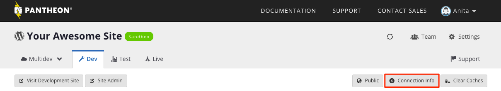

For additional security, Pantheon provides the ability to securely connect to your database and caching service over an encrypted connection using [secure shell tunneling](https://en.wikipedia.org/wiki/Tunneling_protocol#Secure_shell_tunneling). This will increase the security of your remote connection, especially in a public or untrusted environment.

This technique configures an SSH client to forward a local port to a port on Pantheon. Once the tunnel is established, you can connect to the local port to access the remote service using the encrypted connection.

Currently, there are two services on Pantheon that support SSH tunneling:

- [MySQL database](/mysql-access) (dbserver)
- [Redis cache](/object-cache)

To restrict access to these services to SSH tunnels only, consider [Secure Runtime Access](/secure-runtime-access).

## Prerequisites

- Local installation of a MySQL client
- [Redis command-line client](/object-cache#use-the-redis-command-line-client)
- Add an [SSH key](/ssh-keys) to your Pantheon User Dashboard

## Create Secure Connection to MySQL using TLS

Later versions of the MySQL client support the `--ssl` option.  Using this command line option will encrypt your connection to the database server with TLS.  To determine if your MySQL client supports TLS run `man mysql` and search for the `--ssl` option. If you add the `--ssl` option to your command there is no need to setup an SSH tunnel as described below.

Use the following Bash script to establish secure MySQL connections via TLS using the `—ssl` option and [Terminus](/terminus):

```bash
terminus-sql-cli() {
  SITE=$1
  if [ x$SITE = x ]; then
    echo "USAGE:

terminus-sql-cli site-shortname environment

Open a mysql connection to a site.

  site-shortname: REQUIRED: If your site is dev-example.pantheon.io
                  this would be \"example\" .

  environment:    Defaults to \"dev\".
"
    return
  fi

  ENV=$2
  if [ -z "$ENV" ]; then
    ENV="dev"
  fi

  if [ "$ENV" != "live" ]; then
    terminus env:wake $SITE.$ENV
  fi

  $(terminus connection:info $SITE.$ENV --fields=mysql_command --format=string) -A --ssl
}
alias tsqlc=terminus-sql-cli
```

## Manually Create an SSH Tunnel to Connect to a MySQL Database

From the Site Dashboard, access the environment you want to connect with, and click **Connection Info**. This will give you the required environment specific values for the command example below.



Use the required values from the **Connection Info** tab, the desired environment (Dev, Test, or Live), and the  [site uuid](/sites/#site-uuid) found in the Dashboard URL within the following command:

```bash{promptUser: user}
ssh -f -N -L LOCAL_PORT:localhost:SERVER_PORT -p 2222 ENV.SITE_UUID@dbserver.ENV.SITE_UUID.drush.in
```
  * Replace `<LOCAL_PORT>` with an available port on your device.
  * Replace `<SERVER_PORT>` with the designated port found on your Site Dashboard.
  * Often, the same input can be used for the `<LOCAL_PORT>` and `<SERVER_PORT>`.

The command must include the port you are entering the tunnel from. You can replace `<LOCAL_PORT>` with the database port specified in the **Connection Info** tab. Similarly, do the same for `<PASSWORD>`, then execute the following command:

```bash{promptUser: user}
mysql -u pantheon -h 127.0.0.1 -P LOCAL_PORT pantheon -pPASSWORD
```

Assuming the specified port is the `<LOCAL_PORT>`, you can determine if the port is listening by entering the following command:

```bash{promptUser: user}
lsof -i :LOCAL_PORT
```

To test the connection to the database use the following command:

```bash{promptUser: user}
echo 'SELECT 1' | mysql -u pantheon -pPASSWORD -h 127.0.0.1 -P LOCAL_PORT pantheon`
```

It should return the output `1`. A common error you'll receive if you use the wrong port, will resemble the following output:

```bash{promptUser: user}
ssh: Could not resolve hostname dbserver.<ENV>.<SITE_ID>: nodename nor servname provided, or not known
zsh: command not found: 5Drush.in
```

<Alert title="Note" type="info">

Due to the nature of our platform, the connection information will change from time to time due to server upgrades, endpoint migrations, etc. You will need to check the Dashboard periodically or when you can’t connect.

</Alert>

You can destroy the tunnel by using the port value found within the **Connection Info** tab and your computer's `<USERNAME>` in the following command:

```bash{promptUser: user}
ps -fU USERNAME | grep "ssh -f" | grep "PORT:" | awk '{print $2}' | xargs kill
```

## Use Sequel Pro to SSH Tunnel to a MySQL Database

[Sequel Pro](https://www.sequelpro.com/) is an open-source MySQL database client that supports SSH tunneling on Mac. You can configure other MySQL clients in a similar manner.

## Manually Create an SSH Tunnel to a Redis Cache Server

From the site environment, get the one-line connection string. It will be in the following format:

```bash{promptUser: user}
redis-cli -h HOSTNAME -p PORT -a PASSWORD
```

Use the port value from the above one-line connection string, the desired environment (Dev, Test, or Live), and the [site uuid](/sites/#site-uuid) found in the Dashboard URL within the following command:

```bash{promptUser: user}
ssh -f -N -L PORT:localhost:PORT -p 2222 ENV.SITE_UUID@cacheserver.ENV.SITE_UUID.drush.in
```

`PORT` is the database port specified in the **Connection Info** tab. Using the password and port found in the one-line connection string, run the following command:

```bash{promptUser: user}
redis-cli -h 127.0.0.1 -p PORT -a PASSWORD
```

You can destroy the tunnel by using the port value found within the **Connection Info** tab and your computer's USERNAME in the following command:

```bash{promptUser: user}
ps -fU USERNAME | grep "ssh -f" | grep "PORT:" | awk '{print $2}' | xargs kill
```

## Troubleshooting

To find solutions for MySQL connection errors, see [Accessing MySQL Databases](/mysql-access/#troubleshooting-mysql-connections).

If port 2222 is blocked on your network you will see an error similar to the following:

```none
SSH: connect to host codeserver.dev.<site UUID>.drush.in port 2222: No route to host
Fatal: Could not read from remote repository.
```

See [Port 2222 Blocked Workaround](/port-2222) for more information.
