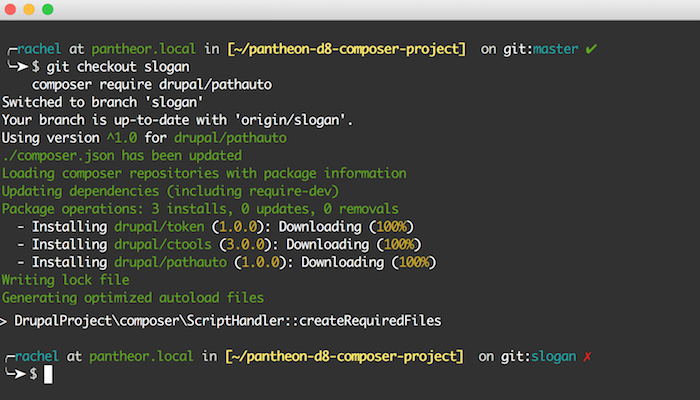

<!-- markdownlint-disable -->

All documentation repositories should adhere to a [style guide](https://en.wikipedia.org/wiki/Style_guide). This document serves to define and detail the style conventions used in Pantheon's documentation.

You can also reference the [Pantheon Documentation Template](/doc-template) to see the common structure of our docs, or copy it to begin a new content piece.

## Content Types

The site features two distinct content types; **docs** and **guides**. We define docs as reference materials used to explain the behavior and intended use of Pantheon's platform features and service offerings. Guides are generally paginated and designed to walk the reader through a specific concept or task.

___

## Voice, Style, and Flow

Some General Rules:

- Only assume as much knowledge from the reader as specified in the Before You Begin section. Otherwise explain everything.
- [Avoid be verbs](http://writing.rocks/to-be-or-not-to-be/).
- Avoid personal opinions, feelings, or anecdotes. Use an informal but succinct tone.
- Use [Inclusive Language](https://pantheon.io/docs/inclusive-language), avoid colloquialisms and hyperbole.
- Use [title case](https://apastyle.apa.org/style-grammar-guidelines/capitalization/title-case) for section headings.


___

## Frontmatter

Meta data for a doc or guide is created in a section referred to as frontmatter. It lives at the very top of the file and is wrapped in three dashes.

<Example>

<h1 className="toc-ignore">Style Guide</h1>

<p className="article-subhead">Formatting rules and guidelines for Pantheon&#039;s open-source documentation.
</p>

<p>
<small>
<i className="fa fa-users"></i> Contributors:                                                     <a href="/docs/contributors/alexfornuto" title="alexfornuto">Alex Fornuto</a>, &nbsp;
<a href="/docs/contributors/rachelwhitton" title="rachelwhitton">Rachel Whitton</a>
</small>

</p>

<hr className="source-code" /> <br/>

```html
---
title: Style Guide
description: Formatting rules and guidelines for Pantheon's open-source documentation.
contributors: [alexfornuto, rachelwhitton]
---
```

</Example>

<Accordion title="Frontmatter Values" id="frontmatter-values" icon="list-alt">

<dl>

<dt><code>title</code></dt>
<dd>The title of the content.</dd>

<dt><code>description</code></dt>
<dd>A brief description displayed under the title.</dd>

<dt><code>contributors</code></dt>
<dd>

An array of IDs for contributors to the content. The ID must correspond to an entry in [contributor.yaml](https://github.com/pantheon-systems/documentation/blob/main/source/data/contributor.yaml).

</dd>

<dt><code>reviewed</code></dt>
<dd>The last date when the content was updated or reviewed for accuracy.</dd>

<dt><code>tags</code></dt>
<dd>An array of tags used by our search engine to quickly identify the primary topics found in the content.</dd>

<dt><code>category</code></dt>
<dd>A value corresponding to the content's position in the site architecture and (sometimes) corresponding category landing page.</dd>

<dt><code>type</code></dt>
<dd>

The content type for this content. Defaults to `doc`, overwritten for other content types like `guide`, `video`, or `resource`.

</dd>

<dt><code>subtitle</code></dt>
<dd>Used in multipage guides to define a title for that page of the guide.</dd>

<dt><code>cms</code></dt>

<dd>

If a page is specifically written for a single CMS or CMS version, it's tagged as `"WordPress"`, `"Drupal"`, `"Drupal 7"`, `"Drupal 8"`, or `"Drupal 9"`.

</dd>

</dl>

</Accordion>

## Before You Begin

This section should outline any steps or services required before starting those in the doc. If there are other docs that should be completed first, list them here.

Of particular note, any documentation that uses Terminus should reference it in this section, and link to the [Terminus Manual](/terminus) .

<Example>

<h2 class="toc-ignore">Before You Begin</h2>

Be sure that you have:

- An existing WordPress site on Pantheon, or [create](https://dashboard.pantheon.io/sites/create) one.
- A [local clone](/git/#clone-your-site-codebase) of your code repository.
- An account with [Amazon Web Services (AWS)](https://aws.amazon.com/s3/). Amazon offers [free access](https://aws.amazon.com/free/) to most of their services for the first year.
- [Terminus](/terminus) installed on your local computer.

<hr className="source-code" /> <br/>

```markdown
## Before You Begin

Be sure that you have:

- An existing WordPress site on Pantheon, or [create](https://dashboard.pantheon.io/sites/create) one.
- A [local clone](/git/#clone-your-site-codebase) of your code repository.
- An account with [Amazon Web Services (AWS)](https://aws.amazon.com/s3/). Amazon offers [free access](https://aws.amazon.com/free/) to most of their services for the first year.
- [Terminus](/terminus) installed on your local computer.
```

</Example>

### Export Local Environment Variables

Be kind. If you're writing a guide that will use one or more example variables the reader must replace when following along, you should walk them through exporting them to local environment variables. See the [Variables](#variables) section below for more details.

___

## Typography

All documentation uses MarkDown to render headings and typographic elements like bold and italic. Note that a newline is required between HTML elements and content, so the MarkDown renderer knows to format the content.

### Headings

Give heading levels a meaningful hierarchy to ensure accessible navigation and structure. Use [title case](https://apastyle.apa.org/style-grammar-guidelines/capitalization/title-case) for headings listed in the TOC.

<Example>

<h1 class="toc-ignore">Page Title</h1>

<h2 class="toc-ignore">Header</h2>

<h3 class="toc-ignore">Sub Header</h3>

<h4 class="toc-ignore">Section not listed on TOC</h4>

<hr className="source-code" /> <br/>

```markdown
---
title: Page Title
---

## Header

### Sub Header
#### Section not listed on TOC
```

</Example>

### Bold

Bold is used for navigational elements within a given interface:

<Example>

Go to **Account** > **Security** > **Personal Access Tokens**.

<hr className="source-code" /> <br/>

```markdown
Go to **Account** > **Security** > **Personal Access Tokens**.
```

</Example>

### Italics

<Example>

Emphasis should *always* be stressed with italics, and *never* with bold.

<hr className="source-code" /> <br/>

```markdown
Emphasis should *always* be stressed with italics, and *never* with bold.
```

</Example>

### Definitions

<Example>

A <dfn id="dfn">dfn</dfn> tag is used to indicate that a paragraph is defining a new term.
New terms should only be defined once throughout the docs, and then cross-referenced.
Definitions and Definition Lists are automatically added to the [Glossary](/glossary).

<hr className="source-code" /> <br/>

```html
A <dfn id="dfn">dfn</dfn> tag is used to indicate that a paragraph is defining a new term.
New terms should only be defined once throughout the doc, and then cross-referenced.
Definitions and Definition Lists are automatically added to the [Glossary](/glossary).
```

</Example>

### Definition List

<Example>

<dl>
<dt>Term</dt>
<dd>Definition.</dd>
<dt>Another Term</dt>
<dd>Description of the new term.</dd>
</dl>

<hr className="source-code" /> <br/>

```html
<dl>

<dt>Term</dt>

<dd>

Definition.

</dd>

<dt>Another Term</dt>

<dd>

Description of the new term.

</dd>

</dl>
```

</Example>

### Abbreviations

<Example>

The <abbr title="Abbreviation">abbr</abbr> tag is used to provide the full name of an abbreviated term on mouse hover.

<hr className="source-code" /> <br/>

```html
The <abbr title="Abbreviation">abbr</abbr> tag is used to provide the full name of an abbreviated term on mouse hover.
```

</Example>

### Hyperlinks

Do not specify a target tab or window for external, or any other links, leaving the viewer the option to open in a new tab.

#### Internal Links

Use relative paths when linking to other pages of the docs site.

<Example>

[Quick Start](/guides/quickstart)

<hr className="source-code" /> <br/>

```markdown
[Quick Start](/guides/quickstart)
```

</Example>

#### External Links

<Example>

[Wikipedia entry on Style guide](https://en.wikipedia.org/wiki/Style_guide)

<hr className="source-code" /> <br/>

```markdown
[Wikipedia entry on Style guide](https://en.wikipedia.org/wiki/Style_guide)
```

</Example>

___

## Code

### Inline

Used for file names, variables, commands, and output, inline within paragraphs:

<Example>

Inline code styling using backticks, like `$EXAMPLE`.

<hr className="source-code" /> <br/>

```markdown
Inline code styling using backticks, like `$EXAMPLE`.
```

</Example>

### Blocks

<Example>

```php
/**
* Example Comment
*
* To provide additional context for the following
* code, and defining any variables the user must
* manually edit.
**/
if (!function_exists('install_drupal')) {
  $conf['preprocess_css'] = 1;
}
```

<hr className="source-code" /> <br/>

````markdown
```php
# This is a Windows-friendly symlink
require_once WP_CONTENT_DIR . '/plugins/wp-redis/object-cache.php';
```

````

</Example>

#### Shell Prompts

You can also define a single line code block as a command:

<Example>

```bash{promptUser: user}
mkdir -p ~/repos/mdx-slug
```

<hr className="source-code" /> <br/>

````markdown
```bash{promptUser: user}
mkdir -p ~/repos/mdx-slug
```
````

</Example>

Or define which lines are output:

<Example>

```bash{outputLines:2-6}
ls  -1 ~/repos
documentation
i3lock-color
i3lock-fancy
j4-dmenu-desktop
mdx-slug
```

<hr className="source-code" /> <br/>

````markdown
```bash{outputLines:2-6}
ls  -1 ~/repos
documentation
i3lock-color
i3lock-fancy
j4-dmenu-desktop
mdx-slug
```
````

</Example>

#### Line Highlighting
You can highlight a specific line in a code block the reader should focus on with `//highlight-line`, or a group with `//highlight-start` and `//highlight-end`:

<Example>

```bash{outputLines: 2-20}
curl -I dev.mysite.com
HTTP/1.1 200 OK
X-Pantheon-Styx-Hostname: styx1a
server: nginx/1.0.15
content-type: text/html; charset=utf-8
x-drupal-cache: MISS
//highlight-start
set-cookie: SESSf60876d132c0913e5fc728eec7f71e38=M1Sr0bxLbbgYmbg1EW7N8sGF4anrKP1np25EkYta-ZU; expires=Wed, 19-Dec-2012 22:04:58 GMT; path=/; domain=.dev.mysite.com; HttpOnly
Cache-Control: no-cache, must-revalidate, max-age=0
//highlight-end
last-modified: Mon, 26 Nov 2012 18:31:30 +0000
expires: Sun, 19 Nov 1978 05:00:00 GMT
x-pantheon-endpoint: c18646dd-aa2b-4faa-a4e3-d71ec3a5ce43
Date: Mon, 26 Nov 2012 18:31:38 GMT
X-Varnish: 486741958
Age: 0 //highlight-line
Via: 1.1 varnish
Connection: keep-alive
X-Pantheon-Edge-Server: 108.166.58.245
Vary: Accept-Encoding, Cookie
```

<hr class="source-code" /> <br />

````none
```bash{outputLines: 2-20}
curl -I dev.mysite.com
HTTP/1.1 200 OK
X-Pantheon-Styx-Hostname: styx1a
server: nginx/1.0.15
content-type: text/html; charset=utf-8
x-drupal-cache: MISS
//highlight-start
set-cookie: SESSf60876d132c0913e5fc728eec7f71e38=M1Sr0bxLbbgYmbg1EW7N8sGF4anrKP1np25EkYta-ZU; expires=Wed, 19-Dec-2012 22:04:58 GMT; path=/; domain=.dev.mysite.com; HttpOnly
Cache-Control: no-cache, must-revalidate, max-age=0
//highlight-end
last-modified: Mon, 26 Nov 2012 18:31:30 +0000
expires: Sun, 19 Nov 1978 05:00:00 GMT
x-pantheon-endpoint: c18646dd-aa2b-4faa-a4e3-d71ec3a5ce43
Date: Mon, 26 Nov 2012 18:31:38 GMT
X-Varnish: 486741958
Age: 0 //highlight-line
Via: 1.1 varnish
Connection: keep-alive
X-Pantheon-Edge-Server: 108.166.58.245
Vary: Accept-Encoding, Cookie
```
````

</Example>

___

## File Excerpts

File excerpts are [code blocks](#blocks) with a file name specified after the syntax as `:title=FILENAME`:

<Example>

```git:title=.gitignore
# WordPress #
############
wp-config-local.php
wp-cli.local.yml
wp-content/uploads
wp-content/blogs.dir/
wp-content/upgrade/
```


<hr class="source-code" /> <br />

````markdown
```git:title=.gitignore
# WordPress #
############
wp-config-local.php
wp-cli.local.yml
wp-content/uploads
wp-content/blogs.dir/
wp-content/upgrade/
```
````

</Example>

___

## Variables

When writing multi-step processes, repeated variables and constants should be defined before providing the first set of commands. If the doc has a "Before You Begin" section, define varables here. Provide them using the callout below, and follow common conventions (lowercase for variables, uppercase for constants).

<Example>

<Alert title="Exports" type="export">

This process uses [Terminus](/terminus) extensively. Before we begin, set the variables `$site` and `$env` in your terminal session to match your site name and the Dev environment:

```bash{promptUser: user}
export site=yoursitename
export env=dev
```

</Alert>

<hr className="source-code" /> <br/>

````markdown
<Alert title="Exports" type="export">

This process uses [Terminus](/terminus) extensively. Before we begin, set the variables `$site` and `$env` in your terminal session to match your site name and the Dev environment:

```bash{promptUser: user}
export site=yoursitename
export env=dev
```

</Alert>
````

</Example>

___

## Callouts

There are several types of callouts commonly used in our docs:

### Notes

<Example>

<Alert title="Note" type="info" >

Notes should identify important pieces of information the reader shouldn't miss.

</Alert>

<hr className="source-code" /> <br/>

```html
<Alert title="Note"  type="info" >

Notes should identify important pieces of information the reader shouldn't miss.

</Alert>
```

</Example>

### Warnings

<Example>

<Alert title="Warning" type="danger" >

Warnings cover information critical to the reader and highlight potential dangers, especially those that can cause data loss.

</Alert>

<hr className="source-code" /> <br/>

```html
<Alert title="Warning" type="danger" >

Warnings cover information critical to the reader and highlight potential dangers, especially those that can cause data loss.

</Alert>
```

</Example>

### Success

Success callouts are used infrequently, usually in guides with specific end results expected. Use success callouts to differentiate between two binary results.

<Example>

<Alert title="Incorrect DNS Configuration" type="danger" icon="remove">


</Alert>

<Alert title="Correct DNS Configuration" type="success" icon="check">


</Alert>

<hr className="source-code" /> <br/>

```html
<Alert title="Incorrect DNS Configuration" type="danger" icon="remove">


</Alert>

<Alert title="Correct DNS Configuration" type="success" icon="check">


</Alert>

```

</Example>

___

## Tabs

When working on a document that will cover steps for multiple CMSs, use tabs when possible to condense instructions that need duplication for the different applications.

<Example>

<TabList>

<Tab title="WordPress" id="wp-example" active={true}>

Here's our WordPress specific copy, and an example snippet:

```php
/**
  * Some WordPress specific thing
  *
  */

Code goes here.
```

</Tab>

<Tab title="Drupal 8" id="d8-example">

Here's our Drupal 8 specific copy, and an example snippet:

```php
/**
  * Some Drupal 8 specific thing
  *
  */

Some code.
```

</Tab>

<Tab title="Drupal 7" id="d7-example">

Here's our Drupal 7 specific copy, and an example snippet:

```php
/**
  * Some Drupal 7 specific thing
  *
  */

Some code.
```

</Tab>

</TabList>

<hr className="source-code" /> <br/>

````markdown
<TabList>

<Tab title="WordPress" id="wp-example" active={true}>

Here's our WordPress specific copy, and an example snippet:

```php
/**
  * Some WordPress specific thing
  *
  */

Some code.
```

</Tab>

<Tab title="Drupal 8" id="d8-example">

Here's our Drupal 8 specific copy, and an example snippet:

```php
/**
  * Some Drupal 8 specific thing
  *
  */

Some code.
```

</Tab>

<Tab title="Drupal 7" id="d7-example">

Here's our Drupal 7 specific copy, and an example snippet:

```php
/**
  * Some Drupal 7 specific thing
  *
  */

Some code.
```

</Tab>

</TabList>
````

</Example>

___

## Screenshots

Submit screenshots without additional markup. For example, don't use Skitch to add an arrow. This helps the Docs team make edits as needed later.

Do not include any personal information like a name, email address, or UUID in the screenshot.

### GUI

Screenshots are used to reference GUI instructions:

<Example>


<hr className="source-code" /> <br/>

```markdown

```

</Example>

### Terminal

Terminal screenshots should be described in the text as much as possible, and should only be used to demonstrate intended output:

<Example>



<hr className="source-code" /> <br/>

```markdown

```

</Example>

___

## Error Messages

Document error messages verbatim as H3s within a **Troubleshooting** section. Use the exact copy of the error message to help improve search result findability. Make the header an H3 to make the section linkable within the table of contents for easy sharing.

<Example>

### RedisException: Redis server went away

The following error occurs when Redis has not been enabled within the Site Dashboard:

```none
RedisException: Redis server went away in Redis->setOption() (line 28 of /srv/bindings/xxxxxxxx/code/sites/all/modules/redis/lib/Redis/Client/PhpRedis.php).
```

Enable Redis via the Pantheon Site Dashboard by going to **Settings** > **Add Ons** > **Add** > **Redis**. It may take a few minutes to provision the service.

<hr className="source-code" /> <br/>

````markdown
### RedisException: Redis server went away
The following error occurs when Redis has not been enabled within the Site Dashboard:

 ```none
 RedisException: Redis server went away in Redis->setOption() (line 28 of /srv/bindings/xxxxxxxx/code/sites/all/modules/redis/lib/Redis/Client/PhpRedis.php).
 ```

Enable Redis via the Pantheon Site Dashboard by going to **Settings** > **Add Ons** > **Add** > **Redis**. It may take a few minutes to provision the service.
````

</Example>

___

## Panels

Use panels for extraneous but useful information such as troubleshooting sections or pro tips that would be distracting or can be skipped over by a large portion of readers. This is primarily used in an effort to promote readability of a page.

<Example>

<Accordion title="Panel Title" id="example-panel" icon="wrench">

### Panel Content Header 

This Panel contains additional context, or advanced instructions.

</Accordion>

<hr className="source-code" /> <br/>

```html
<Accordion title="Panel Title" id="example-panel" icon="wrench">

### Panel Content Header 

This Panel contains additional context, or advanced instructions.

</Accordion>
```

</Example>

___

## Tables

You can use markdown tables to describe availability based on service levels before providing instructions on how to enable or use a given feature. For example:

<Example>

<h2 class="toc-ignore">Enable Redis</h2>

All plans except for a Basic plan can use Redis. Redis is available to Sandbox site plans for developmental purposes, but Redis will not be available going live on a Basic plan.

| Plans         | Redis Support <Popover content="Available across all environments, including Multidevs." /> |
| ------------- | -------------------------------------- |
| Sandbox       | <span style="color:green">✔</span> |
| Basic         | ❌  |
| Performance   | <span style="color:green">✔</span> |
| Elite         | <span style="color:green">✔</span> |

<hr className="source-code" /> <br/>

```markdown
## Enable Redis

All plans except for a Basic plan can use Redis. Redis is available to Sandbox site plans for developmental purposes, but Redis will not be available going live on a Basic plan.

| Plans         | Redis Support <Popover content="Available across all environments, including Multidevs." /> |
| ------------- | -------------------------------------- |
| Sandbox       | <span style="color:green">✔</span> |
| Basic         | ❌  |
| Performance   | <span style="color:green">✔</span> |
| Elite         | <span style="color:green">✔</span> |
```

</Example>

Use ✓ to indicate yes and `❌` to indicate no.

<Accordion title="Advanced Tables">

Standard markdown tables don't allow for cells to span multiple rows or columns, but by using the [gatsby-remark-grid-tables](https://www.gatsbyjs.org/packages/gatsby-remark-grid-tables/) plugin, we can overcome this limitation:

<Example>

+-----------------+--------------+-------------+--------------+------------------------+
| **Environment** | **Severity** | **Browser** | **Watchdog** | **logs/php-error.log** |
+-----------------+--------------+-------------+--------------+------------------------+
|                 | notice       | **✓**       | **✓**        |                        |
|                 +--------------+-------------+--------------+------------------------+
| Dev             | warning      | **✓**       | **✓**        |                        |
|                 +--------------+-------------+--------------+------------------------+
|                 | error        | **✓**       |              |  **✓**                 |
+-----------------+--------------+-------------+--------------+------------------------+
|                 | notice       |             | **✓**        |                        |
+                 +--------------+-------------+--------------+------------------------+
| Test            | warning      |             | **✓**        |                        |
|                 +--------------+-------------+--------------+------------------------+
|                 | error        | **✓**       |              |  **✓**                 |
+-----------------+--------------+-------------+--------------+------------------------+
|                 | notice       |             | **✓**        |                        |
+                 +--------------+-------------+--------------+------------------------+
| Live            | warning      |             | **✓**        |                        |
|                 +--------------+-------------+--------------+------------------------+
|                 | error        |             |              |  **✓**                 |
+-----------------+--------------+-------------+--------------+------------------------+

<hr className="source-code" /> <br/>

````markdown
+-----------------+--------------+-------------+--------------+------------------------+
| **Environment** | **Severity** | **Browser** | **Watchdog** | **logs/php-error.log** |
+-----------------+--------------+-------------+--------------+------------------------+
|                 | notice       | **✓**       | **✓**        |                        |
|                 +--------------+-------------+--------------+------------------------+
| Dev             | warning      | **✓**       | **✓**        |                        |
|                 +--------------+-------------+--------------+------------------------+
|                 | error        | **✓**       |              |  **✓**                 |
+-----------------+--------------+-------------+--------------+------------------------+
|                 | notice       |             | **✓**        |                        |
+                 +--------------+-------------+--------------+------------------------+
| Test            | warning      |             | **✓**        |                        |
|                 +--------------+-------------+--------------+------------------------+
|                 | error        | **✓**       |              |  **✓**                 |
+-----------------+--------------+-------------+--------------+------------------------+
|                 | notice       |             | **✓**        |                        |
+                 +--------------+-------------+--------------+------------------------+
| Live            | warning      |             | **✓**        |                        |
|                 +--------------+-------------+--------------+------------------------+
|                 | error        |             |              |  **✓**                 |
+-----------------+--------------+-------------+--------------+------------------------+
````

</Example>

</Accordion>

___

## Reusable Content

Create reusable content in a separate Markdown file that can be included within sections of other docs. These are called **partials**.

Place the Markdown file within the `source/partials/` directory, in its own directory if it is feature-specific.

Partials use all of the same Markdown, style, and HTML as needed and outlined on this page, but do not require frontmatter. They can be included as their own paragraphs and sections as well as in lists as a step or bullet point.

After you create the file, include it in the doc:

<Example>

<Partial file="partial-example.md" />

<hr className="source-code" /> <br/>

```markdown
<Partial file="partial-example.md" />
```

</Example>

___

## Tooltips

Tooltips are a great way to add additional information without cluttering up a section. For example, you can define jargon and even link out to an external resource without being distracting to the reader:

<Example>

Given two new sites with slugs <Popover title="Slugs" content="Generally, Slugs are URL friendly descriptions for a post or a page in WordPress. In the context of WordPress Site Networks, a slug is a URL friendly description for a network site." /> `first-site` and `second-site`, each configuration will result in the following URLs:

* Subdirectories: `example.com/first-site` and `example.com/second-site`.
* Subdomains: `first-site.example.com` and `second-site.example.com`.

<hr className="source-code" /> <br/>

```markdown
Given two new sites with slugs <Popover title="Slugs" content="Generally, are URL friendly descriptions for a post or a page in WordPress. In the context of WordPress Site Networks, a slug is a URL friendly description for a network site." /> `first-site` and `second-site`, each configuration will result in the following URLs:

* Subdirectories: `example.com/first-site` and `example.com/second-site`.
* Subdomains: `first-site.example.com` and `second-site.example.com`.
```

</Example>

___

## See Also

This is the optimal place to provide links to external resources on the subject, or internal docs on common processes to follow after completing those above.

<Example>

<h2 className="toc-ignore"> See Also</h2>

- [An internal link](/guides)
- [An external link](https://pantheon.io/blog/)

<hr className="source-code" /> <br/>

```markdown
## See Also

- [An internal link](/guides)
- [An external link](https://pantheon.io/blog/)
```

</Example>
