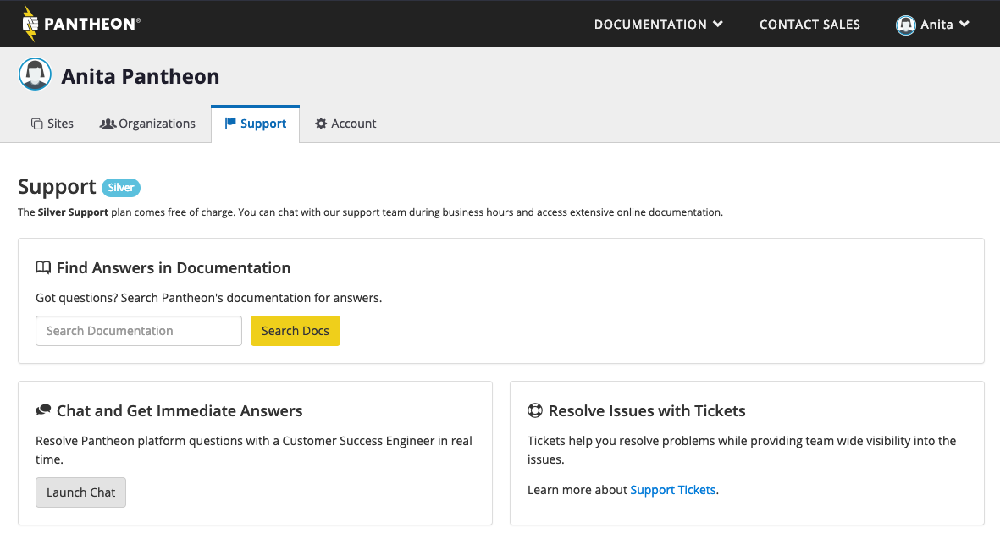
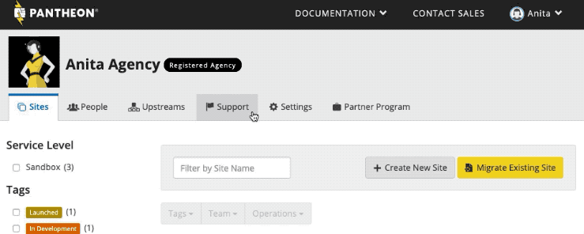
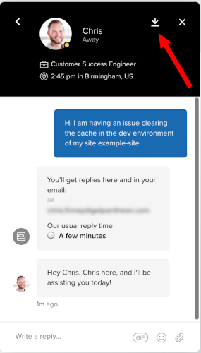

## Support Features and Response Times

Pantheon offers a range of Account options that include the features required for mission critical sites, such as 24x7x365 emergency on-call, debugging assistance, and even bundled [Professional Services](/guides/professional-services) with our Diamond Accounts.

| Account Tier                                           | Silver                            | Gold                              | Platinum               | Diamond            |
|-----------------------------------------------------------|-----------------------------------|-----------------------------------|------------------------|--------------------|
| **Scope**                                                 | Platform <Popover title="Scope of Support" content="<ul><li>Dashboard</li><li>Dev/Test/Live Workflow</li><li>Git/SFTP Mode</li><li>Self-service documentation</li></ul>" /> | Technical <Popover title="Scope of Support" content="<ul><li>Autopilot</li><li>Drupal & WordPress</li><li>Identifying problematic modules and plugins</li><li>Identifying application or site issues</li><li>DNS</li><li>Multidev</li><li>Basic CDN</li><li>Basic Terminus</li><li>Basic Localdev</li><li>Basic Custom Upstreams</li></ul>" /> | Performance <Popover title="Scope of Support" content="<ul><li>New Relic</li><li>Caching</li><li>Cloud Integrations</li><li>Custom Upstreams</li><li>Advanced Workflows</li><li>Advanced CDN</li><li>Advanced Terminus" /> | Dedicated <Popover title="Scope of Support" content="Bespoke site debugging" /> |
| [**Chat**](#real-time-chat-support)                       | 24x5                              | 24x7                              | 24x7: Priority         | 24x7: Top Priority |
| [**Tickets**](#ticket-support)                            | ❌ | 24x5: 8 Hours                     | 24x7: 2 Hours          | 24x7: 1 Hour       |
| [**Emergency On-Call**](#pantheon-on-call)                | ❌ | ❌ | 24x7: 1 Hour           | 24x7: 15 Minutes   |
| [**Professional Services**](/guides/professional-services) | ❌ | Available for Purchase            | Available for Purchase | Available for Purchase    |

### Scope Explanations

- **Platform**: Support helps:
   - Identify and remedy Platform, Dashboard, Dev/Test/Live workflow, and connection mode issues
   - Find appropriate documentation
- **Technical**: Adds support for:
   - Autopilot
   - Drupal and WordPress application-level and site support
   - Identifying problematic modules and plugins
   - Multidev
   - Assistance with basic CDN, Terminus, Localdev, and Custom Upstreams
- **Performance**:
   - New Relic
   - Caching
   - Cloud Integrations
   - Custom Upstreams
   - Advanced Workflows
   - Advanced CDN
   - Terminus
- **Dedicated**: Bespoke site debugging.

## Best Practices

Keep these tips in mind when opening a new support ticket or chat, to help us more quickly resolve your issue:

### Open the Ticket in the Right Place

If you are a member of an [Organization](/organizations), use the Organization's Dashboard to visit the support tab. Contacting Support from your User Dashboard will not provide the same support level as a Site Dashboard owned by an Organization with a higher Account package. For a visual, check out the [Support Tab from the Organization Dashboard](#the-support-tab-from-the-organization-dashboard).

### One ticket per issue

Opening multiple tickets on the same issue will only impede our ability to provide timely support. When opening a chat conversation to follow up on a discussion from a ticket, please let us know about the ticket so we can read up on what's already been discussed and attempted.

### Replication Steps

One of the first steps in troubleshooting is almost always to recreate the problem. Please provide us with the exact steps to replicate the issue. If we can't see it, we can't debug it.

### Specifics

Ambiguity is the kryptonite of good support. When discussing an issue, give us timestamps, error messages (in full), screenshots, URLs, and any other specific information that can help to identify problems.

### Custom Access

If your site uses nonstandard admin URLs, custom logins, etc., please let us know.

### Clarification

We're all only human. We always try our best to understand the situation, but we may not always get it right the first time. At the same time, our explanations or solutions might not always make sense to you. Don't be afraid to correct us, or to ask for clarification if we don't seem to understand the issue.

### Organization Dashboard Support Tab

If you are part of an Organization with an enhanced Account package, navigate to the Support tab from the Organization's Dashboard to make use of the Organization's Support level:

## Real Time Chat Support

Start a chat with our Support Team to ask questions or request assistance on issues within our [scope of support](#scope-of-support). This support feature is available to all users and sites across all plans, including Sandbox.

To receive the highest level of support available to your site or organization, remember to access the chat from the Organization Dashboard if available.

1. From your Site or User Dashboard, click **Support**.

1. Click **Launch Chat**, then click **New Conversation**.

1. Provide a detailed summary of your support request, such as:
   - Steps to reproduce the issue (including URLs or paths to files).
   - Environments affected (Multidev/Dev/Test/Live), if applicable.
   - When the issue began.
   - Error messages received, if applicable.
   - Links to screenshots or screencasts of the behavior, if necessary.

You can download a transcript of your chat with the <em class="fa fa-arrow-down" style="text-decoration: underline;"></em> button:

<Alert title="Note" type="info">

Some in-browser ad or tracking blockers can interfere with the **Launch Chat** button. If you don't see it, try allowlisting `pantheon.io` or disabling the browser extension. Intercom has posted more details on [why this happens](https://docs.intercom.com/faqs-and-troubleshooting/your-users-and-leads-data-in-intercom/why-am-i-missing-users-that-are-showing-up-on-my-own-system) on their site.

</Alert>

## Ticket Support

The ticket support feature is available to certain Account packages and account types. For details, refer to the [support feature table above](#support-features-and-response-times). Tickets are associated with the site from which the ticket is opened. Please be sure that if you maintain several sites, that you open the ticket from the correct site's dashboard.

1. Create a support ticket from within the site's Dashboard by clicking **Support** > **Open Ticket**. This will automatically include the site and user information.

1. Choose the **ticket type**.

1. Enter a subject (summary of your issue).

1. Provide a detailed summary of your support request, such as:
   - Steps to reproduce the issue (including URLs or paths to files).
   - Environments affected (Multidev/Dev/Test/Live), if applicable.
   - When the issue began.
   - Error messages received, if applicable.
   - Links to screenshots or screencasts of the behavior, if necessary.

1. Click **Open Ticket**

Once a ticket is submitted, you can view details for your support requests. If are you are part of an organization, your support tickets are visible to all members except Unprivileged users.

## Pantheon On-Call

Diamond and Platinum Account customers can directly page Pantheon's operations response team, either via the Pantheon Dashboard or by an emergency 800-number. Pantheon on-call immediately escalates to the on-call engineering team. The scope of on-call support is limited to emergencies and business critical issues.

## Scope of Support

We love helping developers succeed! Our Account packages feature a range of support features including basic platform support to more comprehensive support and a dedicated Customer Success Manager. While we have limits to the scope support we can provide, our [Professional Services](/guides/professional-services) team is able to assist in areas that fall outside of support scope. [Contact Sales](https://pantheon.io/contact-us) if your requirements fall outside the scope outlined below.

### Code

Your site code belongs to you. We can offer Diamond Account customers advice on best practices and debugging assistance, but our support team does not change customer code. Pantheon provides updates to the upstream for the site, which only affect core files and Pantheon-specific additions. It is your responsibility to ensure the upstream is not overwritten. If it is, updates initiated from the Dashboard will cause conflicts that you must [resolve manually](/core-updates#apply-upstream-updates-manually-from-the-command-line-to-resolve-merge-conflicts) using Git.

### Outdated Core

Outdated versions of core are not supported on the platform. This includes importing a site, then manually downgrading to an older version of core. Sites utilizing a [Custom Upstream must be updated](/maintain-custom-upstream) by the upstream maintainer each time the project releases a new version.

### Custom Upstreams

If you choose to use a Custom Upstream, please be aware that the scope of support is limited to verification that the externally hosted upstream repository is properly connected to the platform.

We are unable to debug issues with the content or structure of the Custom Upstream. While we encourage you to explore this great way to unify multiple sites, please be aware that the responsibility of testing, [properly maintaining the Custom Upstream](/maintain-custom-upstream), and fixing any issues related to the upstream falls outside of the scope of support.

### Public Distributions

If you choose to use a [public distribution](/start-state/#public-distributions) (a.k.a. installation profile or distribution) in lieu of a [Pantheon provided upstream](/start-state/#pantheon-upstreams) (i.e. WordPress, Drupal 8, Drupal 7), it is your responsibility to ensure it is not behind on core releases or any of its included modules, and, if it is behind, to contact the maintainer through [Drupal.org](https://www.drupal.org) or the distribution's GitHub issue queue.

### Security

We don’t maintain the integrity of your site. We provide the platform on which any code can be deployed. We fully stand behind the platform and support that, but we aren't responsible for the code and configuration that gets deployed or any files uploaded to the site. We strongly encourage all developers and site owners to follow best security practices and keep core code and contributed modules and plugins up-to-date, especially with security-related releases.

### Debugging

Code-level debugging and site architecture recommendations are available to Diamond Accounts. New Relic is also included for most site plans and will help you get to the bottom of most issues. We also have a [comprehensive list of docs](/troubleshoot) to get you started.

### Performance

If your site is slow or modules aren't working, please see our [performance articles](/code/#performance). Issues with the platform are posted on our [status page](https://status.pantheon.io). If there are no platform events, the solution is probably within the site's code.

### Intermittent Issues

Pantheon can only assist if we can replicate the problem. Intermittent issues and server errors are rarely random, rather, they are issues with a yet undefined trigger. Please try to replicate and debug [site errors](/errors-and-server-responses) in your Development environment. If you [contact support](/support), include your findings and attach screenshots whenever possible.

### Isolated Issues

Pantheon Support can quickly determine if an issue is platform related. We take full responsibility for our services and performance, but if something is affecting your site only, or a single environment only, we will most likely refer you to our debugging tutorials or offer to connect you with an agency partner to help you with the resolution.

If problems with your site become severe and overload resources, we will contact you and ask you to take immediate action. If unresponsive, we may need to put the site into maintenance mode.

### Local Development

We recommend development on the platform, rather than on a local environment. Unexpected behavior, not apparent on local instances such as MAMP or shared hosting, can be due to different versions of PHP, different levels of error reporting, Apache vs NGINX, or server configuration. Pantheon is not responsible for resolving such issues.

### Platform Support

We provide technical support for all user interfaces of the Pantheon product, as well as compatibility with the Drupal and WordPress CMSs. While we cannot guarantee that every Drupal module or WordPress plugin will work, we take responsibility for the availability and proper functionality of the platform. If there's something wrong there, we will fix it.

We are also happy to help developers learn the ins and outs of making their sites work great on Pantheon, and we have a large number of tutorials for common development scenarios. We also do our best to answer most questions about development practices or techniques.

### Dedicated Support

Diamond Account customers get an extra level of assistance for their dev teams. Pantheon's team can investigate misbehavior, slowness, or error logs to help identify a root cause. This includes everything from database queries to front end performance.

Our team is experienced with using New Relic to diagnose whether an issue is platform or site related, and has access to internal logging and monitoring.

Diamond Accounts are intended to help developers succeed on Pantheon, not to provide development services. If you need a professional to provide development services for your site, start by [getting a personalized quote](https://pantheon.io/agencies/agency-match) from Pantheon’s network of trusted partners.

## FAQs

### Can I request a feature be added to the platform?

Yes. For more details, talk to your Customer Success Manager or [contact sales](https://pantheon.io/contact-us).

### Is there a support number we can call? If so, is this service available for every package?

Diamond and Platinum customers have access to Pantheon On-Call, which has an emergency 800-number to page an on-call engineer. For more details, [contact sales](https://pantheon.io/contact-us).

### If we open a ticket, do you provide 24/7 support for outages, or are there time restrictions?

Diamond, Platinum and Gold customers can file a downtime ticket for outages on our Support page, and we provide 24/7 on-call support for all platform issues affecting Diamond and Platinum customers.

### What if I can't login to the Pantheon Dashboard?

If you are unable to login, try [resetting your password](https://dashboard.pantheon.io/reset-password).

### How can I review my chat threads?

Access support history for chats in the User or Site Dashboards by selecting **Support** > **Launch Chat**.

### Can I start a chat session via email?

No. Initiate chats via the Pantheon User or Site Dashboards.

### Can I respond to an existing chat message via email?

Yes. Reply directly to the email thread to continue an existing chat session and update the chat history on the Dashboard.

### Who do I talk to about billing questions?

The best way to get help with your billing questions is to contact our support team [via chat](#real-time-chat-support) or through a [ticket](#ticket-support).
