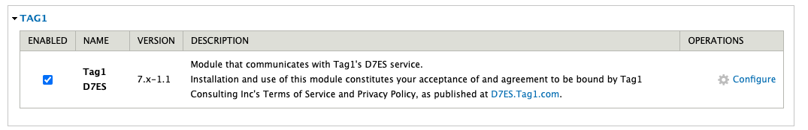
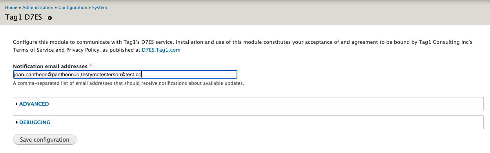
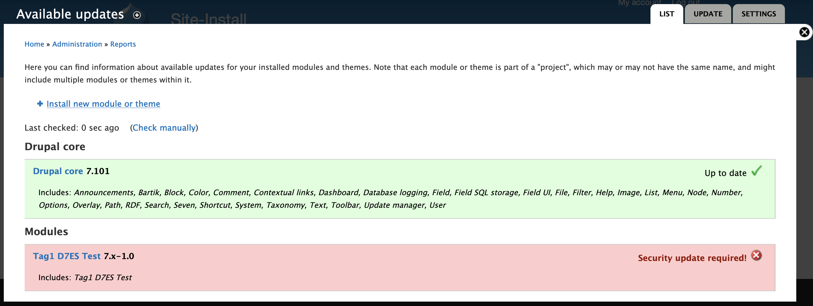

The following table indicates availability of the specified Drupal versions, as well as our usage recommendations and our support scope.

| Drupal version | Available | Recommended | Supported |
| ----------- | :---------: | :---------: | :---------: |
| Drupal CMS          | <span style="color:green">✔</span> | <span style="color:green">✔</span>           | <span style="color:green">✔</span>
| 11          | <span style="color:green">✔</span> | <span style="color:green">✔</span>           | <span style="color:green">✔</span>
| 10          | <span style="color:green">✔</span>         | <span style="color:green">✔</span>           | <span style="color:green">✔</span>          |
| 9           |<span style="color:green">✔</span> <Popover title="Drupal 9 Availability" content="Drupal 9 is past its end of life date and is not an available option during site creation in the Pantheon dashboard. For a workaround, see the  <a href='#drupal-8-and-9-on-pantheon'>section below.</a>  While it remains functional on the platform, do not build for the future on it." /> | ❌           | <span style="color:green">✔</span> |
| 8           |<span style="color:green">✔</span> <Popover title="Drupal 8 Availability" content="Drupal 8 is past its end of life date and is not an available option during site creation in the Pantheon dashboard. For a workaround, see the  <a href='#drupal-8-and-9-on-pantheon'>section below.</a>  While it remains functional on the platform, do not build for the future on it." /> | ❌           | <span style="color:green">✔</span> |
| 7           | <span style="color:green">✔</span>         | ❌           | <span style="color:green">✔</span> <Popover title="Drupal 7 LTS" content="Pantheon offers Long-Term Support for Drupal 7 sites on the platform at no extra cost. For more information, see the <a href='#drupal-7-long-term-support'>section below.</a>" />        |
| 6           | ❌          | ❌           | ❌          |

## Drupal CMS on Pantheon
Drupal CMS is currently available to install via [this Dashboard Link](https://dashboard.pantheon.io/sites/create?upstream_id=462d08e2-3322-48a1-b150-f12a075eaabe) or Terminus:

```bash{promptUser: user}
terminus site:create <site> <label> drupal-cms-composer-managed
```

See the [`site:create` command docs](/terminus/commands/site-create) for all available flags.

Drupal CMS will be an option during site creation in the Pantheon dashboard soon.

## Drupal 10 and 11 on Pantheon
Refer to [Create a New CMS Site](/guides/getstarted/addsite/#create-a-new-cms-site) for how to create a new Drupal 10 or 11 site from the Pantheon dashboard.

If you already have a Drupal 10 site on Pantheon, you can upgrade your existing site to [Drupal 11 via Composer](https://www.drupal.org/docs/upgrading-drupal/upgrading-from-drupal-8-or-later/how-to-upgrade-from-drupal-10-to-drupal-11).

## Drupal 8 and 9 on Pantheon
Drupal 8 and 9 are not available as an option during site creation in the Pantheon dashboard. However, they can still be created on the platform using [Terminus](/terminus). For example:

```bash{promptUser: user}
terminus site:create <site> <label> drupal8
```

## Drupal 7 on Pantheon
Refer to [Create a New CMS Site](/guides/getstarted/addsite/#create-a-new-cms-site) for how to create a new Drupal 7 site from the Pantheon dashboard.

### Drupal 7 long-term support
Drupal 7 will reach it's end of life on January 5, 2025. Pantheon has partnered with [Tag1 Consulting](https://www.tag1consulting.com/) to offer Long-Term Support for Drupal 7 through **January 5, 2027**.
To learn more about this partnership, see the [related blog post](https://pantheon.io/blog/pantheon-and-tag1-support-drupal-7-websites).


#### D7 Core LTS and Platform Compatibility 
The D7 Long-Term Support includes security and compatibility updates to Drupal core and core dependencies from Tag1 Consulting, which are distributed by the Pantheon Drupal 7 Upstream and made available as a one-click updates via [the Pantheon Dashboard](core-updates#apply-upstream-updates-via-the-site-dashboard) or [Terminus command line tool](/core-updates#apply-upstream-updates-via-terminus).

<Alert title="Note" type="info" >

Drupal 7 sites that are currently using Composer with Drupal 7 (e.g. with our [Drops 7 Composer upstream](https://github.com/pantheon-systems/drops-7-composer) or similar) are recommended to migrate away from Drupal 7 with Composer to make the most of Pantheon's Drupal 7 Long-Term Support. Contrib modules cannot be automatically updated in this model and updates would need to be applied manually.

</Alert>

Also included is continued support for Drupal 7-compatible runtime environments on the Pantheon Platform, including PHP, MySQL and other prerequisites.

##### Requirements
* Drupal 7 core LTS available to all site plans and workspace tiers.
* Sites must use the [Pantheon Drupal 7 Upstream](https://github.com/pantheon-systems/drops-7).
  * Or a Custom Upstream based on the Pantheon Drupal 7 Upstream with the [latest updates pulled in](/guides/custom-upstream/create-custom-upstream#pull-in-core-from-pantheons-upstream).
* Sites must be updated to the [latest release](https://github.com/pantheon-systems/drops-7/tags) of Drupal core.

To verify your current Drupal core version, you can check the [Status report tab](/drupal-launch-check#status-report) in the Pantheon site dashboard or you can use Terminus: 

```bash{promptUser: user}
terminus drush <site>.<env> status
```

To verify your current upstream, you can go to the Pantheon site dashboard and click **Settings**, then **About Site** or you can use Terminus: 

```bash{promptUser: user}
terminus site:info <site>
```

For sites not already using the Pantheon Drupal 7 Upstream (or a Custom Upstream based on the Pantheon Drupal 7 Upstream), Pantheon partners with experienced web development agencies. Use our [Agency Matchmaker](https://directory.pantheon.io/agencies/matchmaking?utm_medium=email&utm_source=nurture&utm_content=agency_directory_match_maker&utm_campaign=2024_7_NU_WCOMP_US_wp_compete) to be connected with a trusted expert.

#### D7 Contrib Modules LTS
This includes security patches and compatibility updates to community-contributed modules via Tag1’s [D7 Extended Support (D7ES) module](https://www.drupal.org/project/tag1_d7es), which will be distributed and maintained as part of the Pantheon Drupal 7 Upstream.

##### Requirements
* D7 contrib module LTS available to all non-Sandbox site plans, or sites associated with a Gold, Diamond, or Platinum [workspace account tier](/guides/account-mgmt/plans/workspace-plans).
* Sites must use the [Pantheon Drupal 7 Upstream](https://github.com/pantheon-systems/drops-7).
  * Or a Custom Upstream based on the Pantheon Drupal 7 Upstream with the [latest updates pulled in](/guides/custom-upstream/create-custom-upstream#pull-in-core-from-pantheons-upstream).
* Sites must be updated to the [latest release](https://github.com/pantheon-systems/drops-7/tags) of Drupal core.
* (Recommended) Not a requirement, but we strongly recommend updating all contrib modules to their latest versions as well. 

##### D7ES Usage

By enabling this module and configuring the opt-in, your site’s list of contrib modules will be automatically submitted for D7ES security coverage. You will receive email notifications of D7 core & installed contrib module security and compatibility updates. 



Enable the module, then go to `/admin/config/system/tag1-d7es` to configure the list of email addresses that should be notified when applicable updates are released. On this configuration page you can also confirm your sites connection with Tag1’s update servers.



When updates are available, Drupal's Update Status module will notify you of the available updates. If you have configured your email address in the D7ES module, you will also receive an email notification. [See the Tag1 documentation on notifications for more information about configuration.](https://docs.tag1.com/notifications/)



Apply contrib updates from the Tag1 D7ES service via Drush, Autopilot, or manually via SFTP. For details, see the following tabs.

<TabList>

<Tab title="Drush (Recommended)" id="drush" active={true}>

1. [Set the connection mode to SFTP](/guides/sftp) for the Dev or Multidev environment via the Pantheon Dashboard or with [Terminus](/terminus):

 ```bash{promptUser: user}
 terminus connection:set <site>.<env> sftp
 ```

1. Use Drush to apply contrib updates from the Tag1 D7ES service: 
 ```bash{promptUser: user}
 terminus drush <site>.<env> pm:update --no-core
 ```

</Tab>

<Tab title="Autopilot (Recommended)" id="autopilot">

[Autopilot](/guides/autopilot) will automatically apply contrib module updates from the Tag1 D7ES service the next time Autopilot runs.
 
</Tab>
<Tab title="Manual Overwrite" id="overwrite">

The notification email will include the fully updated module package in tarball (tar.gz) and ZIP archive formats, along with a text patch file of the change. You can update contrib modules by unpackaging and replacing the entire module folder via your preferred SFTP client. For details, see [SFTP Access and Authentication](/guides/sftp/sftp-connection-info).

</Tab>

</TabList>


## Drush version support

Refer to [Manage Drush Versions on Pantheon](/guides/drush/drush-versions/) for information on Drush versions that are compatible with each Drupal version.

<Alert title="Note"  type="info" >

### Site-local Drush is required for Drupal sites.

Do not remove `drush/drush` from `composer.json`. If it's removed, `terminus drush` commands will fail with errors related to Twig.

</Alert>

## Modules Support

Refer to [Drupal Modules with Known Issues](/modules-known-issues) for a list of known compatibility issues.

## More Resources

* [Tag1 D7ES Documentation](https://docs.tag1.com)
* [D7ES Module on Drupal.org](https://www.drupal.org/project/tag1_d7es)
* [Pantheon Long-Term Support announcement post](https://pantheon.io/blog/pantheon-and-tag1-support-drupal-7-websites)
