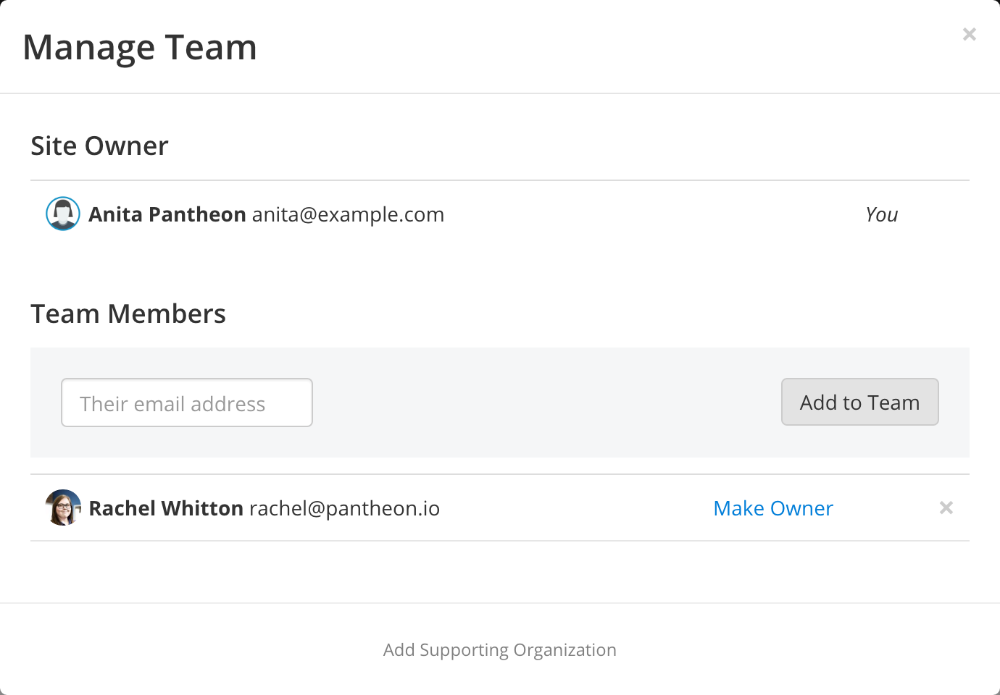
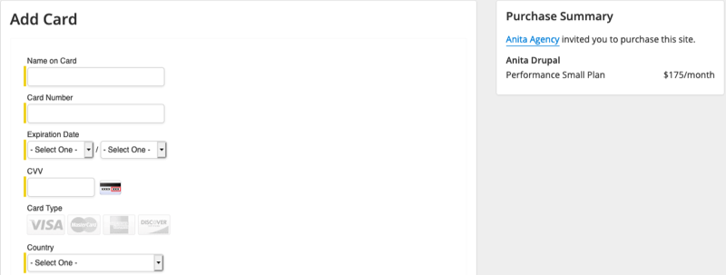

Pantheon has powerful workflow tools that are packed with real-time features that are great for people working in teams, and getting started is easy.

The Site Team generally consists of one Site Owner and any necessary Team Members. These roles have the following permissions:
## Site-Level: Roles and Permissions

| **Permissions**                                   | **Owner** | **Team Member** |
|:------------------------------------------------- |:--------- |:--------------- |
| Access the site Dashboard                         | ✓         | ✓               |
| Work on the site via SFTP or Git                  | ✓         | ✓               |
| Connect to the site's database via MySQL          | ✓         | ✓               |
| Clone Database/Files between all environments     | ✓         | ✓               |
| Deploy changes to Test and Live                   | ✓         | ✓               |
| Access [Pantheon Support](/support) | ✓         | ✓               |
| Enable New Relic                                  | ✓         | ✓               |
| Add/remove team members                           | ✓         |                 |
| Transfer Ownership                                | ✓         |                 |
| Add/remove supporting organizations               | ✓         |                 |
| Add Solr or Redis                                 | ✓         |                 |
| Manage a site's plan                              | ✓         |                 |

Once a site has been associated with an [organization](/organizations), either through ownership or a relationship with a supporting organization, [Role-Based Permissions & Change Management](/change-management) permissions are available.
<Alert title="Note" type="info">
For Sites associated with an Organization, the Developers and Team-members from the Organization may manage Multidev Environments, while members of the Site Team will not be able to Create, Delete, or Merge commits from Multidevs.
</Alert>

## Manage Site Team Members

You can add and delete users in the Team modal by clicking **Team** in the upper-right of your Site Dashboard.

## Add a Team Member

In the Team modal, enter the email address of the user and click **Add team member**.

Once the user has been added to the project, they will receive a welcome email notifying them that they are now a member of the site's team. This will allow them to access the site's codebase, create backups, mark the site as private, clear your sites' caches, sync content, and perform updates.

## Invite a Team Member

Sometimes you need to invite a user to a team or project who does not have a Pantheon account. You can still add them to the project and they will be sent an email with an invite to become a team member on the site.

Once they have successfully created an account, they will be automatically added to the team. As an added bonus if the user signs up, you'll get an extra free Dev site!

## Remove a Team Member

<Alert title="Note" type="info">
All users can be removed except the site owner.
</Alert>

In the Team modal in the Site Dashboard, click the X next to the user you want to delete.

When you delete a user from a site, they lose the ability to perform any operations on that site.

## Site Owner

Site ownership is assigned to the person who creates the site or pays for the site. The site owner cannot be removed from the site team.

### Change the Site Owner

#### Sandbox Sites

<Partial file="transfer-ownership-billing-steps.md" />

#### Paid Sites

To change the owner of a paid site (e.g. Basic, or Performance), you'll need to update the billing information by clicking **Invite a business owner to pay for this site** within the Settings page of the Site Dashboard. Enter the email address for the new site owner. Once the new owner receives the invitation they will be directed to provide payment information, at which point they will assume ownership of the site.

Enterprise Organizations can use the same process to assume ownership of a site; however, Agency Partners do not have the ability to own sites directly.

### Pantheon Partners

The site owner is the person who pays for the site. You'll need to update the payment method to change the owner.

## Add a Supporting Organization

One of the best things about Pantheon is the ability to collaborate with agencies and shops on web projects. If you have contracted with a Pantheon Partner Agency, you can add them to the site as a Supporting Organization, which will give their company access to help build, launch, or maintain your site:

<Partial file="add-supporting-org.md" />
