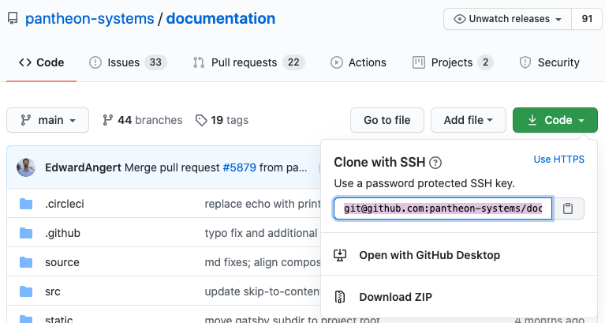

This section provides information on how to extend Terminus functionality and add commands by installing third-party plugins.

<Alert title="Note" type="info">

If you are a plugin author, ensure your your plugin is updated for Terminus 2.0. See [Terminus 2.0](/terminus/terminus-2-0) to compare the differences. Plugins that are advertised to work on Terminus 2.0 may also be used on [Terminus 3.0](/terminus/terminus-3-0).

</Alert>

## Install Plugins

The plugin installation process differs depending on your Terminus version. Please refer to the appropriate section below.

### Terminus 3

Terminus 3 ships with the plugin manager. You can use a Terminus command like the example below to install a plugin:

```bash
terminus self:plugin:install pantheon-systems/terminus-plugin-example
```

### Terminus 2

1. Add plugins within the `$HOME/.terminus/plugins` directory on your local workstation. You may need to create the `$HOME/.terminus/plugins` directory if it does not already exist:

    ```bash{promptUser: user}
    mkdir -p $HOME/.terminus/plugins
    ```

1. Download a zip archive of the plugin's most recent release, then install it by unpacking the archive within `$HOME/.terminus/plugins`:

    ```bash{promptUser: user}
    curl https://github.com/pantheon-systems/terminus-plugin-example/archive/1.x.tar.gz -L | tar -C ~/.terminus/plugins -xvz
    ```

<Accordion title="Composer and Git - Explore Advanced Installation Methods (Optional)" id="advance-installs" icon="lightbulb">

#### Install via Composer

Plugins published on Packagist are available to install via the Composer package manager. 

Open a terminal window on your computer and run the following commands:

```bash{promptUser: user}
composer create-project --no-dev -d ~/.terminus/plugins pantheon-systems/terminus-rsync-plugin:~1
```

#### Install via Git

Most plugins are published online as a Git repository. You can install the plugin by cloning the repository into your local plugins directory (`$HOME/.terminus/plugins`). This will allow you to contribute to the development of the plugin and to update the plugin using Git commands. Follow the steps below to install a plugin with Git.

1. Navigate to the plugin repository on GitHub.

1. Click **<span class="glyphicons glyphicon-save"></span> Code** on the repository home page:

    

1. Open a terminal window on your computer and run the following commands:

    ```bash{promptUser: user}
    cd $HOME/.terminus/plugins && git clone https://github.com/pantheon-systems/terminus-plugin-example.git
    ```

</Accordion>

## Update Plugins

The plugin update process differs depending on your Terminus version. Please refer to the appropriate section below.

### Terminus 3

Terminus 3 ships with the plugin manager. You can use a Terminus command like the example below to update a plugin:

```bash
terminus self:plugin:update pantheon-systems/terminus-plugin-example
```

### Terminus 2

1. Delete the plugin from the `$HOME/.terminus/plugins` directory. 

1. Download the latest version of the plugin and move the plugin directory into the `$HOME/.terminus/plugins` directory.

## Uninstall Plugins

The process to uninstall a plugin differs depending on your Terminus version. Please refer to the appropriate section below.

### Terminus 3

Terminus 3 ships with the plugin manager. You can use a Terminus command like the example below to uninstall a plugin:

```bash
terminus self:plugin:uninstall pantheon-systems/terminus-plugin-example
```

### Terminus 2

Delete the plugin from the `$HOME/.terminus/plugins` directory.

## More Resources

- [WordPress Plugins and Themes with Known Issues](/plugins-known-issues)
- [Drupal Modules with Known Issues](/modules-known-issues)