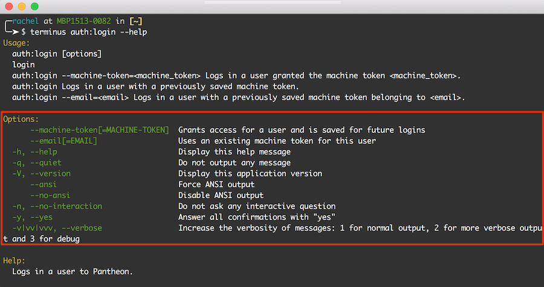

If you find yourself passing the same options to Terminus repeatedly, consider creating a configuration file to provide default values for common options. The Terminus configuration file lives at `$HOME/.terminus/config.yml`.

## Available Configurations

Any command variable normally passed in the form of `--option=VALUE` is configurable. Values stored will be available regardless of which alias you use to run the command. Default values stored this way will be overridden by those supplied on the command line.

You can see all the available options for a given command (e.g., available `--fields` or `--format` options) by running it with the `--help` option in your terminal:



### Example

The `$HOME/.terminus/config.yml` file uses YAML formatting, which relies on indentation in the form of two spaces per indent:

```yml:title=config.yml
hide_git_mode_warning: 1
command:
  auth:
    login:
      options:
        email: anita@example.com
  site:
    pancakes:
      options:
        app: sequelace
```

The example above does three things:

- Terminus will warn you when running commands in an environment set to Git mode, unaware if the command affects the codebase or not:

- When the command `terminus auth:login` is run, it will automatically provide the correct email address. This is useful if you find yourself logging in to multiple accounts frequently, and want to use your regular account by default.

  ```none
  [warning] This environment is in read-only Git mode. If you want to make changes to the codebase of this site (e.g. updating modules or plugins), you will need to toggle into read/write SFTP mode first.
  ```

  Defining `TERMINUS_HIDE_GIT_MODE_WARNING` disables that message, which is useful for those using Terminus for frequent changes to files, not code. <Popover content="See <a href='/pantheon-workflow'>Use the Pantheon WebOps Workflow</a> for more information on Code versus Content."/>

- The Terminus Plugin [Pancakes](https://github.com/terminus-plugin-project/terminus-pancakes-plugin) lets you open your Pantheon site database with a SQL GUI client. Rather than define the app every time, this configuration will always use Sequel Ace, unless otherwise specified.
