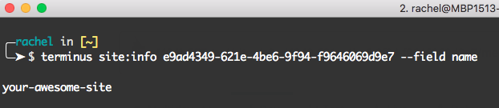

## Command Structure

The basic format of a Terminus command is:

```bash{promptUser: user}
terminus command:subcommand <site>.<env>
```

For more information on any command you can run:

```bash{promptUser: user}
terminus command:subcommand -h
```

Or for a list of all available commands:

```bash{promptUser: user}
terminus list
```

### site.env

Terminus command structure typically includes `<site>.<env>` in order to determine the target site and environment to execute against. Note that the `<>` symbols are part of the example, not to be included in your commands. For example, running the `env:clear-cache` command for the Live environment of a site labeled "Your Awesome Site":


<Accordion title="Learn More" id="identify-site" icon="lightbulb">

<dl>

<dt>Site Label</dt>

<dd>

Human readable, such as "Your Awesome Site", entered during site creation and displayed in the Site Dashboard.

</dd>

<dt>Site Name</dt>

<dd>

Machine readable, such as "your-awesome-site", either derived automatically by the platform from the site label or uniquely defined during site creation via Terminus. This value is used to construct [platform domains](/domains/#platform-domains).

</dd>

<dt>Environment Name</dt>

<dd>

Machine readable, such as "dev", "test", "live", or "bug123", which refers to the target site environment on Pantheon.

</dd>

</dl>

You can also find your site's machine name using the Terminus command `site:info`, and the [site UUID](/sites/#site-uuid). For example:



</Accordion>

### Drush and WP-CLI

Pantheon supports running [Drush (Drupal)](https://drushcommands.com/) and [WP-CLI (WordPress)](https://developer.wordpress.org/cli/commands/) commands remotely against a target site environment through Terminus. This is often faster and easier than leveraging such tools via local installations.

Start with the [basic command structure described above](#command-structure). The commands to invoke Drush and WP-CLI are `remote:drush` and `remote:wp`, respectively. Include `--` followed by the Drush or WP-CLI command and all arguments. For example:


For more information, see [Drupal Drush Command-Line Utility](/drush) and [Using WP-CLI On The Pantheon Platform](/wp-cli).

## Applying Updates

Quickly install updates to core, contributed modules, themes, and plugins from the command line with Terminus.

### Upstream Updates (Core)

Pantheon maintains upstream updates for [WordPress](https://github.com/pantheon-systems/WordPress), [Drupal 8](https://github.com/pantheon-systems/drops-8), and [Drupal 7](https://github.com/pantheon-systems/drops-7). Updates can be applied once they have been merged into the upstream and become available for a site.

<Alert title={"Note"} type={"info"}>

For instructions on how to resolve merge conflicts, see [Upstream
Updates](/core-updates#apply-upstream-updates-manually-from-the-command-line-to-resolve-merge-conflicts)

</Alert>

List available upstream updates:

```bash{promptUser: user}
terminus upstream:updates:list my-site
```

If the environment's connection mode is currently set to SFTP with uncommitted work you want to keep, commit now before proceeding:

```bash{promptUser: user}
terminus env:commit my-site.dev --message="My code changes"
```

<Alert title={"Warning"} type={"danger"}>

The following command will permanently delete all uncommitted SFTP changes. If you wish to keep SFTP changes, commit your work before proceeding.

</Alert>

Set the environment's connection mode to Git so updates can be pulled into the site from Pantheon's upstream:

```bash{promptUser: user}
terminus connection:set my-site.dev git
```

Apply available upstream updates for WordPress and Drupal core from the command line with Terminus:

```bash{promptUser: user}
terminus upstream:updates:apply my-site
```

### Module, Theme, and Plugin Updates

Apply updates to all contributed modules, themes, and plugins via Terminus by setting the environment's connection mode to SFTP and invoking [Drush](/drush) (Drupal) or [WP-CLI](/wp-cli) (WordPress) update commands. You can then use Terminus to commit updates to a development environment on Pantheon.

<TabList>

<Tab title="Drupal" id="drupaltab" active={true}>

First, set the Dev environment's connection mode to SFTP:

```bash{promptUser: user}
terminus connection:set my-site.dev sftp
```

Apply updates to all contrib projects:

```bash{promptUser: user}
terminus drush my-site.dev -- pm-updatecode --no-core
```

Commit contrib updates to the Dev environment:

```bash{promptUser: user}
terminus env:commit my-site.dev --message="Update all contrib projects"
```

</Tab>

<Tab title="WordPress" id="wptab">

First, set the Dev environment's connection mode to SFTP:

```bash{promptUser: user}
terminus connection:set my-site.dev sftp
```

Apply updates to all plugins:

```bash{promptUser: user}
terminus wp my-site.dev -- plugin update --all
```

Apply updates to all themes:

```bash{promptUser: user}
terminus wp my-site.dev -- theme update --all
```

Commit plugin and theme updates to the Dev environment:

```bash{promptUser: user}
terminus env:commit my-site.dev --message="Update all plugins and themes"
```

</Tab>

</TabList>

### Mass Update

Terminus supports third-party plugins that extend it's functionality by adding new commands. The following example demonstrates usage of the [Mass Update](https://github.com/pantheon-systems/terminus-mass-update) plugin to easily apply upstream updates (core updates) in bulk. For instructions on how to install Terminus plugins, see [Extend with Plugins](/terminus/plugins).

Install the [Mass Update](https://github.com/pantheon-systems/terminus-mass-update) plugin, then use the `--dry-run` option to review available upstream updates without applying them:

```bash{promptUser: user}
terminus site:list --format=list | terminus site:mass-update:apply --accept-upstream --updatedb --dry-run
```

The output should be similar to this:

```bash
[notice] Found 3 sites.
[notice] Fetching the list of available updates for each site...
[notice] 3 sites need updates.
[warning] Cannot apply updates to novasoft-drupal because the dev environment is not in git mode.
[DRY RUN] Applying 2 updates to jessiem-drupal7
[DRY RUN] Applying 10 updates to superb-central
```

Resolve warning messages shown in the `--dry-run` output by setting the connection mode to Git for each applicable site:

<Alert title={"Warning"} type={"danger"}>

The following command will permanently delete all uncommitted SFTP changes. If you wish to keep SFTP changes, commit your work before proceeding.

</Alert>

```bash{promptUser: user}
terminus connection:set my-site.dev git
```

Review output then apply the mass update by removing the `--dry-run` option:

```bash{promptUser: user}
terminus site:list --format=list | terminus site:mass-update:apply --accept-upstream --updatedb
```

## Deploying Code

When you're ready to test a new set of changes, use Terminus to deploy code from development environments up to the Test environment while pulling the database and files down from Live:

```bash{promptUser: user}
terminus env:deploy my-site.test --sync-content --note="Deploy core and contrib updates" --cc
```

After testing changes, use Terminus to deploy code from Test up to Live:

```bash{promptUser: user}
terminus env:deploy my-site.live --note="Deploy core and contrib updates" --cc
```

## Reset Dev Environment to Live

There are a few scenarios where it may be useful to reset your Dev environment (codebase, files, and database) to the state of Live:

- Development work that is not ready to go live has been committed directly to the Dev environment, blocking the deployment pipeline for other work ready to be deployed. After preserving work in progress on a local branch or on a [Multidev](/multidev) environment you can unblock deploys by resetting the Dev environment to reflect the state of Live.

- Code changes have been force-pushed or incorrectly merged into the Dev environment creating a large or complex Git history that you wish to undo.

- The state of the Dev environment is stale or otherwise massively out of date with the Live environment with many unneeded changes you wish to abandon.

- The Dev environment has been seriously corrupted and you would like to cleanly reset it to Live.

Start by cloning the site's codebase to your local machine if you have not done so already (replace <code>awesome-site</code> with your site name):

```bash{promptUser: user}
terminus connection:info awesome-site.dev --fields='Git Command' --format=string
```

Then automate the procedure for resetting Dev to Live by downloading the following bash script:

<Download file="reset-dev-to-live.sh" />

GITHUB-EMBED https://github.com/pantheon-systems/documentation/blob/main/source/scripts/reset-dev-to-live.sh.txt bash GITHUB-EMBED

Execute the script from the command line within the root directory of your site's codebase to reset Dev to Live:

```bash{promptUser: user}
sh /PATH/TO/SCRIPT/reset-dev-to-live.sh
```

The Site Dashboard will open once the reset procedure has completed.

## Switch Upstreams

Every site has an upstream assigned in order to deliver [one-click updates](/core-updates) in the Pantheon Site Dashboard. Terminus can be used to manage this site level configuration. There are a few scenarios where it may be useful to change a site's upstream:

- Convert existing sites from a default framework to a [Custom Upstream](/custom-upstream).
- Convert existing sites from one Custom Upstream to another, for reasons like:
  - Repository has been migrated from Bitbucket to Github, or vice versa.
  - Code has been refactored and moved to a new repository.
- Set an empty upstream to disable one-click updates for sites managed by Composer.

Confirm that the user you are authenticated as has the correct [Site-level permissions](/change-management#site-level-roles-and-permissions). Only a User in Charge or Owner can change a site's Upstream.

To see all available upstreams, run:

```bash{promptUser: user}
terminus upstream:list
```

If your organization has a [Custom Upstream](/custom-upstream), you can use Terminus to switch existing sites over to the common codebase:

```bash{promptUser: user}
terminus site:upstream:set my-site "My Custom Upstream"
```

You can use any valid identifier (upstream name, upstream machine name, upstream UUID) returned in `terminus upstream:list` to set a new upstream. For example, the upstream name "My Custom Upstream" is used above.

As a safeguard, Terminus will prevent a framework switch such as moving from Drupal to WordPress or vice versa.

<Alert title={"Note"} type={"info"}>

To set an empty upstream for Composer-managed sites, see [Serving Sites from the Web Subdirectory](/nested-docroot/).

</Alert>

After setting the upstream, you must bring in the new codebase by applying updates to the site. For details on how to apply updates, see the [example usage above](#applying-updates).

### Terminus Error: Permission to change the upstream of this site

If you encounter an error when setting a site's upstream:

```bash{outputLines: 2}
terminus site:upstream:set $SITE $UPSTREAM
 [error]  You do not have permission to change the upstream of this site.
```

Confirm that the user you are authenticated as has the correct [site-level permissions](/change-management#site-level-roles-and-permissions).

To check the currently authenticated user:

```bash{promptUser: user}
terminus auth:whoami
```
