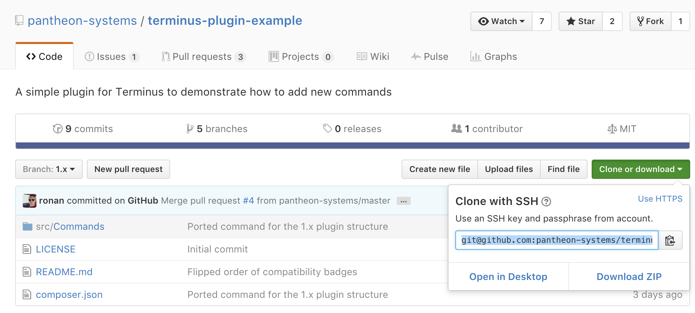

Extend the functionality of Terminus and add commands by installing third party plugins.

<Alert title="Note" type="info">

If you are a plugin author, ensure your your plugin is updated for Terminus 2. See [Terminus 2.0](/terminus-2-0) to compare the differences.

</Alert>

## Install Plugins

Add plugins within the <code>$HOME/.terminus/plugins</code> directory on your local workstation. You may need to create the <code>$HOME/.terminus/plugins</code> directory if it does not already exist:

```bash
  mkdir -p $HOME/.terminus/plugins
```

Download a zip archive of the plugin's most recent release, then install it by unpacking the archive within <code>\$HOME/.terminus/plugins</code>:

```bash
  curl
  https://github.com/pantheon-systems/terminus-plugin-example/archive/1.x.tar.gz
  -L | tar -C ~/.terminus/plugins -xvz
```

<Accordion title="Explore Advanced Install Methods (Optional)" id="advance-installs" icon="lightbulb">

### Install via Composer

Plugins published on Packagist are available to install via the Composer package manager. From a terminal window on your computer, use the following commands:

```bash
  composer create-project -n -d $HOME/.terminus/plugins
  pantheon-systems/terminus-plugin-example:~1
```

### Install via Git

Most plugins are published online as a Git repository. You can install the plugin by cloning the repository into your local plugins directory (`\$HOME/.terminus/plugins`). This will allow you to contribute to the development of the plugin and to update the plugin using Git commands. To install a plugin using Git, find the Git URL of the plugin’s repository. On GitHub you can find it by clicking **Clone or download** on the repository home page:



Then in a terminal window on your computer, use the following commands:

```bash
  cd $HOME/.terminus/plugins && git clone
  https://github.com/pantheon-systems/terminus-plugin-example.git
```

  </Accordion>

## Update Plugins

Delete the plugin from the `$HOME/.terminus/plugins` directory. Download the latest version of the plugin and move the plugin directory into the `$HOME/.terminus/plugins` directory.

## Uninstall Plugins

Delete the plugin from the `$HOME/.terminus/plugins` directory.
