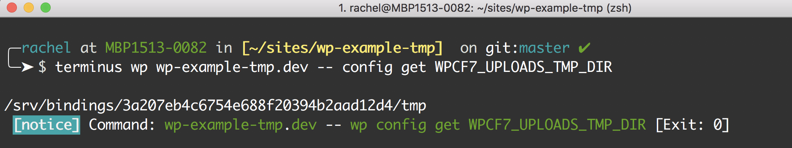
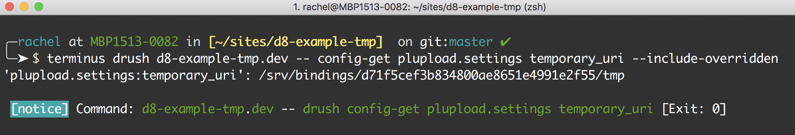
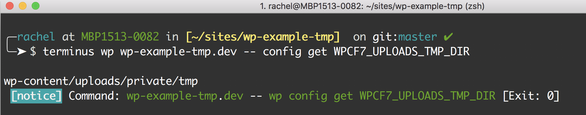
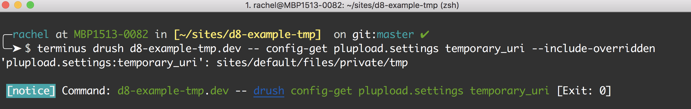

<Alert title="Exports" type="export">

This doc uses [Terminus](/terminus) commands. Before we begin, set the variables `$site` and `$env` in your terminal session to match your site name and the correct environment:

```bash
export env=dev
```

</Alert>

## Default Temporary Path

Pantheon configures an appropriate temporary path for [WordPress](https://github.com/pantheon-systems/WordPress/blob/default/wp-config-pantheon.php#L67) and [Drupal 8](https://github.com/pantheon-systems/drops-8/blob/8.5.3/sites/default/settings.pantheon.php#L146-L154). Drupal 7 sites can achieve the same configuration by adding the following to `settings.php`:

```php
/**
 * Drupal 7
 * Define appropriate location for tmp directory
 */
if (isset($_ENV['PANTHEON_ENVIRONMENT'])) {
  $conf['file_temporary_path'] = $_SERVER['HOME'] .'/tmp';
}
```

## Fix Unsupported Temporary Path

Errors caused by an unsupported temporary path typically surface as permission errors for `.tmp` files and can be replicated on any environment.

<TabList>

<Tab title="WordPress" id="wptmppath" active={true}>

Correct an unsupported temporary path set by a plugin or theme in `wp-config.php`. Replace `SOME_TMP_SETTING` with the conflicting plugin or theme option:

```php
/**
* WordPress
* Fix unsupported temporary path
* Replace SOME_TMP_SETTING
*/
if (isset($_ENV['PANTHEON_ENVIRONMENT'])) {
  define('SOME_TMP_SETTING', $_SERVER['HOME'] . '/tmp');
}
```

Verify the setting by using [Terminus](/terminus) to run `wp config get`:

```bash{promptUser: user}
terminus wp $site.$env -- config get SOME_TMP_SETTING
```

Output of this command should look something like the following Contact Form 7 example:



</Tab>

<Tab title="Drupal 7" id="d7tmppath">

Correct an unsupported temporary path set by a module or theme using `$conf` override in `settings.php`. Replace `some_tmp_setting` with the conflicting module or theme setting:

```php
/**
* Drupal 7
* Fix unsupported temporary path
* Replace some_tmp_setting
*/
if (isset($_ENV['PANTHEON_ENVIRONMENT'])) {
  $conf['some_tmp_setting'] = $_SERVER['HOME'] . '/tmp';
}
```

Verify the setting by using [Terminus](/terminus) to run `drush variable-get`:

```bash
terminus drush $site.$env -- variable-get some_tmp_setting
```

Output of this command should look something like the following Plupload example:


</Tab>

<Tab title="Drupal 8" id="d8tmppath">

Correct an unsupported temporary path set by a module or theme using `$config` override in `settings.php`. Replace `some_module` and `some_tmp_setting` with the conflicting module or theme setting:

```php
/**
* Drupal 8
* Fix unsupported temporary path
* Replace some_module and some_tmp_setting
*/
if (isset($_ENV['PANTHEON_ENVIRONMENT'])) {
  $config['some_module.settings']['some_tmp_setting']= $_SERVER['HOME'] . '/tmp';
}
```

Verify the setting by using [Terminus](/terminus) to run `drush config-get` with `--include-overridden`:

```bash
terminus drush $site.$env -- config-get some_module.settings some_tmp_setting --include-overridden
```

Output of this command should look something like the following Plupload example:



</Tab>

</TabList>

## Multiple Application Containers

Errors caused by this scenario occur on production environments (Test or Live) and typically reference some `.tmp` file as not found and could not be copied. These errors cannot be replicated on development environments (Dev or Multidev) since those environments use a single application container.

Sites on the Performance Medium plan and above have multiple [application containers](/application-containers). To help sites perform at scale, the platform routes requests across available application containers based on their load.

The default temporary path (`$_SERVER['HOME'] . '/tmp'`) is not synchronized across application containers, so operations that expect this path to persist will fail.

### Considerations

It's not common for a plugin, module, or theme to use the temporary path in a way that results in such errors. We suggest reporting the issue to the author and replacing the conflicting plugin, module, or theme whenever possible until a fix is released.

Be aware that temporary files are not cleaned up automatically in the following configuration, which can result in [highly populated directories](/platform-considerations/#highly-populated-directories).

### Persistent Temporary Path Workaround

<Alert title="Warning" type="danger">

In general, there's no need for temporary files to persist across application containers. Using a different plugin or module is preferred to taking the performance hit caused by the workaround below.

</Alert>

<TabList>

<Tab title="WordPress" id="wpworkaround" active={true}>

Configure a temporary path that uses a private subdirectory of Pantheon's networked filesystem in `wp-config.php`. Replace `SOME_TMP_SETTING` with the conflicting plugin or theme option:

```php:title=site-config.php
/**
* WordPress
* Persistent tmp across app containers
* Replace SOME_TMP_SETTING
*/
if (isset($_ENV['PANTHEON_ENVIRONMENT'])) {
  define('SOME_TMP_SETTING', '/wp-content/uploads/private/tmp');
}
```

The `private` and `tmp` directories do not exist by default; you must create the folders via SFTP if you have not done so already. We do not recommend using a public path since core treats the temporary path as non-web-accessible by default.

Verify the setting by using [Terminus](/terminus) to run `wp config get`:

```bash
terminus wp $site.$env -- config get SOME_TMP_SETTING
```

Output of this command should look something like the following Contact Form 7 example:



</Tab>

<Tab title="Drupal 7" id="d7workaround">

Configure a temporary path that uses a private subdirectory of Pantheon's networked filesystem using `$conf` override in `settings.php`. Replace `some_tmp_setting` with the conflicting module or theme setting:

```php:title=settings.php
/**
* Drupal 7
* Persistent tmp across app containers
* Replace some_tmp_setting
*/
if (isset($_ENV['PANTHEON_ENVIRONMENT'])) {
  $conf['some_tmp_setting'] = 'sites/default/files/private/tmp';
}
```

The `private` and `tmp` directories do not exist by default; you must create the folders via SFTP if you have not done so already. We do not recommend using a public path since core treats the temporary path as non-web-accessible by default.

Verify the setting by using [Terminus](/terminus) to run `drush variable-get`:

```bash{promptUser: user}
terminus drush $site.$env -- variable-get some_tmp_setting
```

Output of this command should look something like the following Plupload example:


</Tab>

<Tab title="Drupal 8" id="d8workaround">

Configure a temporary path that uses a private subdirectory of Pantheon's networked filesystem using `$config` override in `settings.php`. Replace `some_module` and `some_tmp_setting` with the conflicting module or theme setting:

```php:title=settings.php
/**
* Drupal 8
* Persistent tmp across app containers
* Replace some_module and some_tmp_setting
*/
if (isset($_ENV['PANTHEON_ENVIRONMENT'])) {
  $config['some_module.settings']['some_tmp_setting']= 'sites/default/files/private/tmp';
}
```

The `private` and `tmp` directories do not exist by default; you must create the folders via SFTP if you have not done so already. We do not recommend using a public path since core treats the temporary path as non-web-accessible by default.

Verify the setting by using [Terminus](/terminus) to run `drush config-get` with `--include-overridden`:

```bash
terminus drush $site.$env -- config-get some_module.settings some_tmp_setting --include-overridden
```

Output of this command should look something like the following Plupload example:



</Tab>

</TabList>
