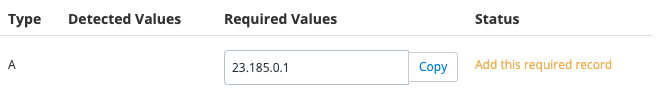
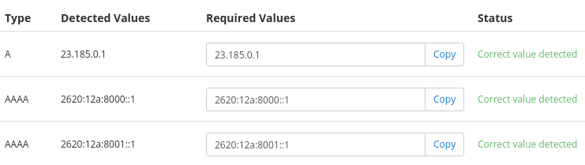

Pantheon Partners, Strategic Partners, Enterprise accounts, Resellers, and OEM Partners have the ability to provision a custom vanity domain for each environment on every site running on the platform, in addition to the default Platform domain (`pantheonsite.io`).

<Partial file="vanity-https.md" />

The Vanity domain can either be a subdomain of your primary site (`sites.mydomain.com`) or a dedicated domain name (`mypantheonprojects.com`).

If a subdomain of your primary site is configured, a newly created site named "supersite" will then have a Dev environment URL of `dev-supersite.sites.mydomain.com`. If a dedicated domain name is used, the site would instead have a Dev environment URL of `dev-supersite.mypantheonprojects.com`.

<Partial file="secure-only-tlds.md" />

## Request the Vanity Domain

From your Organization Dashboard, go to Dashboard and [open a support ticket](/guides/support/contact-support) with "Request for custom Vanity domain" as the subject. You must provide the Vanity domain required on the site, like `sites.example.com`.

<Alert title="Note" type="info">

We recommend using a separate domain from your production site. This prevents any security issues related to domain-specific cookies. Even the same domain under a different TLD (`.com`, `.net`, etc) would suffice.

</Alert>

### AGCDN Vanity Domains

You must provide a custom certificate if you want to use a vanity domain on your [Advanced Global CDN](guides/professional-services#advanced-global-cdn) site.

Our [Custom Certificate](/custom-certificates#add-a-custom-certificate) service is only available to contract customers, including Elite, Enterprise, Higher Education, and Resellers. 

## Create Wildcard DNS Records

At your DNS provider, create a wildcard A/AAAA record pointing to our edge. Using the example domain `sites.example.com`, the record would need to be created as follows. Replace `X` with a `1`, `2`, `3`, or `4`:

> `*.sites.example.com` **A** `23.185.0.X`
>
> `*.sites.example.com` **AAAA** `2620:12a:8000::X`
>
> `*.sites.example.com` **AAAA** `2620:12a:8001::X`

See [Introduction to Domain Name Services](/dns/#what-are-aaaa-records-and-do-i-need-them) for more information about AAAA records.

<Alert type="info" title="Note">

If the domain in question is already in use, be sure to configure your vanity domain at Pantheon _before_ changing DNS records to avoid any downtime.

</Alert>

## Effects and Considerations

- Existing sites created before configuring a Vanity domain will continue to use the default Platform domains and will not use the custom Vanity domain.

- Sites associated with your organization will receive the custom Vanity domain for all environments (including Multidev) created while the organization remains a supporting organization.

- After adding a custom Vanity domain to your organization, some workflow operations such as restoring an environment from a backup or changing the PHP version, can cause site domain URLs in other environments to unexpectedly change from the Pantheon domain to the custom domain.

- **Environment URLs are permanent.** If an organization is removed as the supporting organization, any environment created during its association will keep the original URL after removal. Paid sites can add custom domains to any environment, as a workaround for those wishing to use different URLs after launch and disassociation of the site with the organization.

- **Do not configure DNS for custom domains using Vanity domain values.** Even after configuring a vanity domain, your custom domain records should *always* be `A`/`AAAA` records pointing to the platform IP addresses, as recommended within the **<span class="glyphicons glyphicons-global"></span> Domains / HTTPS** page. Vanity domains are designed to be viewed by end users, not added into records for other domains.

<Alert title="Incorrect DNS Configuration" type="danger" icon="remove">



</Alert>

<Alert title="Correct DNS Configuration" type="success" icon="check">



</Alert>

- If your site uses a custom domain instead of a platform domain, edit the `wp-config.php` to reflect the custom domain. 

## Security Considerations

If you run sites on subdomains of your primary site (e.g. `sites.awesomeagency.com`), you should be aware of some security considerations:

<Partial file="vanity-https.md" />

- Sites on the subdomains may be able to read cookies set on your primary site.
- If a site on the subdomain is reported as a malicious phishing/spam/malware site, it could prevent access to your main marketing site if Google/Norton/etc. block the site.


## Robots.txt with Custom Vanity Domains

For SEO and to prevent duplicate content, the `robots.txt` file attached to the custom vanity domain will contain the following by default:

```http:title=robots.txt
# https://live-sitename.agencyname.com/robots.txt
User-agent: *
Disallow: /
```

To present an alternate `robots.txt` file from within the source code, [add a custom domain](/guides/launch/domains) to the site's Dashboard and create the appropriate DNS record.
