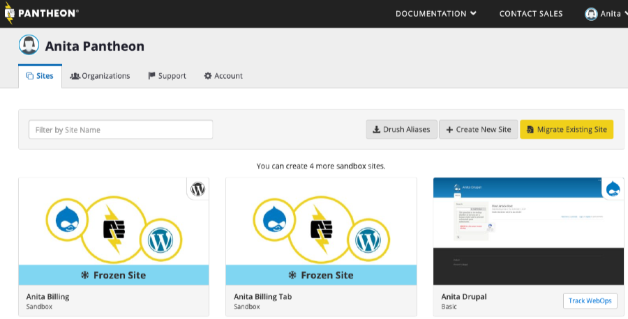
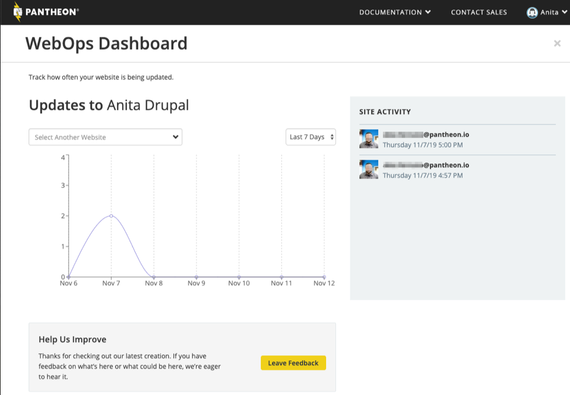

Pantheon's [WebOps](https://pantheon.io/webops) Dashboard combines metrics and data in one page of easy to understand visualization of site development.

## How to Access the WebOps Dashboard

From the [User](https://dashboard.pantheon.io) or Org Dashboard, any Site that is not [Sandbox](/create-sites#sandbox-sites) or [Frozen](/platform-considerations#inactive-site-freezing) has a **Track WebOps** button:

## What the WebOps Dashboard Shows

The WebOps Dashboard shows site activity as measured by code deployed from the Test to Live environment.

The graph shows the frequency of activity over the time period selected in the dropdown (**Last 30 Days** in the screenshot above). The **Site Activity** section lists the most recent deploys by the user's email.

To view the Site Activity for another site, use the **Select Another Website** dropdown.

### What Counts As a Deploy

Merges from Test to Live are considered Deploys.

### How to Request a Feature

Yes! Click the **Leave Feedback** button from the WebOps Dashboard or let our team know in [chat](/guides/support/contact-support/#real-time-chat-support).
