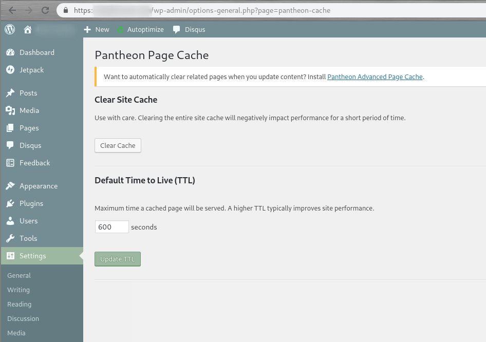

Pantheon maintains an [optimized version of WordPress](https://github.com/pantheon-systems/WordPress) that includes a plugin to control cache expiration. By default, pages will expire from the Varnish Edge Cache after 10 minutes (600 seconds). The plugin sets a default HTTP header: `Cache-Control: public, max-age=600`

You can increase the default value to increase the chances that a visitor will request a cached page, which will reduce page load times.

If you want to automatically clear cached pages when content is updated, check out the [Pantheon Advanced Page Cache](https://wordpress.org/plugins/pantheon-advanced-page-cache)

## Pantheon Page Cache Plugin Configuration

1. Log in to your WordPress site as an administrator.

1. Click **Settings**.

1. Click **Pantheon Cache**. You'll end up at: `/wp-admin/options-general.php?page=pantheon-cache`

1. Adjust the **Default Cache Time** as desired.

1. Click **Save Changes**.



You'll want to strike a balance between freshness of content and speed. We recommend a minimum of 600 seconds.  If you can increase the setting to 30 minutes (1800 seconds) or 1 hour (3600 seconds), many more requests will hit the Edge Cache. Every page served from the Edge Cache won't hit your application container's PHP workers or MySQL database, which means faster page load times and a better user experience for site visitors.

## Programmatically Using Pantheon Cache Functions

Within the `pantheon-cache.php` file that houses the Pantheon Cache plugin code, there are three functions that are useful to developers. You can call them from within your own custom code using various WordPress hooks, such as [save_post()](https://codex.wordpress.org/Plugin_API/Action_Reference/save_post). Currently, the [limit on the number of paths](https://github.com/pantheon-systems/WordPress/issues/24) that can be cleared in a single call is 10.

### flush_site

Flushes the site cache for the entire site. This achieves the same result as the Clear Site Cache button on the Pantheon Cache administration page.

```php
/**
 * Clear the cache for the entire site.
 *
 * @return void
 */
public function flush_site()
```

### clean_post_cache

Flushes the cache for an individual post, which is identified by the `$post_id`. The optional `$include_homepage` argument can also be passed, but if not the default value is "true".

```php
/**
 * Clear the cache for a post.
 *
 * @param  int $post_id A post ID to clean.
 * @return void
 */
public function clean_post_cache( $post_id, $include_homepage = true )
```

### clean_term_cache

Flushes the cache for an individual term or terms which are passed in an array, or for a complete taxonomy passed via a single taxonomy ID.

```php
/**
 * Clear the cache for a given term or terms and taxonomy.
 *
 * @param int|array $ids Single or list of Term IDs.
 * @param string $taxonomy Can be empty and will assume tt_ids, else will use for context.
 * @return void
 */
public function clean_term_cache( $term_ids, $taxonomy )
```

## See Also

- [Testing Global CDN Caching](/test-global-cdn-caching)
- [Global CDN Caching for High Performance](/global-cdn-caching)
- [Installing Redis on Drupal or WordPress](/redis)
