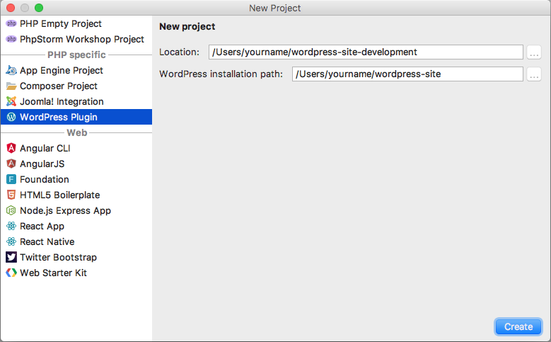
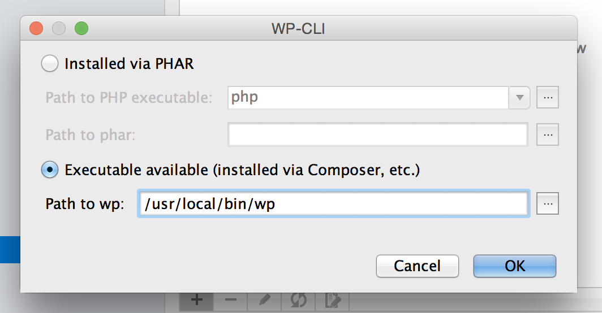
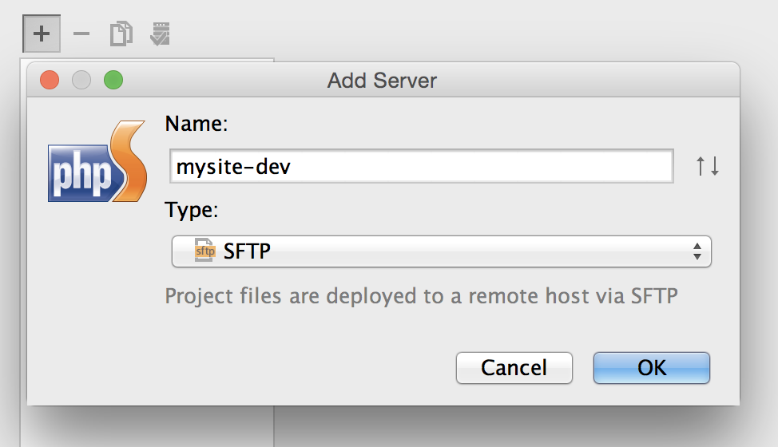
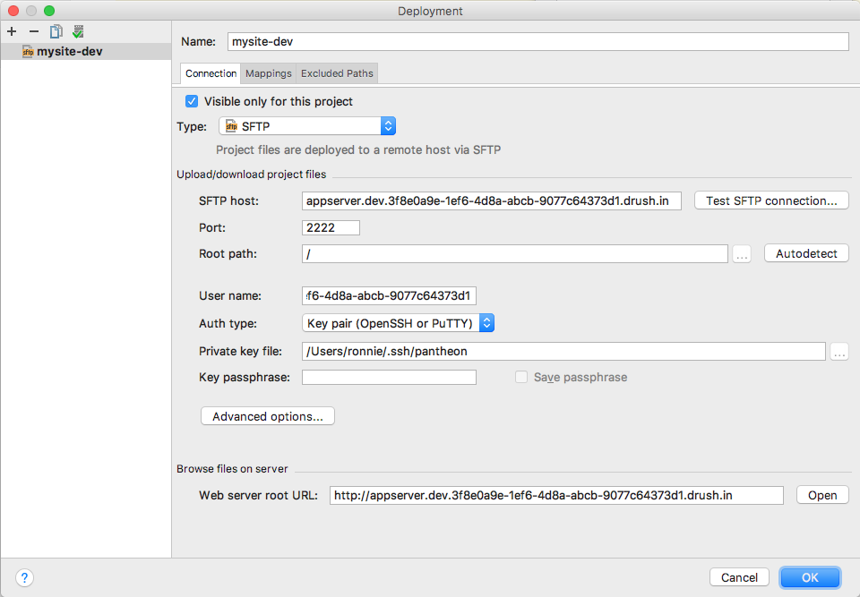
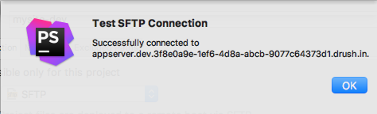

## Overview

[JetBrains PhpStorm](https://www.jetbrains.com/phpstorm/) is a commercial PHP IDE that can be configured to work with WordPress sites, allowing users to easily build and maintain custom plugins. This doc will set you up with a local environment in PhpStorm to create your custom plugins and themes.

For detailed information, see [WordPress Development using PhpStorm](https://confluence.jetbrains.com/display/PhpStorm/WordPress+Development+using+PhpStorm). This document focuses on integrating and showcasing the PhpStorm workflow and is current as of PhpStorm version 2017.1.4.

## Create a WordPress site

If you do not already have one, [create a new WordPress site](/guides/quickstart) on Pantheon. This will be your empty site, in which to develop your new plugin or theme.

## Clone the Code Repository

Copy your site code to your local workstation using [SFTP](/sftp#sftp-connection-information) or clone your site codebase with [Git](/git/#clone-your-site-codebase).

## Create a PhpStorm Project

1. Open PhpStorm.
2. Click **Create New Project** from the startup window or go to **File Menu > New Project...** if you have an existing project open.
3. Name your project.
4. Select **WordPress Plugin** as the project type on the left sidebar.
5. Specify or browse to the file path to save your project's files. This is where PhpStorm will store its "working files", and should be separate from your WordPress directory.
6. Specify or browse to the root directory for your local WordPress site, and click **Create**:

    

There will not be any files open within your project once you complete these steps. You will find a PHP file in the project's root, which contains the standard plugin header for WordPress.

## Configure WP-CLI (Optional)

Many WordPress plugin developers use the command line tool [WP-CLI](https://make.wordpress.org/cli/handbook/). This is useful if you have a local development environment and want to use WP-CLI to manage it.

<Alert title="Note" type="info">
You must successfully create a project before adding WP-CLI as a Command Line Tool.
</Alert>

Once you have installed WP-CLI on your local machine you can configure PhpStorm to recognize WP-CLI from within your project by following these steps:

1. Launch PhpStorm Menu > **Preferences...**
2. In the Tools Section click [Command Line Tool Support](https://www.jetbrains.com/help/phpstorm/command-line-tool-support.html) then click the click **+** icon to add an entry.
3. Choose the tool **WP-CLI**, and click **OK**.
4. Select **Executable Available** and enter the file path to your local `wp` directory.
 
5. Click **OK** to save the changes.

## Configure Your Pantheon Development Environment

1. Put your [Dev environment into SFTP mode](/sftp#sftp-mode), and click **Connection Info** to see the connection settings.
2. With your PhpStorm project opened, go to the **Tools Menu** > **Deployment** and click the **Configuration...** option.
3. Click **+** to [add a web server](https://www.jetbrains.com/help/phpstorm/add-server-dialog.html).
4. Enter your Pantheon site name, followed by a dash and the environment.
5. Select **SFTP** for type and click **OK**.

### Connection Tab

Use your site's [SFTP connection information](/sftp#sftp-connection-information) to configure the Connection tab:

1. Type: `SFTP`
1. SFTP Host: `appserver.dev.<Site UUID>.drush.in`
1. Port: `2222`
1. User name: `dev.<Site UUID>`
1. Auth Type: Select Password and specify password, or key pair and select your private SSH key.
1. Root Path: Click the **Autodetect** button and the Root Path should be automatically populated:

    
    <Alert tile="Warning" type="danger">
    PhpStorm does not allow the Root Path to be left blank. Because the Pantheon platform sometimes migrates sites across app servers without warning, you will need to update the root path any time the binding path changes for your Dev environment.
    </Alert>

1. Click the **Test SFTP Connection...** button and make sure the connection is successful before moving forward.  Click **OK**.

    

### Mappings Tab

Provide the file paths within the Mappings tab to allow correspondence between project folders:

1. Local path: This field is automatically populated and requires no edits.
2. Deployment path on server: `/code`
3. Web path on server: `/`
4. Click **OK**.

## Enabling Automatic Upload

Go to **Tools Menu** > **Deployment** > **Automatic Upload**.

You are now ready to begin editing your code. Any files you change and save locally will be automatically uploaded to your Pantheon development environment.
