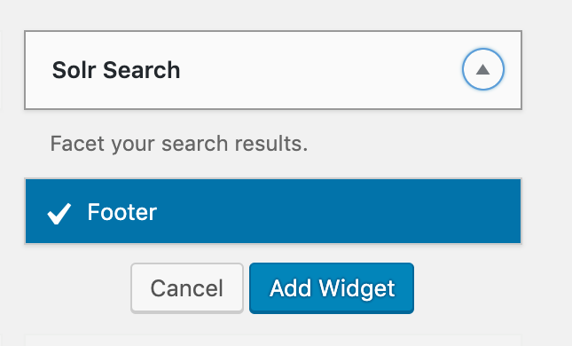
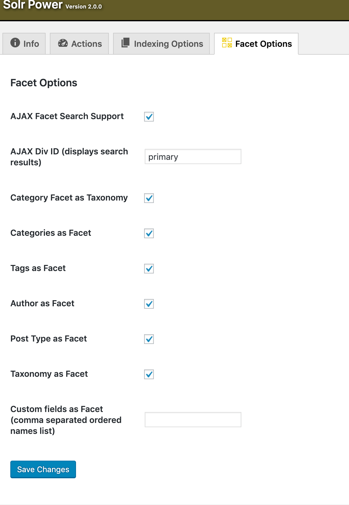

[Apache Solr](/solr) is a system for indexing and searching site content. All plans except for a Basic plan can use Pantheon Solr. <Partial file="solr-version.md" />

<Enablement title="Get WebOps Training" link="https://pantheon.io/learn-pantheon?docs">

Learn how to configure Solr with help from our experts. Pantheon delivers on-demand training to help development teams master the platform and improve internal WebOps.

</Enablement>

## Enable Solr from the Site Dashboard

Before you can start using Solr on WordPress, you need to add the Index Server to your site:

From your Dashboard, go to **Settings** > **Add Ons** > **Apache Solr Index Server: Add**:


This will provision Apache Solr containers for every environment for your site. You are now ready to begin integrating with WordPress.

## Solr Search for WordPress

Pantheon supports and maintains [Solr Search for WordPress (Solr Power)](https://wordpress.org/plugins/solr-power/).  This plugin replaces the [default search mechanism](https://codex.wordpress.org/Class_Reference/WP_Query#Search_Parameter) within WordPress while preserving the familiar integration methods within themes and widgets.

This plugin requires PHP version 7.1 or higher. See [Upgrade PHP versions](/php-versions) for more information on switching PHP versions.

## Install and Configure Plugin

1. [Set the connection mode to SFTP](/sftp) for the Dev or Multidev environment via the Pantheon Dashboard, or with [Terminus](/terminus):

 ```bash
 terminus connection:set <site>.<env> sftp
 ```

1. Install and activate the [Solr Search for WordPress (Solr Power)](https://wordpress.org/plugins/solr-power/) plugin on the Dev or Multidev environment using the WordPress Dashboard, or with Terminus:

 ```bash
 terminus wp <site>.<env> -- plugin install --activate solr-power
 ```

 Or for WP Site Networks:

 ```bash
 terminus wp <site>.<env> -- plugin install --activate --network solr-power
 ```

1. From the WordPress Dashboard, navigate to **Solr Power** (previously under **Settings**). You should see your site's Solr Server details within the **Info** tab.

1. Select **Indexing Options** from the navigation bar and configure desired indexing options for Solr. Click **Save Changes** after making modifications.

   <Alert title="Note" type="info">

   You can exclude pages or posts from being indexed by providing the numeric ID of the item (comma separated) in the **Excludes Posts or Pages** field.

   </Alert>

1. Index all publicly queryable post types by navigating to the **Actions** tab and clicking **Start Index** next to **Index Searchable Post Types**, or via Terminus:

 ```bash
 terminus wp <site>.<env> -- solr index
 ```

 For WP Site Networks, you will need to index all your subsites individually:

 ```bash
 terminus wp <site>.<env> -- url=example.pantheonsite.io/subsite solr index
 ```

1. Deploy the plugin to the site's Test and Live environments after validation and testing.

## Set up Front-end AJAX Search Bar

1. In **Appearance** > **Widgets**, add the Solr Search Widget in your desired widget position.

  

1. In **Solr Power** > **Facet Options** tab, check **AJAX Facet Search Support** and enter the Div ID in **AJAX Div ID (displays search results)** eg. `primary`.

  

   The **Div ID** is where the search results will appear. You can use an existing Div ID in the page template, or you can create your own blank element using a unique ID name.

1. Check your desired Facets and save your settings, then test the search functionality before committing the changes.

### Optimize Index

For details, see the [Optimize command](https://solarium.readthedocs.io/en/stable/queries/update-query/building-an-update-query/optimize-command/) document.

### Schema.xml

<Alert title="Note" type="info">

Custom `schema.xml` files exist outside of version control, and must be uploaded to each environment separately.

</Alert>

Upon activation of the plugin on the Dev or Multidev environment, a default [`schema.xml`](https://github.com/pantheon-systems/solr-power/blob/master/schema.xml) document is automatically sent to the Solr server. The `schema.xml` file is submitted automatically when deploying the plugin to another environment on Pantheon.

You can set a custom `schema.xml` by uploading it to the `/wp-content/uploads/solr-for-wordpress-on-pantheon/` directory using SFTP. Then, from the plugin's **Actions** tab, look for **Repost schema.xml** and click on **Execute**.

## Known Issues/Limitations

This plugin is under active development on [GitHub](https://github.com/pantheon-systems/solr-power). Use the issue queue for status updates and support. Pull requests are also welcome!

### Re-Indexing

New, deleted, and modified posts and pages are automatically added to the Solr index. However, if you modify the indexing options within **Solr Power**, you must manually re-index the site on the **Actions** tab.

### Enable Solr for AJAX and WordPress Dashboard

Use the `solr_allow_ajax` and the `solr_allow_admin` filters to allow Solr to work with AJAX and within the WordPress Dashboard.

## Safely Remove Solr

The following code changes are required before Solr can be safely uninstalled and disabled:

<Partial file="remove-addons/wp-solr.md" />
