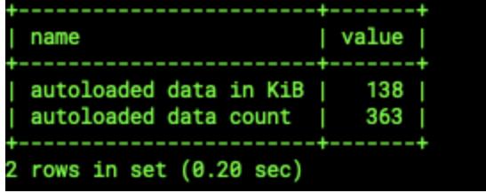
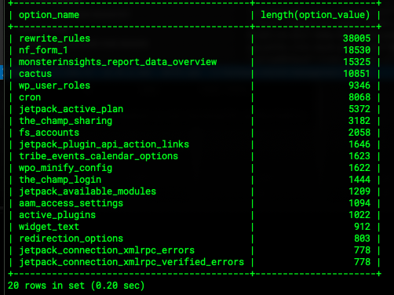

## wp_options Table

The `wp_options` table stores several types of data for your site, including:

    - settings for your plugins, widgets, and themes
    - temporarily cached data
    - site URL and home URL
    - category settings
    - autoloaded data

 <Alert title="Note"  type="info" >

`wp_` is the default prefix of the `options` table. The prefix of the `options` table may vary if you are using a custom prefix, such as `customexample_options`.

</Alert>
 
## Check the Size of Your Autoloaded Data

 If your website is running slow and you receive the following message in the database stats: `consider autoloading only necessary options`, follow the steps below.

 First, start by checking the size of your autoloaded data.

1. Log in to your [MySQL client](/mysql-access).

1. Select your database (by default `pantheon`) and then click the `SQL` tab.

1. Run the following code to see the total autoloaded data and data count:

    ```sql
    SELECT 'autoloaded data in KiB' as name, ROUND(SUM(LENGTH(option_value))/ 1024) as value FROM wp_options WHERE autoload='yes' UNION  SELECT 'autoloaded data count', count(*) FROM wp_options WHERE autoload='yes';
    ```
 
 The response will look similar to the example below.

 

 If your autoloaded data is less than 1 MB, it is unlikely that autoloaded data is slowing down your site. If your data is higher than 1 MB, you have a high number of options being autoloaded, and it is most likely slowing down your site.

 ## Check Your Top Autoloaded Items

1. Run the following code to see the top items with autoloaded data:

    ```sql
    SELECT option_name, length(option_value) FROM wp_options WHERE autoload='yes' ORDER BY length(option_value) DESC LIMIT 20
    ```
 The response will look similar to the example below.

 

1. Run the following code if you want to turn off autoload for an item:

    ```sql
    update_option( 'wp_option', 'value' ); to be update_option( 'wp_option', 'value', 'no' );
    ```

    You must specify `no` in the third parameter (if left blank it will default to `yes`). 

 ## Tips to Minimize Autoloaded Data

 We recommend minimizing your autoloaded data to increase to your site's performance. We've provided a few tips for reducing your autoloaded cache below.

### Redirect Your Site with PHP

Redirect plugins are common culprits for causing increased autoloaded cache. You can clean up your excess autoloaded data by [redirecting your site configuration with PHP](/redirects#redirect-with-php).

### Clean up Transient Data

Transients cache data for a set amount of time in WordPress. Although transients are only stored temporarily, they can become excessively large and slow down your site.

Run the following code to clean up your transient data:

    ```sql
    SELECT * FROM wp_optionsWHEREautoload= 'yes' ANDoption_nameLIKE '%transient%';
    ```

### Avoid Using Transient Data

You can use Pantheon's [Object Cache](/object-cache) to completely avoid using transient data for the `wp_options` table.

### Use Pantheon's Professional Services

You can also use [Pantheon's Professional Services](/guides/professional-services/advanced-global-cdn#edge-redirects) to reduce requests to your CMS by moving page redirects to the edge.