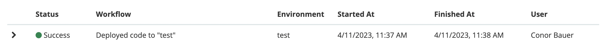
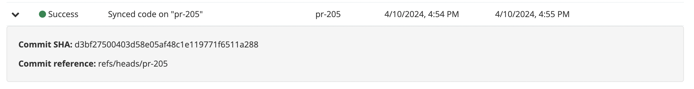
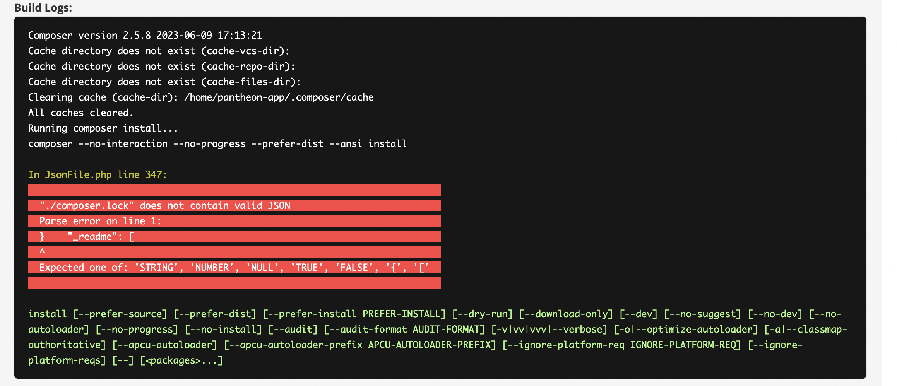
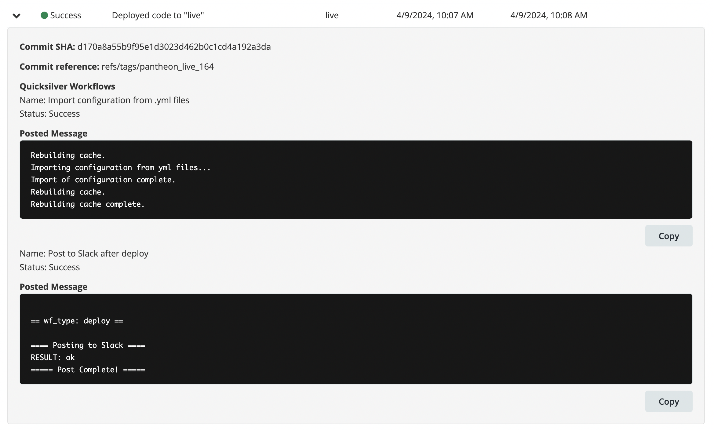
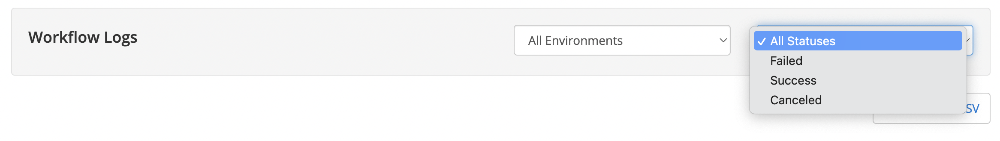

<Alert title="Early Access" type="info" icon="leaf">

Workflow Logs are available for [Early Access](/guides/support/early-access/) participants.

While this feature is in Early Access, Pantheon's development team releases new functionality often. Please review Pantheon's [Software Evaluation Licensing Terms](https://legal.pantheon.io/#contract-hkqlbwpxo) for more information about support expectations for and access to Pantheon's pre-release software.

</Alert>

Workflows serve as the backbone of the Pantheon platform, orchestrating operations for every user action. Whether it's pushing a commit or creating a new Multidev environment, workflows ensure the intended end state for a site is achieved. The Workflow Logs feature is specifically designed to provide enhanced visibility into the status of user-relevant workflows, offering critical insights for monitoring and troubleshooting purposes.

## Accessing Workflow Logs
From your workspace dashboard, select a site. You'll find the tab for workflow logs conveniently located next to the support tab.

Simply click on the tab to access.

## Functionality
### Status Indicators
Each workflow's status is represented by a color code.

Alongside the status, you'll find essential details such as the corresponding environment, start time, end time, and the team member who initiated the workflow. If a workflow spans multiple environments, the environment field may appear blank.

### Details Section
Workflows may contain additional details, indicated by a caret on the left side of the workflow row. To view these details, click on the row, and a dropdown will appear.

**Code Sync**: Any workflow containing a code sync will have the commit hash and reference.

**Error Details**: If a workflow does not complete successfully, please refer to the details section for additional information to assist you in troubleshooting.

**Build Logs**: For sites utilizing Integrated Composer, access the build log to review error details for each triggered build workflow. Please note that logs can be long – the inner window will become scrollable to accommodate.

If there is an error in the build, details regarding the error will likely be highlighted in red. However, on rare occasions, you may need to review the surrounding text that is not highlighted to gather the necessary details.

**Quicksilver Posted Messages**: If you have sites using Quicksilver, view the status of Quicksilver tasks in the details section. Any posted messages scripted to appear will also be displayed here.

### Filtering Options
By default, the table displays the most recent workflows at the top, encompassing all environments and completion statuses. Utilize the filter feature to streamline your search by specifying a particular environment or completion status.

### Downloading Logs
Workflows are stored for a limited duration on the Pantheon dashboard. Use the 'Download to CSV' button to export all visible workflows to a CSV file for archival purposes.

## Ongoing Improvements
Throughout the duration of the early access program, our team will continuously implement improvements for a better Workflow Logs experience. These improvements will be deployed as soon as they are finalized. Planned improvements include:

**Real-time Progress Notifications**: Progress estimations will be added to enhance the experience of monitoring in-progress workflows. Upon completion of a workflow, the status will automatically update in the workflow logs table. Additionally, the tab will feature alerts indicating status changes through a visible badge.

**Table Sorting**: Instead of the default sorting by start time, the table will become sortable by any column header in both ascending and descending orders.

**Improved Troubleshooting**: We will also be enhancing troubleshooting capabilities for common errors. The list includes, but not limited to:
* Backup failures
* File import/export errors
* Merge conflicts

Furthermore, we will actively triage your feedback throughout the program to prioritize and implement further improvements based on your input.

## Our Ask
If you have any questions while using workflow logs, please don't hesitate to ask. We truly value your feedback, so please send any comments our way. Here are some specific points we'd like you to consider:
* **Listed Workflows**: The list in the table is curated to enhance your development workflow by focusing on the most relevant tasks. Therefore, workflows that are strictly related to the Pantheon platform will not be displayed. If you encounter any workflows that you believe should be included or notice any discrepancies, please don't hesitate to inform us.
* **Functionality Feedback**: We're eager to hear your thoughts on the usability, performance, and responsiveness of the feature documented in this guide.
* **Documentation Input**: This early access guide serves as a precursor to the update on the Pantheon documentation that will cover this feature. If you have any feedback on the presented information or suggestions for additional details, please share them with us.

## Request early access

If you're interested in getting early access to Workflow Logs, we invite you to join our early access program. Simply fill out the [request form](https://docs.google.com/forms/d/e/1FAIpQLSfky2c4oEOv6Wyq9drp0oxh8hhP3Zkphb_e1GlV7RK_aHzvug/viewform) to apply. This will allow you to start using the feature and provide us with valuable feedback to help improve it further.

Alternatively, you can email any feedback or questions directly to serena.xu@pantheon.io.
