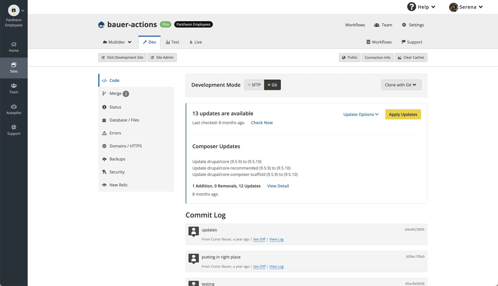
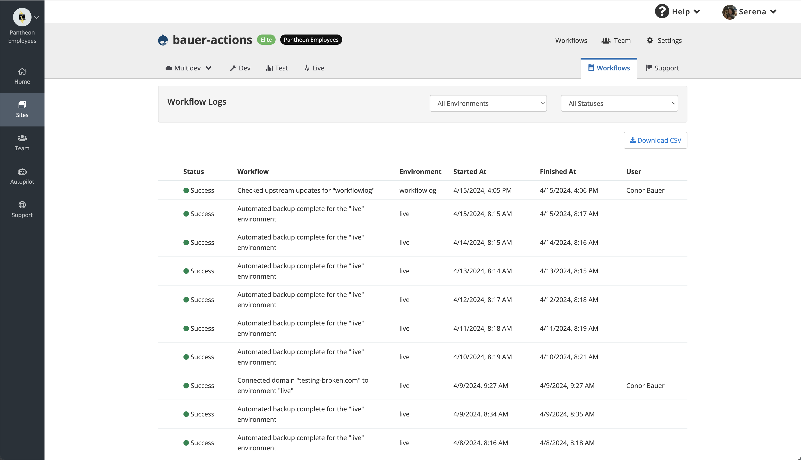
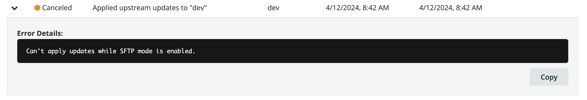

Workflows serve as the backbone of the Pantheon platform, orchestrating operations for every user action. Whether it's pushing a commit or creating a new Multidev environment, workflows ensure the intended end state for a site is achieved. The Workflow Logs feature is specifically designed to provide enhanced visibility into the status of user-relevant workflows, offering critical insights for monitoring and troubleshooting purposes.

## Accessing Workflow Logs
From your workspace dashboard, select a site. You'll find the tab for workflow logs conveniently located next to the Support tab in the top right corner.

Simply click on the tab to access.

## Functionality
### Status indicators
Each workflow's status is represented by a color code.

Alongside the status, you'll find essential details such as the corresponding environment, start time, end time, and the team member who initiated the workflow. If a workflow spans multiple environments, the environment field may appear blank.

### Details section
Workflows may contain additional details, indicated by a caret on the left side of the workflow row. To view these details, click on the row, and a dropdown will appear.

**Code sync**: Any workflow containing a code sync will have the commit hash and reference.

**Error details**: If a workflow does not complete successfully, please refer to the details section for additional information to assist you in troubleshooting.

**Build logs**: For sites utilizing Integrated Composer, access the build log to review error details for each triggered build workflow. Please note that logs can be long – the inner window will become scrollable to accommodate.

If there is an error in the build, details regarding the error will likely be highlighted in red. However, on rare occasions, you may need to review the surrounding text that is not highlighted to gather the necessary details.

**Quicksilver posted messages**: If you have sites using Quicksilver, you can view the status of Quicksilver tasks in the details section. Any scripted messages will also be displayed here. Please note that the status currently reflects whether the Quicksilver scripts have successfully started. For the completion status of the scripts themselves, please review the contents of the posted messages.

### Filtering options
By default, the table displays the most recent workflows at the top, encompassing all environments and completion statuses. Utilize the filter feature to streamline your search by specifying a particular environment or completion status.

### Downloading logs
Workflows are stored for a limited duration on the Pantheon dashboard. Use the 'Download to CSV' button to export all visible workflows to a CSV file for archival purposes.

