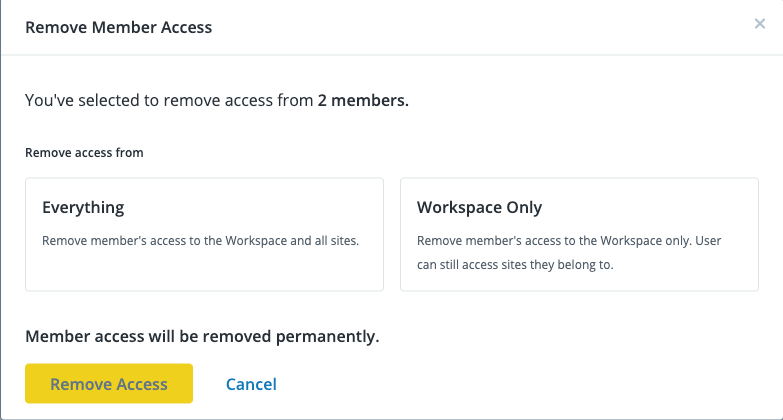
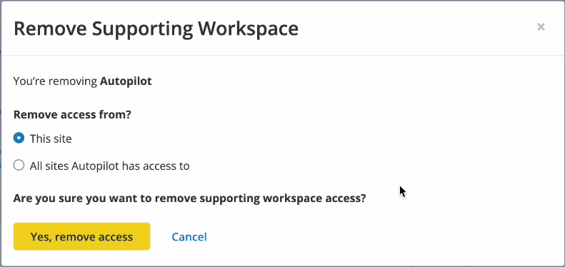

<!-- Note to authors: this is early access content. When the feature goes to general access, this content should be added to /source/content/guides/account-mgmt/workspace-sites-teams/07-teams.md 

Also, this URL has been added to addsearch to exclude it from search results. that entry should be removed when EA is over

-->

<Alert title="Early Access" type="info" icon="leaf">

Workspace Offboarding is available for:

- [Early Access](/guides/support/early-access/) participants.

This feature is available to:

- Selected Enterprise accounts.

While this feature is in Early Access, Pantheon's development team releases new functionality often. Please review Pantheon's [Software Evaluation Licensing Terms](https://legal.pantheon.io/#contract-hkqlbwpxo) for more information about support expectations for and access to Pantheon's pre-release software.

</Alert>

## Remove Team Members

Use this process if you want to remove a member from either a single workspace or from a workspace and **all** its associated sites.

1. [Go to the workspace](/guides/account-mgmt/workspace-sites-teams/workspaces#switch-between-workspaces) and select the **Team** tab.

1. Find and select the team member(s) you wish to remove.

1. Select **Actions**, then **Remove**.

1. Select one of the following options:

   - **Everything**: removes a member from all workspaces and associated sites.

   - **Workspace Only**: removes a member from this workspace only. Associated sites will not be impacted.

     

1. Click **Remove Access**. The members are removed based on the selection you made.

## Remove Supporting Workspaces

1. [Go to the Site Dashboard](/guides/account-mgmt/workspace-sites-teams/sites#site-dashboard) with the Supporting Workspace you wish to remove.

1. Click ** Team**.

1. Click the **x** to the right of the Supporting Workspace you wish to remove.

1. Select one of the following options:

   - **This site**: removes the workspace from this site only.

   - **All sites workspace has access to**: removes the workspace from all sites it's currently associated with.

     

1. Click **Yes, remove access**. The Supporting Workspace is removed based on the selection you made.
