## What is Two Factor Authentication?

Two Factor Authentication is a security practice which requires users of your website to provide, along with their standard username and password, an additional form of authentication in order to log in. The two most common methods involve authentication through an SMS message or a generated application one time code on an user’s mobile phone, although more advanced methods such as using a biometric information, location through GPS, or a hardware token are also possible. For more information, read [this article about Multi Factor Authentication](http://drupalwatchdog.com/volume-2/issue-2/multi-factor-authentication).

## Why do you need Two Factor Authentication?

Two Factor Authentication is a helpful security practice because it prevents attackers from compromising accounts by requiring an extra authentication method beyond the password to login. This is important because standard password access can be very easy to bypass if the user is using an easily guessable password, is observed typing in their password, or has used their password on another site that becomes compromised. By requiring a second form of authentication (especially one tied to a physical device like a mobile phone or a USB key), would be attackers not only have to compromise a user’s passwords but also their mobile phone or physical USB key which makes the attack much more difficult. 

## Setting Up Two Factor Authentication with WordPress (Single Site)

For a single site, there are many different [WordPress plugins for Two Factor Authentication](https://wordpress.org/plugins/tags/two-factor-authentication) which can provide TFA capabilities to your site. One of the most popular is the [Clef plugin](https://wordpress.org/plugins/wpclef/) which makes it easy to set up Two Factor Authentication on your WordPress site like this:

1. Install and activate the [Clef plugin](https://wordpress.org/plugins/wpclef/) on your WordPress site.
2. Download and setup the [Clef mobile app](https://getclef.com/apps/) on either iOS or Android.
3. Use the app on your mobile phone to scan the “wave” provided by Clef in order to connect your mobile phone to the website.
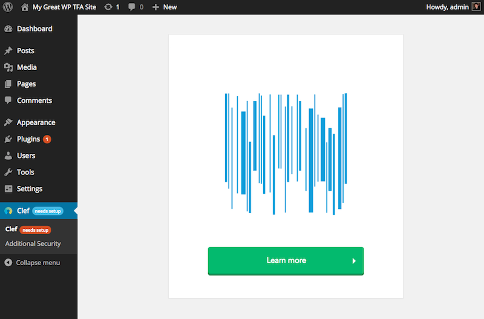
4. Configure the [security settings for the Clef plugin](http://support.getclef.com/article/60-recommended-password-settings-for-clef-wordpress-plugin) to “Disable passwords for Clef users” and create a private “Override URL” which allows users to login with their passwords if needed. 
5. Login to your WordPress site by using the Clef mobile app to scan the “wave” provided on the WordPress login form.
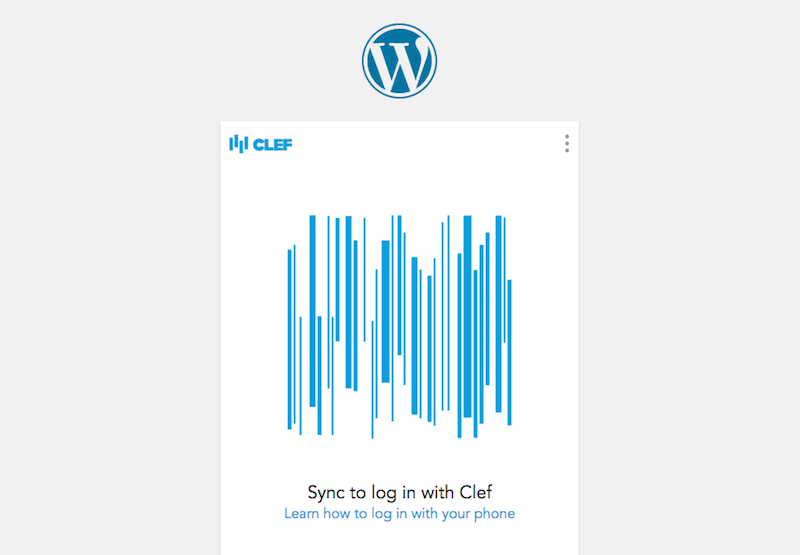

## Setting Up Two Factor Authentication with WordPress (Organization Wide)

For an organization wide solution, there are many different [WordPress plugins for single sign on](https://wordpress.org/plugins/tags/single-sign-on) which can also provide TFA capabilities. One of the service options, which we use internally at Pantheon, is OneLogin which has a [OneLogin WordPress plugin](https://wordpress.org/plugins/onelogin-saml-sso/). '

### OneLogin Instructions

1. Signup and create a [OneLogin account](https://www.onelogin.com/) for your organization.
2. Install the WordPress SAML 2.0 app connector as part of the OneLogin dashboard. This will need to be done for each WordPress site that is being managed by OneLogin.
3. Edit the OneLogin WordPress app connector to provide the appropriate default values for the “Configuration” section. Other sections should be set up correctly. 
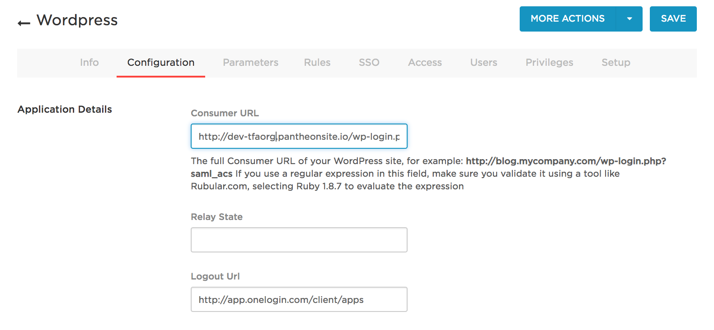
4. Configure the “Authentication Factors” found under settings and add an appropriate TFA solution that will work for your users.
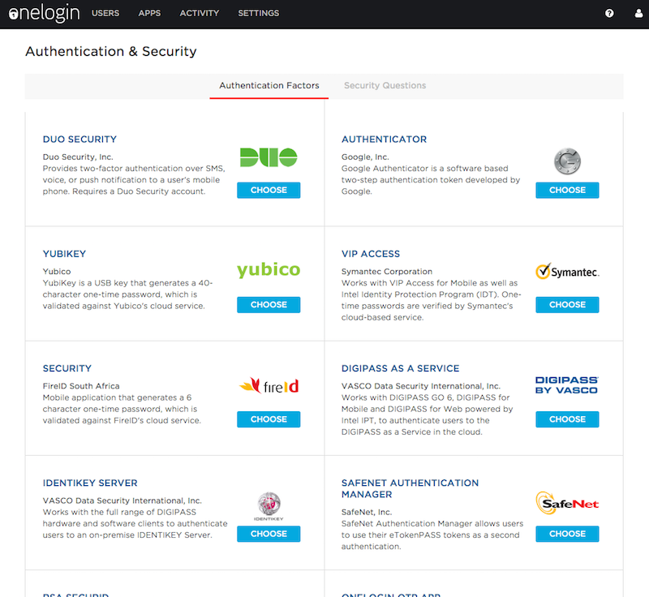
5. Create user accounts by using the “Users” administration area in OneLogin and clicking “New User”. Make sure that the “Username” and "Email" field in OneLogin matches their WordPress usernames and email.
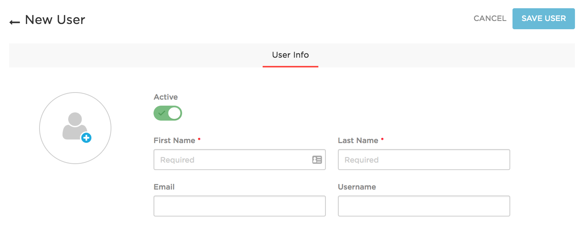

### WordPress Instructions

1. Install and activate the [OneLogin plugin](https://wordpress.org/plugins/onelogin-saml-sso/) on your WordPress site.
2. Configure the “Identity Provider Settings” in the SSO/SAML Settings in the WordPress admin to provide the appropriate values which are available in the “SSO” section of the OneLogin configuration page.
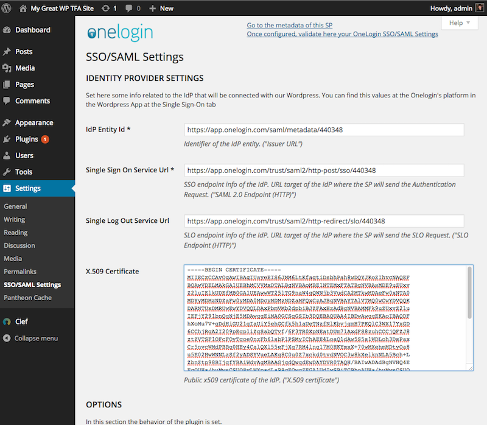
3. Configure the “Attribute” in the SSO/SAML Settings in the WordPress admin to provide the appropriate values which are available in the “Parameters” section of the OneLogin configuration page.
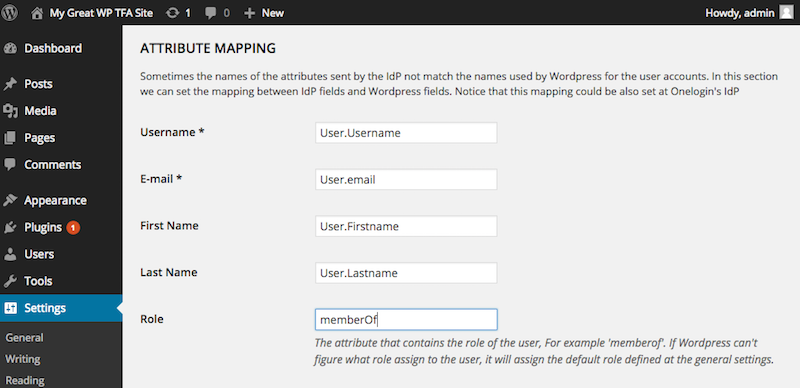
4. Configure the “Customize Actions and Links” in the SSO/SAML Settings in the WordPress admin to “Prevent local login”. This requires OneLogin as the authentication solution.
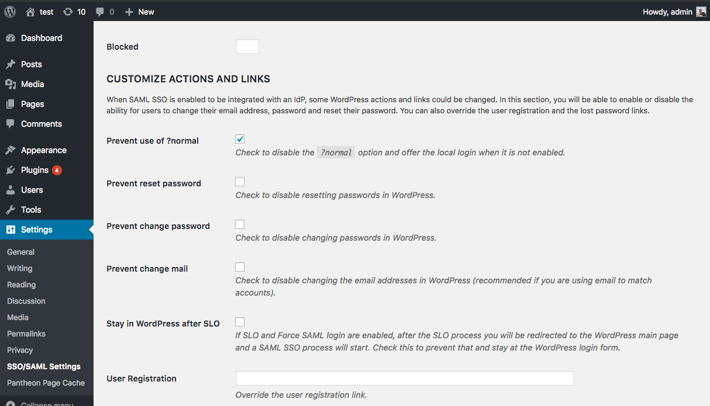
5. Use the OneLogin dashboard to login to your WordPress site! 

## Setting Up Two Factor Authentication with Drupal (Single Site)

For a single site, there is a [Two Factor Authentication module](https://www.drupal.org/project/tfa) which provides the foundation necessary to use Two Factor Authentication on a Drupal site. In addition to the foundation module, you also will need to use a specific TFA module plugin to implement your preferred TFA method. Several of the common TFA methods such as SMS or Time-based One Time Password are available in the [TFA Base plugins module](https://www.drupal.org/project/tfa_basic) or there are developer instructions to [write your own TFA plugin](https://www.drupal.org/node/1663240#dev). To get it working you need to:

1. Install and enable the [TFA module](https://www.drupal.org/project/tfa) on your Drupal site.
2. Install and enable the [TFA Basic plugins module](https://www.drupal.org/project/tfa_basic) on your Drupal site.
3. Download and setup an TOTP app such as [Authy](https://www.authy.com/users) for either iOS or Android.
3. Configure the TFA module (admin/config/people/tfa) to "Enable TFA", set "TOTP" as the default validation plugin, add "Recovery Codes" as a fallback plugin, and allow "Trusted Browsers" for your domain.
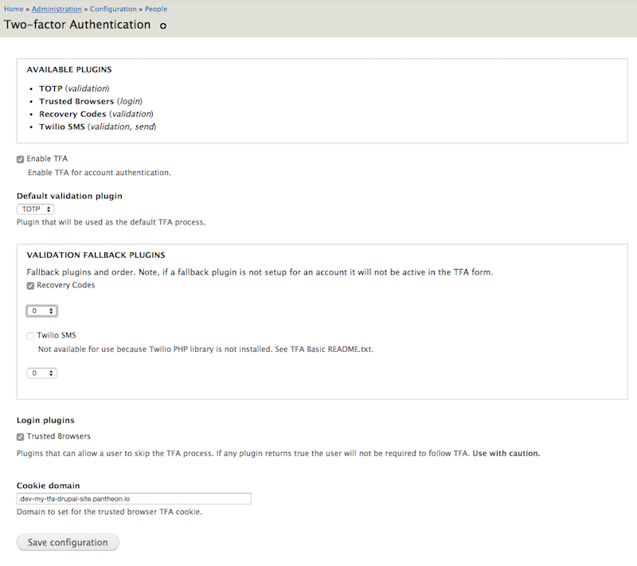
4. Go to the "Security" settings on each user profile you want to use TFA, click "Enable TFA", type in your current password, and view the "TFA setup - Application" page.
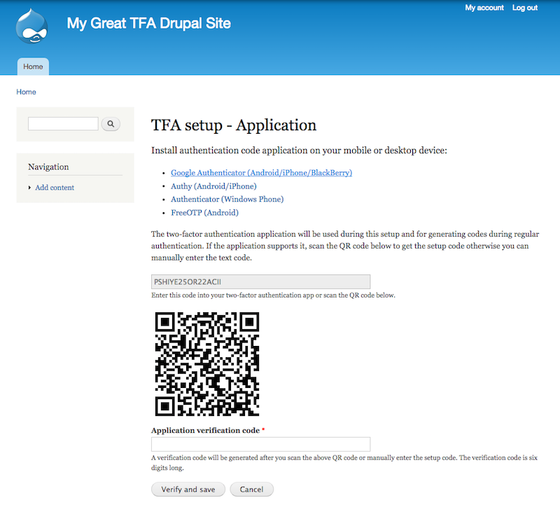
5. Use the app on your mobile phone to scan the QR code which will install a new TFA account on your mobile phone.
6. Enter the six digit TFA code on your mobile app for your specific site to complete the setup. You will then be prompted to confirm a "trusted browser" (which is optional and will skip TFA on that browser in the future) and to write down TFA recovery codes (best practice).
7. Login to your Drupal site by using the TOTP mobile app to generate a six digit code asked at login:
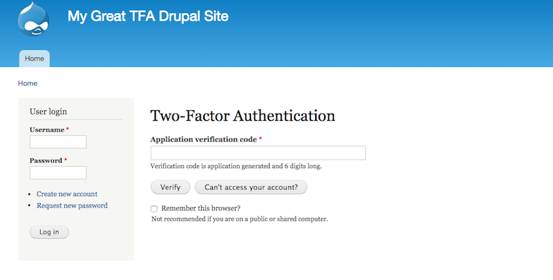

## Setting Up Two Factor Authentication with Drupal (Organization Wide)

For an organization wide solution, there are many different [Drupal modules for single sign on](https://groups.drupal.org/node/182004) which can also provide TFA capabilities. One of the service options, which we use internally at Pantheon, is OneLogin which has a [OneLogin Drupal module](https://www.drupal.org/project/onelogin). To get a TFA solution through OneLogin:

### OneLogin Instructions

1. Signup and create a [OneLogin account](https://www.onelogin.com/) for your organization.
2. Install the Drupal SAML 2.0 app connector as part of the OneLogin dashboard. This will need to be done for each Drupal site that is being managed by OneLogin.
3. Edit the OneLogin Drupal app connector to provide the appropriate default values for the “Configuration” section. Other sections should be set up correctly. 
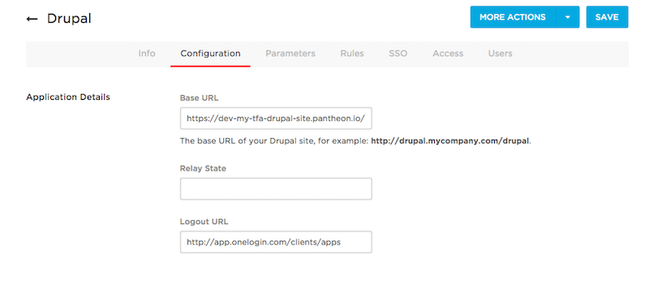
4. Configure the “Authentication Factors” found under settings and add an appropriate TFA solution that will work for your users.

5. Create user accounts by using the “Users” administration area in OneLogin and clicking “New User”. Make sure that the “Username” and "Email" fields in OneLogin matches their Drupal usernames and emails.

### Drupal Instructions

1. Install and enable the GitHub version of the [OneLogin module](https://github.com/onelogin/drupal-saml) on your Drupal site. This module is eventually intended to live on Drupal.org as the [2.x branch of the OneLogin project](https://www.drupal.org/project/onelogin).
2. Configure the OneLogin module (admin/config/onelogin_saml) to provide the appropriate values which are available in the “SSO” and "Parameters" section of the OneLogin configuration page. 
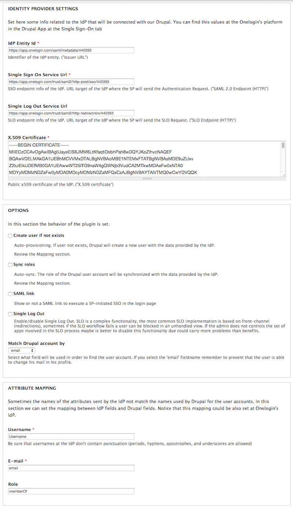
3. Use the OneLogin dashboard to login to your Drupal site! 
