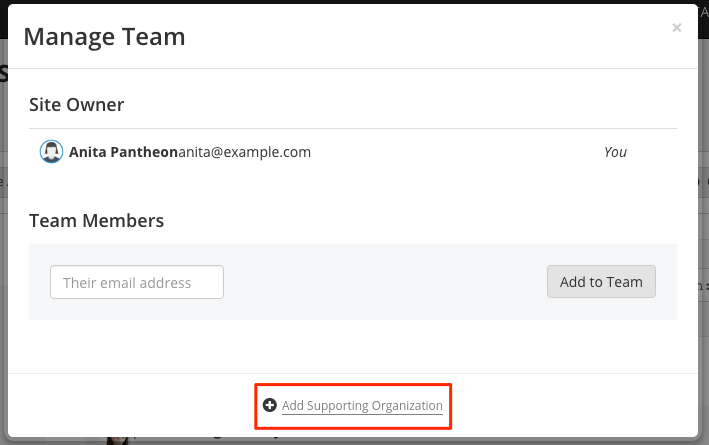
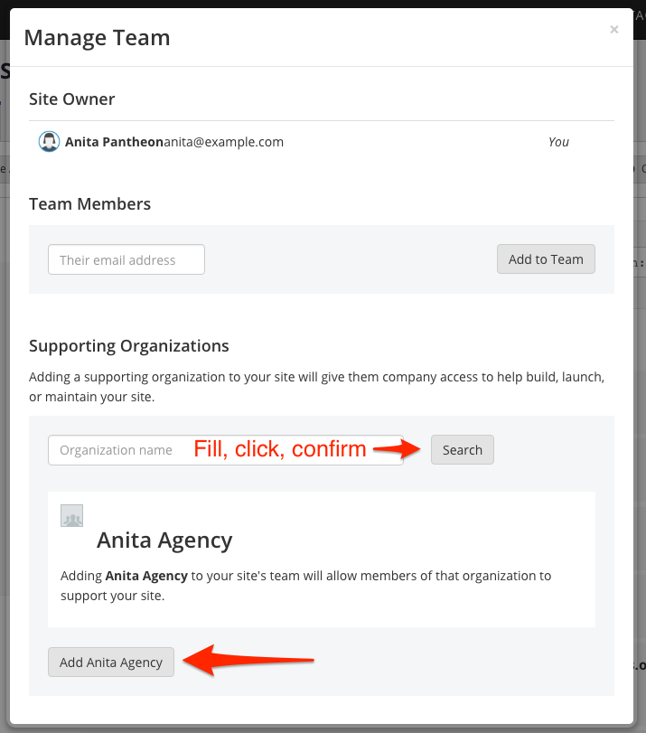

<Alert title="Note" type="info">

Because Supporting Organizations have full access to a site, only the site owner can perform this action.

</Alert>

1. From the [Pantheon Site Dashboard](https://dashboard.pantheon.io/), click  **Team** in the upper-right corner.

1. At the bottom of the Manage Team window, click  **Add Supporting Organization**:

  

1. Enter the agency's full name and click **Search**. The name must match exactly.

  Use the [Agency Directory](https://directory.pantheon.io/agencies?docs) to search Agency Partners or to be matched with the right Partner.

1. Once the agency has been located and confirmed to match the agency intended, click the **Add** button:

  

  The agency will receive an email notification.
