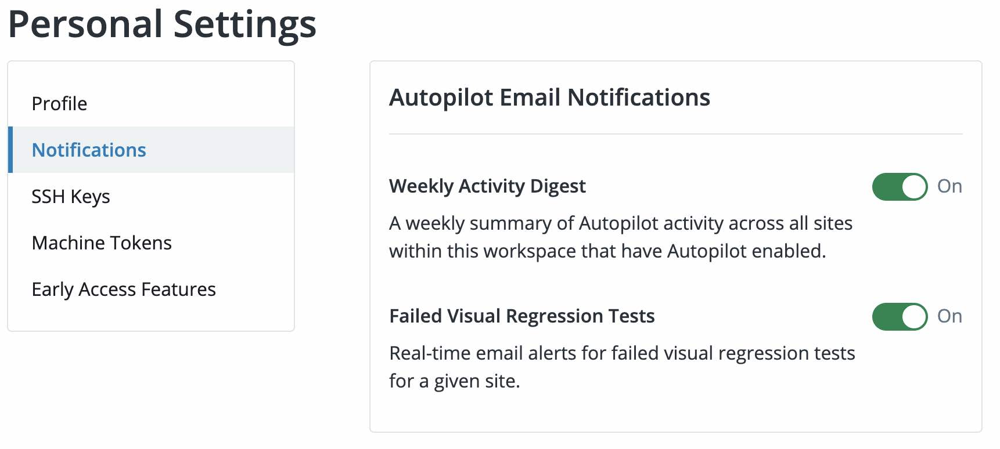

Configure email notifications for Autopilot alerts and activity digests in your Personal Workspace settings:

1. Click the <i className="fa fa-user-circle"></i> Gravatar in the upper right corner and click <i className="fa fa-user-cog"></i> **User Settings**
1. Click **Notifications** and choose your options in the **Autopilot Email Notifications** section:

   - **Weekly Activity Digest**: A weekly summary of Autopilot activity across all sites within the workspaces that have Autopilot enabled.
     - Digests are sent each Monday with information about the previous seven days.
   - **Failed Visual Regression Tests**: Real-time email notifications for failed visual regression tests for a given site.
