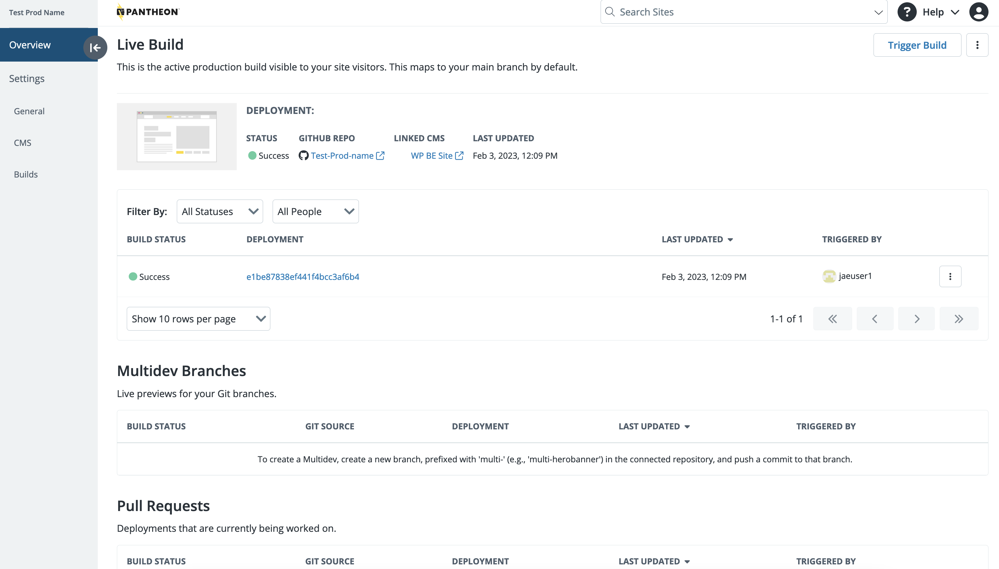

This section provides information on how to view Build details and how to trigger a new build in the Overview page.

## Build Details

You can view build details and get information on your Front-End Site development and specifications. Build information is provided in the Overview page in three sections:

- Live Build
- Multidev Branches
- Pull Requests

Build details include:

- **Status:** The build’s latest status. Possible status values are:
    - `In Progress`
    - `Success`
    - `Failed`
    - `Queued`

- **Build:** The build number and reference ID.
- **Branch:** The name of the latest GitHub branch.
- **Deployment:** The URL to the environment that the build was deployed to.
- **Last Updated:** The date the site content was last modified.
- **Triggered by:** The name of the user who deployed the site build.

### View Build Details

1. Log in to your **Pantheon Dashboard** and select the **Sites** page.

1. Click the **Front-End Sites** tab and select the site you want to view the build details for.

## Trigger a Build

You can save time by quickly triggering a build from your Overview page.

1. Log in to your **Pantheon Dashboard** and select the **Sites** page.

1. Click the **Front-End Sites** tab and select the site you want to trigger a build for.

1. Click the **Trigger Build** button in the top left corner.