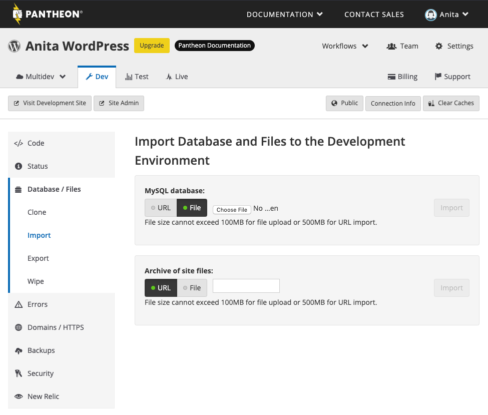
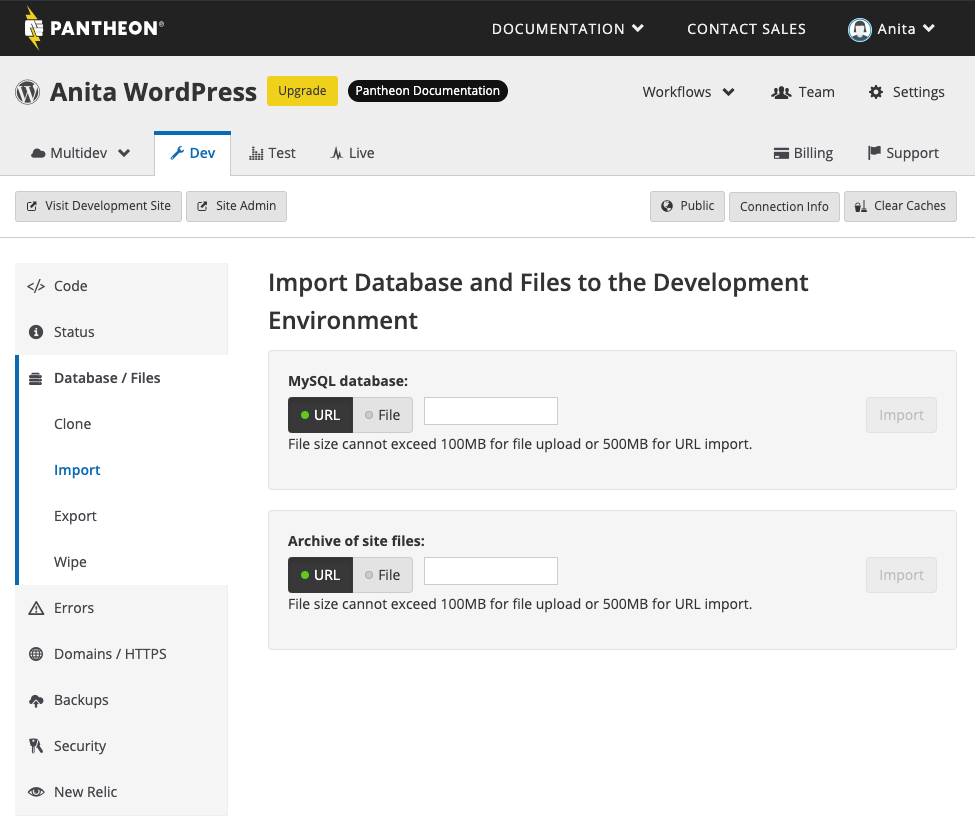

The **Database** import requires a single `.sql` dump that contains the site's content and configurations.

1. Create a `.sql` dump using the [mysqldump](https://dev.mysql.com/doc/refman/5.7/en/mysqldump.html) utility.

1. Compress the resulting archive with gzip to reduce the size for a faster transfer:

  ```bash{promptUser: user}
  mysqldump -uUSERNAME -pPASSWORD DATABASENAME > ~/db.sql
  gzip ~/db.sql
  ```

   - Replace `USERNAME` with a MySQL user with permissions to access your site's database.
   - Replace `PASSWORD` with the MySQL user's password. To force a password prompt, move `-p` to the end of the command and leave it blank. This prevents your MySQL password from being visible on your terminal.
   - Replace `DATABASE` with the name of your site database within MySQL.
   - `~/db.sql` defines the output target to a file named `db.sql` in your user's home directory. Adjust to match your desired location.

  The resulting file will be named `db.sql.gz` You can use either the Pantheon Dashboard or a MySQL client to add your site's database.

1. Select the **<span class="glyphicons glyphicons-wrench"></span> Dev** environment in the Site Dashboard.

1. Select **<span class="glyphicons glyphicons-server"></span> Database / Files**.

1. Click **Import** and add your archive accordingly (based on file size):

  <TabList>

  <Tab title="Up to 100MBs" id="100mbs" active={true}>

  If your archive is under 100MB, upload the file directly:

   1. Navigate to the **MySQL database** field > click **File** > **Choose File**.

   2. Select your local archive file > click **Import**.

   

   **Note**: If you recently imported the database and need to re-import, refresh the page and use a new filename for the database file.
  
  </Tab>

  <Tab title="Up to 500MBs" id="500mbs">

  If your archive is less than 500MB, import it from URL:

   1. Navigate to the **MySQL database** field > click **URL**.

   1. Paste a publicly accessible URL for the `.sql.gz` file > click **Import**. 

   <Alert title="Note"  type="info" >

   You must change the end of Dropbox URLs from `dl=0` to `dl=1` to import your archive correctly.

   </Alert>

      

  </Tab>

  <Tab title="Over 500MBs" id="500mbsplus">

  The following instructions allow you to add database archives larger than 500MBs using the command line MySQL client. You can also use a GUI client like Sequel Ace or Navicat. For more information, see [Accessing MySQL Databases](/mysql-access).

   1. Navigate to the Pantheon Site Dashboard > open the **<span class="glyphicons glyphicons-wrench"></span> Dev** environment > click **Connection Info** > copy the Database connection string. 
   
    The Database connection string will look similar to this:

      ```bash{promptUser: user}
      mysql -u pantheon -p{random-password} -h dbserver.dev.{site-id}.drush.in -P {site-port} pantheon
      ```

   2. `cd` into the directory containing your `.sql` file in your terminal.
   
   1.  Paste the connection string and append it with: `< database.sql`. 
   
    Your command will look like:

      ```bash{promptUser: user}
      mysql -u pantheon -p{random-password} -h dbserver.dev.{site-id}.drush.in -P {site-port} pantheon < database.sql
      ```

     If you encounter a connection-related error, the DB server could be in sleep mode. To resolve this, load the site in your browser to wake it up, and try again. For more information, see [Troubleshooting MySQL Connections](/mysql-access/#troubleshooting-mysql-connections).

    The `.sql` file is imported to the **<span class="glyphicons glyphicons-wrench"></span> Dev** environment after you run the command.

  </Tab>

  </TabList>
