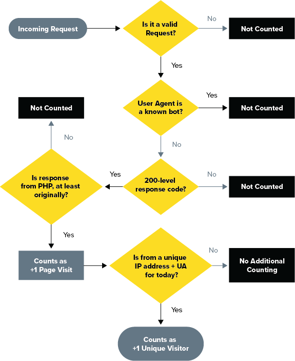

Pantheon tracks two traffic metrics which relate to site plan levels: **Visits** and **Pages Served**. These are available in the Site Dashboard, and are refreshed daily.

The data comes directly from our Global CDN, which tracks _all_ requests for resources on Pantheon. However, known bots and crawlers do not count towards site traffic limits, nor do we meter requests for static assets (e.g. CSS or images).

<dl>

<dt>Visits</dt>

<dd>

Pantheon defines Visits as traffic from unique consumers in a 24 hour period. We identify unique consumers as a combination of user agent (device/browser) and IP address (network source).

</dd>

<dt>Pages Served</dt>

<dd>

Pages Served is the number of requests for resources generated by the CMS (WordPress or Drupal). Most commonly these are HTML web pages, but they also include non-HTML resources such as JSON, RSS, or XML-RPC. These are typically used for bringing data into the site from another source (e.g., a list of places on a map).

The number of Pages Served allowed for each Site Plan is five times the maximum monthly Site Visits.

</dd>

</dl>

For both metrics, we count based on the total volume of requests, which includes visitors receiving pages (or other CMS-generated resources) which are served from our Global CDN cache.

