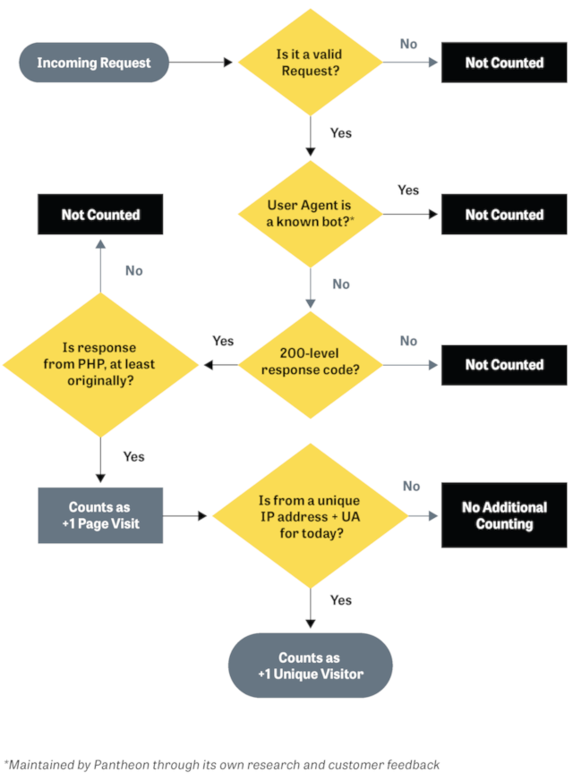

The number of unique visits displayed in Pantheon’s Site Dashboard represents the traffic measurement Pantheon will apply for evaluating use on your site under your pricing plan. The Site Dashboard also includes the number of pages served, to help evaluate trends, and project future traffic. Traffic information is refreshed daily.

The data comes directly from our Global CDN, which tracks _all_ requests for resources on Pantheon. However, many known bots and crawlers do not count towards site traffic limits, nor do we meter requests for static assets (images, PDFs, CSS, JS, etc.).

<dl>

<dt>Visitor</dt>

<dd>

A visitor is a person or device who/that receives information from the site. The platform counts each visitor once per day, regardless of the number of times they return that day or the number of pages they visit that day.

</dd>

<dt>Site Visits</dt>

<dd>

We consider a Site Visit as a 200-level response code in response to a visitor, and we identify unique consumers as a combination of user agent (device/browser) and IP address (network source), as shown in the diagram above.

</dd>

<dt>Pages Served</dt>

<dd>

Think of this as something that gets delivered to the visitor: Pages served is the number of requests for resources generated by the CMS (WordPress or Drupal). Most commonly these are HTML web pages, but they also include non-HTML resources such as JSON, RSS, or XML-RPC. These are typically used for bringing data into the site from another source (e.g., a list of places on a map).

The number of Pages Served allowed for each Site Plan is five times the maximum monthly Site Visits.

</dd>

</dl>

For both metrics, the platform counts based on the total volume of requests, which includes visitors receiving pages (or other CMS-generated resources) which are served from our Global CDN cache.

As shown here, visits and visitors have different meanings. If two visitors go to the site, and one opens another page but the other leaves, that would be tracked as two visitors; three pages served. If one of those visitors returns again the next day, it would be counted as two visitors, three visits, and four pages served.

How do you know if a visit counts?

The visit counts if it:

- Is valid
- Is not a known bot
- Returns a [200-level](https://en.wikipedia.org/wiki/List_of_HTTP_status_codes#2xx_Success) response
  - That originates from PHP

Additionally, if that visit is from a unique IP and user agent combination for the day, then that counts as a unique visitor that day too.

