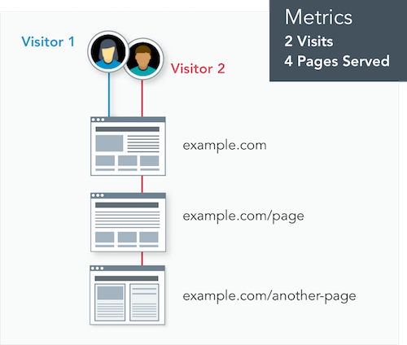

The number of unique visits displayed in Pantheon’s Site Dashboard represents the traffic measurement Pantheon will apply for evaluating use on your site under your pricing plan. The Site Dashboard also includes the number of pages served, to help evaluate trends, and project future traffic. Traffic information is refreshed daily.

The data comes directly from our Global CDN, which tracks _all_ requests for resources on Pantheon. However, many known bots and crawlers do not count towards site traffic limits, nor do we meter requests for static assets (images, PDFs, CSS, JS, etc.).

<dl>

<dt>Visitor</dt>

<dd>

A visitor is a person or device who/that receives information from the site. The platform counts each visitor once per day, regardless of the number of times they return that day or the number of pages they visit that day.

</dd>

<dt>Site Visits</dt>

<dd>

We consider a Site Visit as a [200-level](https://en.wikipedia.org/wiki/List_of_HTTP_status_codes#2xx_Success) (and some [300-level](https://en.wikipedia.org/wiki/List_of_HTTP_status_codes#3xx_Redirection)<Popover content="300-level response codes that count as traffic: 303, 304, 305." />) response code in response to a visitor, and we identify unique consumers as a combination of user agent (device/browser) and IP address (network source), as shown in the diagram below.

</dd>

<dt>Pages Served</dt>

<dd>

Think of this as something that gets delivered to the visitor: Pages served is the number of requests for resources generated by the CMS (WordPress or Drupal). Most commonly these are HTML web pages, but they also include non-HTML resources such as JSON, RSS, or XML-RPC. These are typically used for bringing data into the site from another source (e.g., a list of places on a map).

The number of Pages Served allowed for each Site Plan is five times the maximum monthly Site Visits.

</dd>

</dl>

For both metrics, the platform counts based on the total volume of requests, which includes visitors receiving pages (or other CMS-generated resources) which are served from our Global CDN cache.

As shown here, visits and visitors have different meanings. If two visitors go to the site, and one opens another page but the other leaves, that would be tracked as two visitors; three pages served. If one of those visitors returns again the next day, it would be counted as two visitors, three visits, and four pages served.

## How Do You Know if a Visit Counts?

### Counted Visits

A visit counts if it:

- Is valid

- Is not a known bot

- Returns a [200-level](https://en.wikipedia.org/wiki/List_of_HTTP_status_codes#2xx_Success) response that originates from PHP
  - Or returns a [300-level](https://en.wikipedia.org/wiki/List_of_HTTP_status_codes#3xx_Redirection) of 303, 304, or 305.

- Additionally, if that visit is from a unique IP and user agent combination for the day, then that counts as a unique visitor that day too.

### Uncounted Visits

The traffic measurement model below describes interactions excluded from your site's visit count. Our exclusion metric model relies partly on customer feedback. [Contact support](/guides/support/contact-support) to request that Pantheon consider additional exclusions if you experience issues with your site. 

A visit does not count if it:

- Is invalid (originating from a known bot or crawler)
  - A high-performance response to crawlers supports SEO, which is one of the reasons Pantheon is the platform of choice for our customers. Although it places load on the platform, Pantheon excludes select automated traffic from legitimate crawlers and bots that would otherwise count towards your website's total traffic. See the above definition of _visits_, regarding the combination of datasets to determine traffic metrics. Pantheon excludes certain activity on your Site Dashboard (e.g., Google bot user agent).
  - Some bots and crawlers present themselves as end-user browsers. This makes their behavior difficult to distinguish from human end users. Some bots exhibiting this behavior, while they claim to be regular browsers, remain distinctive enough to exclude from billing.
  - To block specific bots and crawlers from your site, [add them to `robots.txt`](/bots-and-indexing#indexing-your-pantheon-site) or [use PHP to block specific User Agents](/optimize-site-traffic#block-user-agents-in-drupal-or-wordpress).

- Is a non-unique or repeated IP address for a given day

- Is a response from a static asset, such as images, PDFs, CSS, JS, etc.

- Is using excessive bandwidth 
  - Individual sites consuming excessive bandwidth may be contacted separately by Pantheon for monitoring and actions required to address any plan abuse.

- Is a redirect
  - The platform does not count the following [300-level](https://en.wikipedia.org/wiki/List_of_HTTP_status_codes#3xx_Redirection) redirect responses: 301, 302, 307, 308.

- Is a 404 or other client error
  - Client errors are returned as [400-level](https://en.wikipedia.org/wiki/List_of_HTTP_status_codes#4xx_Client_errors) responses, and do not count as part of plan traffic limits. 

