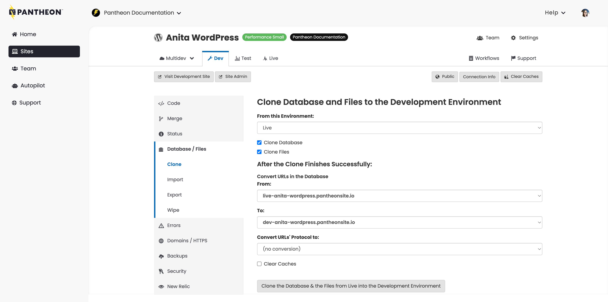

These include improvements to selected states for environment tabs and menus to help keep you better oriented when moving through the UI, added white space to give everything some breathing room, and nested secondary menu items on the left side to streamline navigation.

